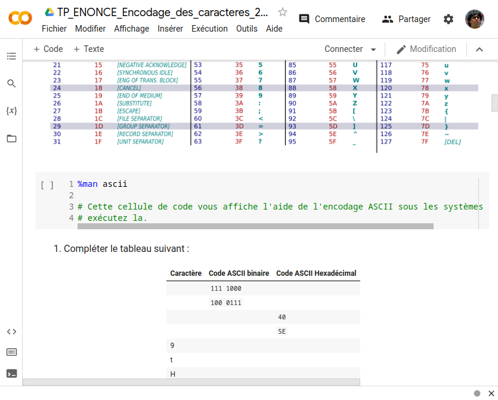

# Google Colab



## Un serveur de Notebook

Google Colab est un serveur de Notebook à destination des professionnels et des étudiants.

Il permet d'exécuter des fichiers Jupyter Notebook Python (format .ipynb).

Ces fichiers comportent des cellules de deux type :

- de texte, saisi en markdown et mis en forme dans le notebook
- de code, en Python, exécutable directement.

## Intégré à Google Classroom et Google Drive

### Google Classroom

Il est facile de créer un notebook et de le partager avec vous, via Google Classroom.
Vous disposez alors tous d'une copie que je peux consulter.

Ainsi l'échange de travaux est aisé.

### Google Drive

Le serveur permet d'accéder facilement à votre google drive pour utiliser des fichiers. Nous n'utiliserons que rarement cette fonctionnalité.

## Avec quelques limites

Contrairement aux serveur de Notebooks complets, Colab ne permet d'exécuter que du Python, cela ne nous gène pas trop.

Aussi, le format d'encodage du fichier est particulier et il est difficile d'y comprendre quelque chose lorsqu'on l'ouvre avec un éditeur. C'est un contrainte pour moi, pas pour vous.

## Utilisation courante

Lorsqu'on débute avec un Notebook vierge, il contient une seule cellule de code.

Par défaut, il n'est pas connecté au serveur et il faut exécuter au moins une cellule pour créer un environnement de travail.

On insère une cellule pour chaque partie de code à créer et on les exécute dans l'ordre qu'on veut.

### Ordre d'exécution

Imaginons avoir deux cellules :

```python
# Cellule 1
a = 1
```

et

```python
# Cellule 2
a = 2
```

Si j'exécute dans cet ordre : `cellule 1` puis `cellule 2` alors `a = 2`

Dans l'ordre contraire `a = 1`.

Cela peut sembler évident mais il faut le garder en tête, l'ordre d'exécution importe !

Souvent on saisit une fonction, ensuite on crée une cellule pour tester la fonction et lorsqu'on l'exécute on a une erreur... parce qu'on a oublié d'exécuter la fonction.

Parfois c'est pire, la fonction est fausse, on la rectifie mais les erreurs ne disparaissent pas... parce qu'il faut réexécuter la fonction.

Vous travaillerez souvent avec Colab et vous intégrerez ces pratiques sans problème.

En première c'est un outil formidable, en terminale je trouve qu'il atteint vite ses limites.
