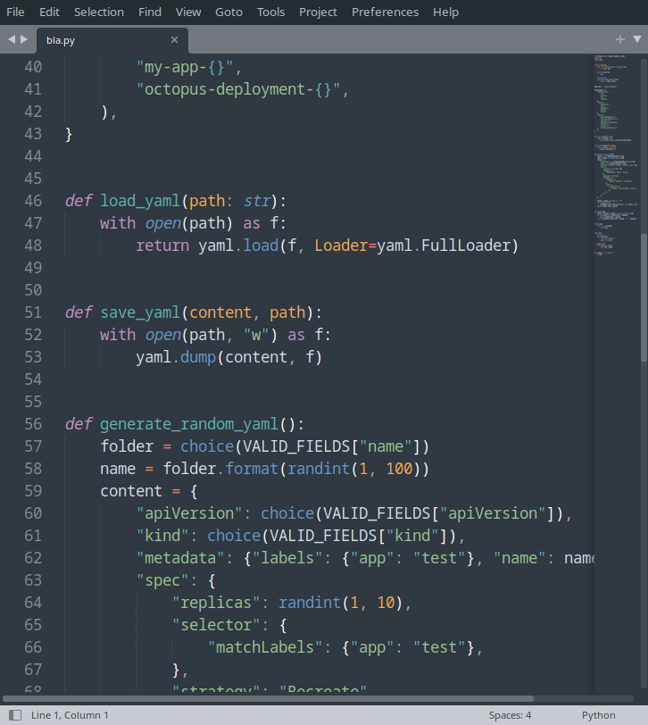

[pdf](./sublime_text.pdf)

# Sublime Text

## Un éditeur généraliste

Sublime Text, dans sa version 3 est un éditeur de code généraliste (_fonctionne avec tous les langages_) qui est assez prisé des développeurs.

Sublime Text devrait être installé sur vos postes. Nous l'utiliserons pour la partie IHM sur le web et pour les projets avancés. C'est l'éditeur de référence en terminale.

Il a de nombreux avantages :

- _très rapide_.
- simple,
- extensible
- dispose d'une large communauté

## Un outil puissant

Sulblime text peut être étendu pour intégrer des outils professionnels comme un LSP ou des débuggeurs.

Certains professionnels ne jurent que par lui, mais il ne fait pas partie des IDE les plus prisés.

## Remarques importantes

### Exécuter du `code

Si Python est installé correctement vous pouvez exécuter du code directement depuis l'éditeur avec Ctrl+B (Tools, Build).

Le résultat apparaît dans une fenêtre, malheureusement non éditable.

### Tabulation, espaces

Par défaut, sublime text insère des tabulations quand vous pressez tab. C'est pénible en Python où les espaces et les tabulations ne doivent pas être mélangés dans un fichier.

Pour résoudre ce problème :

- View, indentation, indent using space
- View, indentation, use 4 spaces,
- View, indentation, convert to spaces

malheureusement, ce réglage ne persiste pas au redémarrage sur vos postes et il faut le refaire à chaque fois.

Correctement installé chez vous, cela ne se règle qu'une fois.
`
