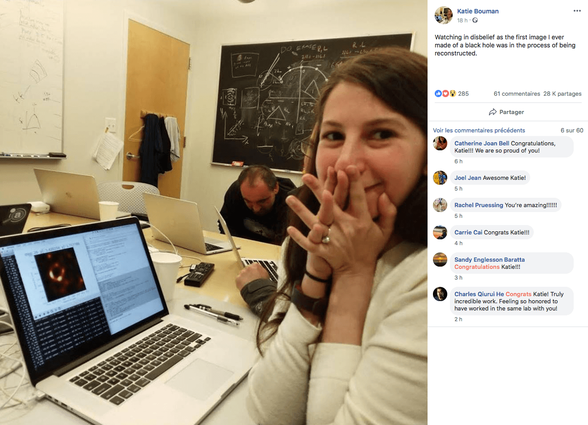

### pdf : [pour impression](/uploads/docsnsi/presentation_python/presentation_python_print.pdf) et [diaporama](/uploads/docsnsi/presentation_python/presentation_python_slides.pdf)

# Python

## Présentation de Python


Python est un langage de programmation crée au début des années 90 par
Guido Van Rossum.


## Python dans l'éducation

Python est choisi pour

* le lycée : informatique, maths, physique, snt
* les classes prépa et les licences informatiques

C'est un langage qui facile d'accès, idéal pour les débutants.

Cependant Python est un langage puissant et complet qui a de nombreux usages
dans l'industrie informatique.

## Caractéristiques de Python

* Python est _gratuit_ et ses sources sont _ouvertes_. Tout le monde peut les consulter et les améliorer s'il le souhaite.
* Python est un _langage haut niveau_. Cela signifie qu'on est éloigné de ce qui se passe réellement dans la machine et qu'on peut se concentrer sur le déroulement du programme en lui même.
* Python est un langage _interprété_ et non compilé. Cela signifie qu'à chaque exécution d'un programme Python, un programme appelé interpréteur traduit le code en _bytecode_ exécutable par la machine.
  Le code est ainsi facile à éditer et à corriger.
* Python est à la fois _multi-plateforme_ (il fonctionne sur tous les systèmes courants) et _multi-paradigme_ (il existe plusieurs manières d'écrire un programme qui accomplisse le même résultat)

## Caractéristiques de Python

* Python est doté d'un _typage dynamique_. Contrairement au C ou à Java, il n'est pas nécessaire de déclarer le type d'une variable. Celui-ci peut changer durant l'exécution du programme.
* La syntaxe de Python diffère de celles inspirées du C. C'est _l'indentation qui décrit la structure d'un programme_.
* Python dispose de plusieurs interpréteurs mais le plus courant est _CPython_ écrit en C.
* Python dispose de deux versions majeures partiellement incompatibles : Python 2.7 et _Python 3_. Nous utiliserons cette année la dernière version stable de Python 3

## Quelques éléments de syntaxe

La syntaxe de Python est conçue pour être facilement lisible.

Les commentaires sont précédés d'un symbole `#`

```python
  a = 3 # un commentaire
```

## Tests et conditions

La structure (les blocs) sont indiqués par une indentation (généralement 4 espaces)

Par exemple :

```python
a = 3                       # affecter =
if a == 2:
  print(a, "vaut 2")
elif a > 2:                # comparer ==
  print(a, "est plus grand que 2")
else:
  print(a, "est inférieur à 2")
```

Les espaces après `if` et `else` indiquent ce qui doit être exécuté si ces conditions sont vérifiées.

# Boucles

## boucle while

Il existe deux types de boucles `for` et `while`

La syntaxe de `while` est similaire à celle du C :

```python
a = 1
while a < 5:
  # faire quelquechose
  a = a + 1
```

## boucle for

La syntaxe de `for` est différente. On parcourt un objet _itérable_

```python
liste = [1, 2, 3, 4, 5, 6]
for nombre in liste:
  if nombre % 2 == 0:
    # nombre % 2 est le reste de la division
    # euclidienne par 2
    print(nombre, "est pair")
  else:
    print(nombre, "est impair")
```

## Les fonctions

Une fonction est un morceau de code qui peut être appelé et exécuté plusieurs fois.

Une fonction prend des _paramètres_ en entrée et _retourne_ un résultat.

Toutes les fonctions Python retournent une valeur avec `return`.
Si rien n'est indiqué après `return` ou si ce mot-clé est omis, la fonction retourne `None`

```python
def carre(n):
  '''
  calcule le carré d'un nombre
  @param n: (number)
  @return: (number)
  '''
  return n ** 2
```

## Spécifier

On _spécifie_ une fonction en indiquant dans une chaîne de caractères sur
plusieurs lignes :

* ce qu'elle fait,
* ses paramètres et leur type
* ce qu'elle renvoit


## Objets simples

Les _types_ courants en Python sont :

* `int` : les entiers (0, -1, 234567890 etc.)
* `float` : les "nombres à virgules" (0.2, 1234.1234 etc.)
* `str` : les chaînes ce caractères (`"a"`, `"bonjour David59"`)
* `bool` : `True`, `False`
* `Nonetype` : `None` (rien)

## Objets complexes

Ils sont généralement _itérables_, on peut les parcourir élément par élément.

* `list` : `[1, 2, 3]` une liste (ou un tableau) d'objets. Mutables.
* `tuple` : `(1, 2, 3)` comme une liste mais non mutables.
* `dict` : `{"nom" : "David", "tel" : "0612345678"}`. tableau associatifs ou dictionnaire. Mutables

Il en existe de nombreux autres que nous rencontrerons plus tard.

## Librairies

On importe une librairie avec `import`

```python
from math import pi
def circonference(rayon):
  '''
  Calcule la circonference d'un cercle
  @param rayon: (number)
  @return: (float)
  '''
  return 2 * pi * r
```

## Librairie standard et paquets

Python est fourni avec une _librairie standard_ très riche qu'il est
rarement nécessaire d'étendre.

Cela est néanmoins facile avec le gestionnaire de paquets
`pip` (_Pip Installs Python_) :

```
$ pip install numpy
```

## Nous utiliserons notamment :

* `pygame` et `pgzero` : jeux vidéos,
* `flask` : site web,
* `pillow` : manipulation d'images,
* `matplotlib` : figures scientifiques,

## Adoption

Python est massivement utilisé par les professionnels. Depuis 2014 c'est le
langage qui connait la plus forte croissance dans la communauté des développeurs.

C'est le second langage le plus cité après `JavaScript` comme étant celui
qu'ils préfèrent utiliser.

## Applications

Parmi les applications fréquentes de Python citons :

* L'intelligence artificielle avec les librairies `panda` `sklearn` et `tensorflow`,
* Le calcul numérique avec `numpy` et `matplotlib`,
* Les logiciels (fenêtres etc.) avec `QT` et `Tkinter`,
* Les tests. Les développeurs doivent s'assurer du bon fonctionnement et de l'efficacité de leurs programmes. De nombreux tests sont écrits en Python.


## Projets utilisant Python

Parmi les entreprises et projets qui utilisent Python citons :

* Google,
* La NASA,
* Industrial Light & Magic (effets spéciaux de Disney, LucasFilm etc.)
* Netflix,
* LibreOffice etc.

## Python dans les médias

Citons Katie Bouman, célèbre pour avoir présenté la première image d'un trou noir et qui travaille au MIT.



On peut voir qu'elle est en train de programmer un script Python.
