### pdf : [pour impression](./grove.pdf)

_Ce document est grandement inspiré par le livret rédigé par Philippe Leclerc_

# Introduction

Ce projet vise à vous guider dans l'utilisation du module grove avec le BBC micro:bit.
On suppose que vous maîtrisez les fonctions du base : boutons, matrice à LEDs,
entrées / sorties).

On suppose aussi que l'utilisation de mu-editor est acquise.

Dans ce TP, nous utiliserons **mu-editor**, étant donné qu'il permet de manipuler
les fichiers présents sur le micro:bit.


## Nature du TP

L'expérimentation se fait sous la forme de mini projets pour lesquels on vous
présente le principe d'un module, un schéma de raccordement, le code et
des observations. 

Ensuite un défi vous est proposé.

Cela vous donnera de quoi vous occuper si un module ne fonctionne pas (ce qui
arrive) ou s'il n'est pas disponible immédiatement (il y a moins de modules
que d'élèves).


# Utiliser le module grove


## Principe

Le kit Grove, développé par Seeed Studio est constité de une carte d'extension
dans laquelle on insère le BBC Micro:bit et de différents éléments qui se
raccordent tous de la même manière.


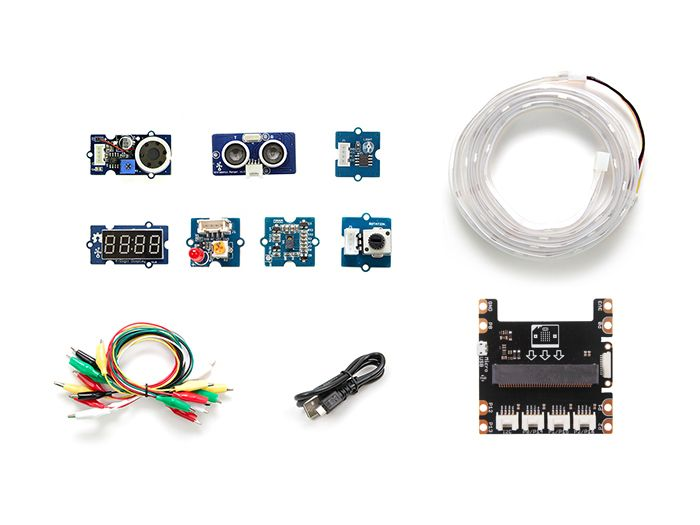

## Branchements

Chaque capteur ou actionneur utilisé dans le TP se branche à l'aide d'un câble
entre le capteur et la carte d'extension.

Les montages sont donc très simples.

Il est nécessaire d'employer une carte d'extension, mais aussi parfois une
alimentation supplémentaire car la carte BBC micro:bit fonctionne en 3.3V
tandis que les éléments Grove fonctionnent en 5V.

Seed Studio propose aussi des modules Grove pour les raspberry, arduino qui
fonctionnent de manière similaire.

## Librairie

L'utilisation de certains modules grove nécessite du code relativement complexe
qui est disponible ici :

* [micro_grove](https://raw.githubusercontent.com/qkzk/data_colab/master/nsi/grove_nsi/micro_grove.py)
* [display_4d](https://raw.githubusercontent.com/qkzk/data_colab/master/nsi/grove_nsi/display_4d.py)

Ces librairies fournissent des fonctions et méthéodes prédéfinies dont la
syntaxe est explicitée à la fin du document.


**Téléchargez ces fichiers**


## Utilisation du module dans `mu-editor`

**Rappel du TP précédent** :

Le bouton fichier s'utilise comme ceci :


Cette fonction n'est accesible qu'après avoir chargé un fichier sur la carte.

Dans mu-editor, 

1. raccordez votre BBC micro:bit et assurez-vous que le script par défaut
   (Hello, World!) fonctionne.
2. Ouvrez les deux scripts `micro_grove.py` et `display_4d.py` dans mu-editor
    et enregistrez les dans le dossier par défaut.
3. Ouvrez le menu `files`. Vous devriez voir apparaître les fichiers
  `display_4D.py` et `micro_grove.py` à droite et un seul fichier `main.py`
  à gauche.
4. Glissez les deux scripts à gauche.

Vous pouvez maintenant continuer comme d'habitude :


1. Vous copiez / éditez le code dans l'éditeur,
2. Vous enregistez vos modifications,
3. Vous flashez le code vers le BBC micro:bit.
4. Vous le redémarrez si rien ne fonctionne normalement (bouton reset au dos.)

# Mini-projets

## Projet 1 : contrôler la lumière

Nous allons utiliser les boutons du micro:bit pour controler une LED

### Montage

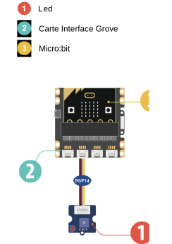

### Code exemple

```python
from microbit import *

# on défini une variable
etat_led = 0
while True:
  if button_a.is_pressed():
    # on met la LED a l'état 1 (5V)
    etat_led = 1
  if button_b.is_pressed():
    # on met la LED à l'état 0 (0V)
    etat_led = 0
  # on copie l'état de la led sur la broche P0
  pin0.write_digital(etat_led)
  sleep(100)
```

Appuyer sur A puis sur B pour allumer et éteindre la LED

### Approfondissement possible

Que se passe-t-il quand on appuie sur les deux boutons en même temps ?

Comment modifier le programme pour rendre A prioritaire ?

Comment modifier le programme pour allumer et éteindre avec A seulement.
Pensez à `was_pushed`.

## Projet 2 : controler la luminosite

Nous allons utiliser les LEDs de la micro:bit pour afficher une mesure de la
luminosité ambiante

### Montage

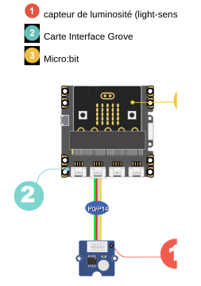

### Code exemple

```python
from microbit import *
from micro_grove import luminosite, affiche_jauge

while True:
  # on récupère la valeur fournie par le capteur
  mesure = luminosite(pin0)
  # on affiche le niveau de luminosité sur les leds
  affiche_jauge(mesure, 100)
  sleep(50)
```

* Observer les leds lorsqu'on monte et descend la main devant le capteur
* Que se passe-t-il quand on modifie la valeur 100 dans `affiche_jauge` ?

## Projet 3 : éclairage automatique

Nous allons allumer une LED lorsque la nuit tombe

### Montage

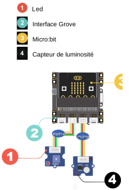

Code
Capteur de luminosité

### Code exemple

```python
from microbit import *
from micro_grove import luminosite
while True:
  # le capteur est branché sur la broche P1
  if luminosite(pin1) < 10:
    etat_led = 1
  else:
    etat_led = 0
  # on recopie l'état de la led sur la broche P0
  pin0.write_digital(etat_led)
  sleep(100)
```

Vérifier que la led s’allume si on recouvre le capteur.

### Approfondissement possible

Modifier le programme pour que la led s’allume plus tôt quand la nuit tombe.

## Projet 4 : un peu de musique

Nous allons utiliser les boutons de la micro:bit pour jouer de la musique

## Montage


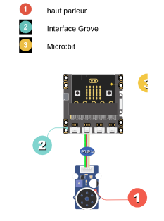

haut parleur
Interface Grove
Micro:bit

## Code Exemple

```python
from microbit import *
from music import *
from micro_grove import bip

# les notes sont définies en Scientific Pitch Notation (SPN).
ma_note = “c4:1" # c’est un DO
while True:
  if button_a.is_pressed() and not button_b.is_pressed():
    # on joue une note
    play(ma_note)
  elif button_b.is_pressed() and not button_a.is_pressed() :
    # on joue une mélodie pré-enregistrée
    play(PUNCHLINE)
  elif button_a.is_pressed() and button_b.is_pressed():
    # on emet un beep
    bip()
    sleep(500)
```

On doit entendre des sons différents quand on appuie sur une touche à la fois

## Approfondissement possible

Après une recherche sur internet modifier le programme pour jouer la note “LA”
à la place du DO

Ajoute la définition de 
la mélodie `ma_melodie = [“C4:4”, "D", "E", "C", "C", "D", "E", "C", "E"]`


## Projet 5 : mouvements 

Nous allons utiliser les touches sensitives et les capteurs de mouvement

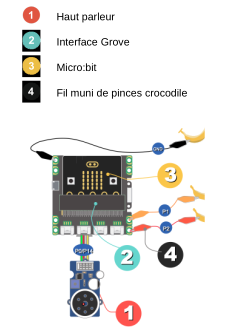

## Montage

## Code Exemple

```python
from microbit import *
from music import *
gesture = "x"
while True:
  if pin1.is_touched() :
    # on joue une melodie
    play(PYTHON)
  elif pin2.is_touched():
    play(ENTERTAINER)
  # on surveille les changement de position de la carte
  if gesture != accelerometer.current_gesture():
    gesture = accelerometer.current_gesture()
  if gesture == "left":
    play(JUMP_UP)
  elif gesture == "right":
    play(POWER_UP)
  sleep(100)
```
Touche avec une main l'un des fils (ou la touche directement), puis l'autre.

Penche la carte brièvement à droite ou à gauche.


### Approfondissement possible

Complète le programme pour que d’autre mélodies soient jouées quand on 
lève ou baisse la carte.

On trouveras des informations [ici](https://microbit-micropython.readthedocs.io/en/v2-docs/music.html)

## Projet 6 : gardien des secrets

### Description

Dans cette démo, tu vas apprendre à créer une alarme.
Si quelqu’un rentre dans ta chambre, une led s’allumera
et une “sirène” retentira

### Montage


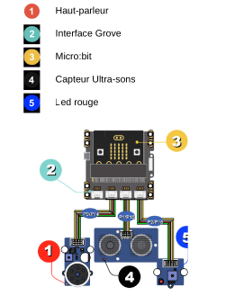

Haut-parleur
Interface Grove
Micro:bit
Capteur Ultra-sons
Led rouge

### Code exemple


```python
from microbit import *
from micro_grove import mesure_temps_A_R
from music import play
maNote = "F6:1"
while True:
  # Valeur fournie par le capteur ultra-sons
  t = mesure_temps_A_R(pin1)
  distance = t * 0.034328 / 2 # cm
  if distance < 100:
    # on detecte une présence
    for i in range(5):
      pin2.write_digital(1)
      play(maNote)
      sleep(150)
      pin2.write_digital(0)
      sleep(150)
  sleep(500)
```

Vérifie que quand tu passes ta main lentement devant le capteur à ultra-sons, l’alarme s’enclenche
certain temps

### Approfondissement possible

Modifie le code pour que l’alarme dure 2 fois plus longtemps, sans changer la
fréquence du clignottement.

Modifie de nouveau le code pour que la led clignote 3 fois plus vite.


## Projet 7 : de toutes les couleurs

Nous allons utiliser un ruban à LEDs 

Il faut alimenter la carte avec les piles pour avoir assez de puissance

### Montage
Micro:bit
potentiomètre rotatif


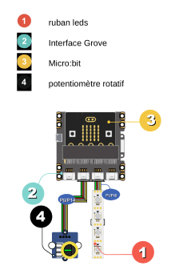

### Code Exemple

```python
from microbit import *
from micro_grove import *
import neopixel
np = neopixel.NeoPixel(pin1, 30)
np.clear()
rouge = (255, 0, 0)
vert = (64, 255, 12)
magenta = (219, 0, 115)
while True:
  if button_a.is_pressed():
    couleur = rouge
  elif button_b.is_pressed():
    couleur = vert
  else:
    couleur = magenta

  # on calcule le nbre de leds à allumer
  potentiometre = position_curseur(pin0)
  nombre_de_leds = (int)(potentiometre / 3.3)
  #on eteint tout
  for x in range(30):
    np[x] = (0, 0, 0)

    # on allume le nombre de leds calculé
    for x in range(nombre_de_leds):
      np[x] = couleur

  # on applique les changements sur le ruban
  np.show()
  sleep(100)
```
Observe l’effet d’une action sur le potentiomètre, puis le bouton A et enfin le bouton B

### Approfondissement possible

Recherche sur Internet le code RVB de la couleur BLEU, et modifie le programme
pour allumer quand on appuie sur le bouton B.

## Projet 8 : Métronome

Dans cette démo, tu vas apprendre à créer un
métronome qui te donnera le tempo. 

Il faut peut-être alimenter la carte micro:bit avec des piles pour avoir
suffisament de puissance.

### Montage


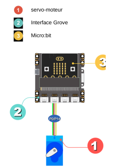

### Code exemple 

```python
from microbit import *
from micro_grove import angle_servomoteur
from utime import sleep_us

#on positionne le servomoteur à droite
angle_servomoteur(pin0, 45)
sleep(1000)
#tempo moderato = 60 pulsations par seconde
duree=10400
while True:
  if button_a.was_pressed():#on demarre ave le bouton A
    while not button_b.was_pressed():# on arrete avec B
      for x in range(45, 135,+2):
        angle_servomoteur(pin0,x)
        sleep_us(duree)
    for x in range(135, 45, -2):
      angle_servomoteur(pin0,x)
      sleep_us(duree)
```

Avec le chronomètre de ton smartphone, vérifie qu’on obtient bien 60
battements du servomoteur par minute.


### Approfondissement possible

Modifie le programme pour obtenir un tempo Moderato à 110 pulsations par minute.
Peux-tu expliquer pourquoi on ne peut par obtenir un tempo Prestissimo à 200
pulsations par minutes.

## Projet 9 : commande à distance

Dans cette démo, tu vas apprendre à utiliser une
deuxième carte microbit pour agir à distance.

### Montage


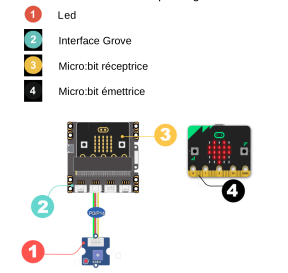

Led
Interface Grove
Micro:bit réceptrice
Micro:bit émettrice

### Code : carte émétrice

```python
from microbit import *
import radio
#on choisit un canal
radio.config(channel=22)
radio.on()
while True:
  if button_a.was_pressed():
    radio.send("Allume")
  if button_b.was_pressed():
    radio.send("Eteint")
  sleep(100)
```


À toi de jouer
S’il y a d’autres cartes microbit qui utilisent a radio à proximité, choist un autre canal entre 0 et 83.

### Code : carte réceptrice

```pyhton
from microbit import *
import radio
#on choisit un canal
radio.config(channel=22)
radio.on()
etat_led = 0
while True:
  message = radio.receive()
  if message == "Allume":
    etat_led = 1
  if message == "Eteint":
    etat_led = 0
  pin0.write_digital(etat_led)
  sleep(100)
```

S’il y a d’autres cartes microbit qui utilisent a radio à proximité, choist un autre canal entre 0 et 83. 
Vérifie que la télécommande fonctionne bien.
Essaie de trouver par expérience la portée maximale de la radio.

### Approfondissement possible

Ajoute un feedback ! Pour faire ça, affiche l’état de la led (A ou E)
sur la matrice


## Projet 10 : Éclairage automatique économique

Dans cette démo, tu vas apprendre à allumer un éclairage
extérieur quand il fait nuit, mais uniquement si on détecte la
présence de quelqu’un. Ça permet d’économiser l’énergie.

### Montage


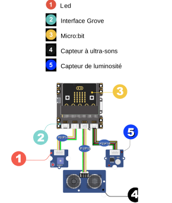


### Code exemple

```python
from microbit import *
from micro_grove import *
Capteur de luminosité
etat_led = 0
while True:
  # Valeur fournie par le capteur ultra-sons
  t = mesure_temps_A_R(pin1)
  distance = t * 0.034328 / 2 # cm
  # Valeur fournie par le capteur de luminosité
  mesure_lum = luminosite(pin2)
  if mesure_lum < 10:
    # il fait nuit
    if distance < 100:
      # on detecte une présence
      etat_led = 1
    else:
    # il n'y a personne
    if etat_led == 1:
      sleep(5000)
    etat_led = 0
  else:
    # il ne fait pas nuit
    etat_led = 0
  pin0.write_digital(etat_led)
  sleep(1000)
```

Vérifie que la led s’allume quand on recouvre le capteur de luminosité et qu’on passe sa main devant


### Approfondissement possible

Peux tu modifier le code pour que la led reste allumée 10 secondes après 
qu’on s’est éloigné du capteur

## Projet 11 : télémètre à ultra-sons

Dans cette démo, tu vas apprendre à mesurer une
distance et à l’afficher.

### Montage

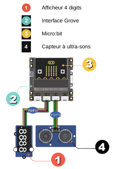

Capteur à ultra-sons

### Codeexemple 

```python
from microbit import *
from display_4d import D4AFF7SEG
from micro_grove import mesure_temps_A_R
from math import ceil

aff_4D = D4AFF7SEG(clk=pin0, dio=pin14)
while True:
  # le capteur nous fournit le temps d’un
  # d’un aller retour des ultra-sons
  t = mesure_temps_A_R(pin1)
  # on calcule la distance à partir de la vitesse du son
  distance = ceil(t * 0.034328 / 2) # cm
  aff_4D.affiche(distance)
  sleep(500)
```

Place un objet plat (un livre par exemple) à une distance connue devant le
capteur à ultra-sons et vérifie que la valeur affichée sur les afficheurs
est cohérente.

Essaie de trouver par expérience la distance maximale qu'on peut mesurer en
se plaçant à distance d’un mur.

### Approfondissement possible


* Modifie le programme pour afficher la distance en millimètres
* Mesurer la vitesse du son ! En utilisant une distance connue, on peut estimer
  le temps nécessaire pour un aller retour à l'onde sonore.


# Librairies

Cette page regroupe la documentation des librairies

## `micro_grove.py`

```python
mesure_temps_A_R(broche) -> float
```

* Module grove : Ultrasonic ranger
* Renvoie la durée d'un aller / retour des ultra sons en micro secondes
* Paramètre : Nom de la broche utilisée, (pin1 par défaut)

```python
mesure_temperature(broche, modele: int) -> float
```

* Module grove : Temperature sensor
* Renvoie la température en degré celsius
* Paramètres : nom de la broche utilisée (pin2 par défaut, version du modèle de
  de capteur: 0, 1 ou 2 - 0 par défaut)

```python
luminosite(broche) -> float
```

* Module grove : Light sensor
* Renvoie un entier entre 0 et 100. 100 correspond à 100% soit environ 60 lux
* Paramètre : nom de la broche utilisée (pin 0 par défaut)

```python
it_s_dark(broche) -> float
```

* Module grove : ligth-sensor
* Renvoie `True` si la luminosité est inférieure à 10 lux
* Paramètre : nom de la broche utilisée (pin 0 par défaut)


```python
position_curseur(broche) -> int
```

* Module grove : Rotary angle sensor (potentiomètre)
* Renvoie un entier entre 0 et 100 indiquant la position du bouton
* Paramètre : nom de la broche utilisée (pin 0 par défaut)


```python
affiche_jauge(val: float, val_max=100: int) -> None
```

* Module grove : -
* Utilise la matrice à LEDs
* Affiche une valeur sous forme de jauge (graphe en bâton) sur la matrice à leds
* Paramètre : val (`float`) la valeur à afficher, `val_max` la plus grande valeur
  possible, 100 par défaut.


```python
angle_servomoteur(broche = pin0, angle = 0)
```

* Module Grove - Grove-Servo
* positionne le servomoteur à un  0 < angle < 180 degrés
* Paramètre : Nom de la broche utilisée, angle

## `display_4d.py`

Importer la classe avec :

```python
from display_4d import D4AFFSEG
```

Initialiser un objet :

```python
aff_4D = D4AFFSEG(clk=pin0, dio=pin14)
```


Ensuite on peut utiliser les méthodes suivantes :

```python
aff_4D.affiche(valeur)
```

* Affiche valeur sur les 4 afficheurs
* paramètre `valeur`, entier entre -999 et 9999 
* exemple `aff_4D.affiche(1234)`

```python
aff_4D.affiche_2(heure, minute, separateur)
```

* Affiche l'heure avec éventuellement un séparateur (`:`)
* paramètres : heure et seconde des `int`
* exemple : `aff_4D.affiche_2(20, 30, True)`
