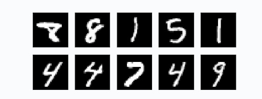

_Voici un projet de fin d'année pour ceux qui voudraient travailler
un peu autour de kNN avec d'autres données réelles_

_Ce projet ne présente aucune nouveauté théorique, seulement un moyen
simple de manipuler des fichiers de données et d'en déduire des informations._

# OCR

L'_OCR_ (Reconnaissance Optique de Caractères) désigne les procédés informatiques
pour la traduction d'images de textes imprimés en fichiers texte.

L'idée est de partir d'une image représentant un chiffre ou une lettre et d'en
extraire le contenu.

Il existe d'innombrables méthodes pour y parvenir et nous allons en présenter
une simpliste permettant de reconnaître des chiffres manuscrits.

# Les données : "_The MINST Database_"

Partagées par Yann LeCun, un chercheur informatique français travaillant maintenant
pour Facebook et pionnier de l'intelligence artificielle, ce jeu de données
comporte quelques milliers de chiffres manuscrits, photographiés et présentés
dans un format standard.

Toutes les images ont cette allure :



**Format des images MNIST** : Ce sont des images en niveau de gris, blanches
sur fond noir de dimensions 28x28 pixels.

Ce traitement des données préalable nous permet d'attaquer directement
le sujet.

Nous allons créer un programme qui reconnaît des chiffres dans ce format.

Ainsi, une fois que nous aurons testé notre programme sur les images du jeu de
données, nous pourrons nous assurer qu'il est capable de reconnaître
un chiffre écrit à la main enregistré dans une image qui respecte
ce format.

Nous allons utiliser l'algorithme de classification kNN. Ce n'est sûrement
pas le meilleur et nous n'obtiendrons pas d'excellents résultats.

Les algorithmes modernes commensent par résumer chaque image en quelques
données intéressantes. Ensuite ils créent un modèle capable de fonctionner
rapidement. Ce n'est pas ce que fait kNN

## Cahier des charges

1. Récupérer le jeu de données ???
2. Décompresser les données afin d'obtenir 4 fichiers :

  * les images d'entrainement ???
  * les labels de ces images d'entrainement ???
  * les images de test ???
  * les labels de ces images de test ???


3. Écrire une fonction qui converti un octet (`byte`) en l'entier qui lui correspond
4. Ouvrir les images et extraire le tableau d'octets.
  
    Ces images sont enregistrées sous la forme de 28 x 28 pixels, un octet par pixel.

    On éxtrait donc 28 lignes de 28 octets. Il convient d'en faire un tableau
    de 784 entiers.

    Plus précisément :

    Les deux fichiers d'image sont enregistrés dans un fichier dont :

    * les 4 premiers octets indique le type de fichier (sans intérêt),
    * le nombre d'image occupe les 4 octets suivants,
    * la largeur de chaque image occupe les 4 octets suivants (on doit trouver comme valeur $28$)
    * la hauteur de chaque image occupe les 4 octets suivants (on doit trouver comme valeur $28$)
    * chaque image est un lot de 784 octets.


    Le plan est donc simple :

    1. On ouvre le fichiers d'image avec Python en mode `rb` (read bytes), 
    2. On zappe 4 octets,
    4. On lit le nombre d'images `nb_image`,
    3. On calcule les dimensions (on le fait réellement !) 

        * deux lectures de 4 octets,
        * conversion en entier,
        * produit de ces entiers.
    4. Dans une boucle on remplit une double liste, chaque sous-élément étant
      les pixels d'une image (1 octet chacun)

  À cette étape les images sont chargées en mémoire.

5. Recommencer avec le fichiers des labels. Cette fois on a :

    * 4 octets pour le format,
    * 4 octets pour le nombre de labels,
    * 1 octet par label.

  À cette étape les labels sont chargées en mémoire.


On prendra soin d'avoir crée deux fonctions bien propres et utilisant des variables
explicites.

7. Nos images étant représentées par des tableaux d'octets, on peut maintenant
    les considérer comme des tableaux de nombres et mesurer la distance
    qui sépare deux images.

    Comment ?

    Avec une distance euclidienne, c'est-à-dire la distance usuelle.

    Vous connaissez la formule à deux dimensions :

    $$d = \sqrt{(x_B-x_A)^2 + (y_B-y_A)^2}$$


    Avec `a` et `b` et les notations habituelles de l'info cela donne :

    $$d = \sqrt{(a[0] - b[0])^2 + (a[1] - b[1])^2}$$

    Et lorsqu'on a plus de deux dimensions ? Et bien on fait une boucle pour
    additionner tous les $(a[i] - b[i])^2$.

    Écrire une fonction qui prend deux listes d'octets de même longueur
    et réalise cette opération.

    On prendra soin de convertir les octets en entier avec la fonction crée
    plus tôt.


8. **kNN** on y arrive !

    Le procédé est le même que celui des TP traités en classe :

    On crée une fonction qui reçoit trois listes et un entier :

    1. les pixels des images d'entrainement,
    2. les labels de ces images,
    3. les pixels des images de test,
    4. `k` le nombre de voisins qu'on décide d'examiner. Un entier généralement impair.

    Pour chaque image de test, 
    Elle déterminer la distance entre cette image et toutes les images d'entrainement,
    Ensuite elle trie ce tableau selon les distances croissantes (il convient
    d'introduire les indices à cette étape pour savoir de quel chiffre on parle).

    Ensuite elle garde les `k` voisins les plus proches et décide du label
    à apporter selon un vote majoritaire.

    On renvoie cette liste.

    On peut maintenant comparer la prédiction avec le vrai label, (le dernier
    fichier, qu'on n'a pas encore utilisé).

    Les données étant massives, il convient de développer avec de petites valeurs
    avant de passer à un test grandeur nature.

9. Mesurer la précision. Écrire une fonction qui mesure la précision et tester
     sur l'ensemble des données. S'approche-t-on des meilleurs scores ? 
     (12% d'erreur en 1998, 0.23% d'erreur en 2012 ?)

9. Comparer avec nos chiffres.

    Dans paint ou autre, créer un `.png` de 28x28, fond noir, chiffre manuscrit centré
    en blanc similaire aux chiffres de MNIST.

    Je fournis deux fonctions permettant d'importer ces images dans le format
    de nos tableaux définis plus haut :

    ```python
    from PIL import Image
    import numpy as np

    def read_image(path):
        return np.asarray(Image.open(path).convert('L'))

    def write_image(image, path):
        img = Image.fromarray(np.array(image), 'L')
        img.save(path)
    ```

    Elles devraient fonctionner sur les ordinateurs du lycée. Chez vous penser à
    installer les librairies `pillow` et `numpy`.

    Il ne reste plus qu'à tester avec un chiffre que vous écrivez si
    kNN est capable de le reconnaître. On peut enregistrer les images
    de test au fur et à mesure. Cela aide à comprendre pourquoi certaines
    sont mal reconnues.

    Certains chiffres passent mal (9, 7) d'autres mieux (2). Pourquoi ?

## Approfondissement

1. Le compromis vitesse / efficacité :

    Utiliser toutes les images d'entrainement améliore le score, au prix d'une
    exécution très lente. Faire quelques essais. Le temps dépend bien sûr
    de la puissance de votre machine.
2. Jouer sur la valeur de `k` change le résultat. Quel `k` donne
    les meilleurs scores pour 1000, 10000, 30000 images d'entrainement ?

3. Afficher quelques images et leur valeur. On peut réaliser une jolie
    présentation en Python de ce qu'on a prédit.

## Remarques

Cette méthode est très lente, on l'a déjà dit. Il conviendrait de bosser
un peu plus en amont pour créer un programme qui ne nécessite pas de comparer
les _images_ entre elles mais d'en dégager des caractéristiques intéressantes.

C'est ainsi qu'on atteint les meilleurs résultats et ce qui est fait
dans tous les programmes modernes reconnaissant des images (filtres snapchat etc.)

De nombreuses librairies Python font ce travail. Un exemple est donné
dans la partie suivante.

On peut étendre cette approche à un autre jeu de données `Fashion MNIST`, des images d'articles de mode
pré traitées selon un format similaire.

Votre algorithme reconnait-il une chaussure d'un T-shirt ?


## Version moderne de la classification avec TensforFlow et Keras :

Google Colab a été afin de créer "facilement" des modèles de calcul scientifique.

La librairie TensforFlow de Google permet de comparer notre modèle : [Google Colab](https://colab.research.google.com/github/tensorflow/examples/blob/master/lite/examples/digit_classifier/ml/mnist_tflite.ipynb#scrollTo=xPtbtEJ2uacB)

Exécutez les cellules une par une. 

Le code qu'elle contient est largement hors programme, il repose sur des mathématiques
relativement poussées, suppose d'avoir étudié l'apprentissage automatique et
de connaître TensforFlow et Keras. Le modèle atteint 2.47% d'erreur sur 313 images.

On est encore loin des meilleurs résultats mais c'est un début impresionnant !
