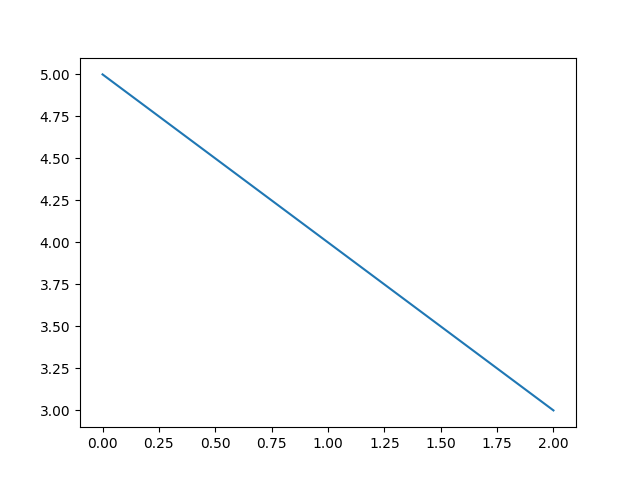

# Importer un fichier python ou une fonction

pdf: [pour impression](./importer.pdf)

## Importer : deux méthodes aux syntaxes différentes

Il est courant de devoir utiliser des morceaux de programmes déjà écrits.

On connait la syntaxe :

```python
import math

print(math.pi)
```

et on peut accéder à toutes les fonctions de la librairie `math` avec
`dir(math)` ou l'aide `help(math)`

Il est aussi possible de n'importer qu'un objet particulier avec :

```python
from math import pi

print(pi)
```

Cette fois, on n'a accès qu'à ce qu'on a importé.

C'est plus simple pour écrire le code et cela évite de créer beaucoup d'identifieur inutiles.


Attention cependant, `import module` et `from module import objet` conduisent tous deux à ce que
Python charge tout le `module`... Il n'y pas d'économie de mémoire à utiliser le second.


Enfin, on peut renommer des modules en les important :

```python
import matplotlib.plot as plot


plot([0, 1, 2], [5, 4, 3])
plot.show()
```




## `if __name__ == "__main__:"`

Si vous lisez du code, vous rencontrerez régulièrement cette syntaxe à la fin d'un fichier.

Généralement, elle est suivie d'une ou plusieurs lignes consistant à appeler une fonction.

Qu'est-ce ?

Lorsqu'on exécute un fichier python directement `python mon_script.py`, en mémoire, le module
entier (`mon_script.py`) s'appelle toujours `__main__`.

Lorsqu'on _importe_ un module avec `import` il porte alors un autre nom.

Ainsi, cette condition `__name__ == "__main__"` n'est vraie que lorsqu'on importe directement.

Généralement, on souhaite qu'au moins une fonction soit exécutée... Parfois simplement un test.

Par contre, lorsqu'on importe une module, on n'a pas forcément envie que certains tests soient réalisés.

### Un exemple

Imaginons qu'on écrive une librairie `vecteurs.py` avec toutes les opérations vectorielles courantes (indispensable pour créer des jeux-vidéos par exemple...)

Alors on aurait :

```python
def ajouter(vec1, vec2):
    """Ajoute deux vecteurs"""
    ...

def test():
    assert ajouter(Vecteur(1, 2), Vecteur(3, 4)) == Vecteur(4, 6)
    ...

if __name__ == "__main__":
    test()
```

Et ce test ne sera effectué que si on exécute directement, pas lorsqu'on importe la
librairie pour faire des calculs.


## `#! /usr/bin/python3` et `#! c:\python\python.exe`

Ces lignes sont parfois présentes en première ligne d'un fichier.
Elles servent à indiquer au système d'exploitation comment lancer ce fichier.

Elles permettent donc de rendre le fichier exécutable (il y a autre chose à faire) directement, sans passer par `python mon_script.py`
