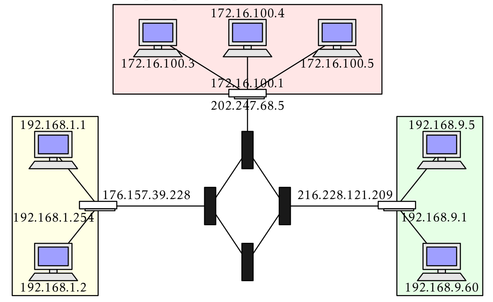
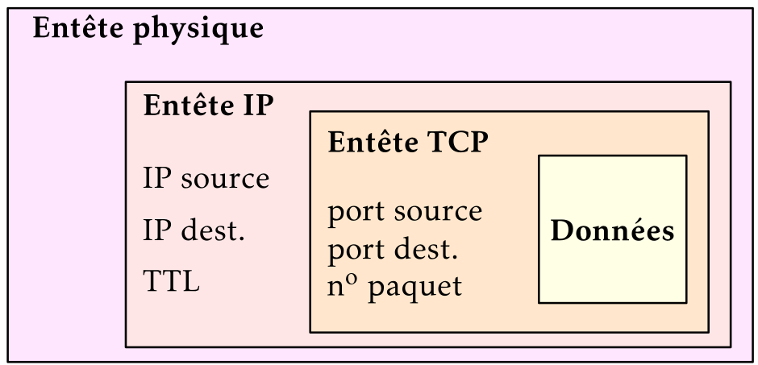
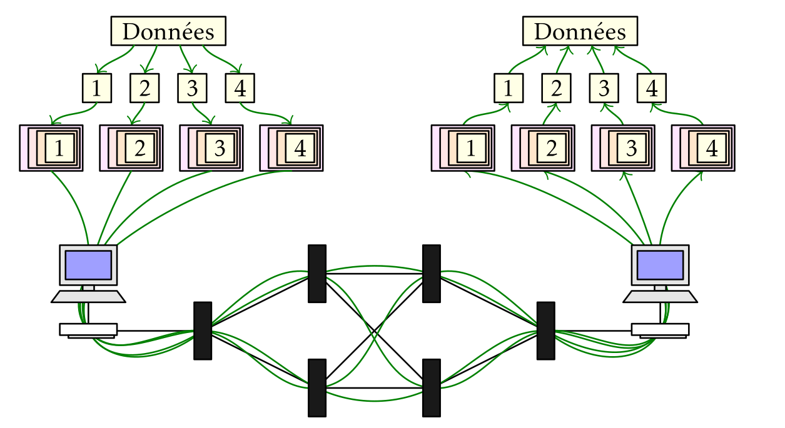
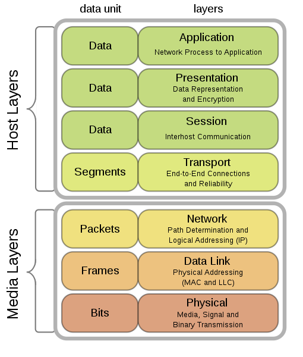
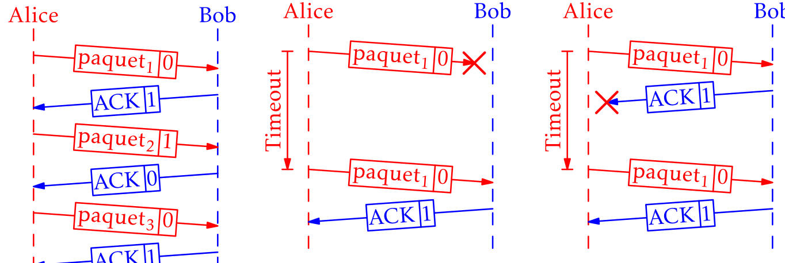
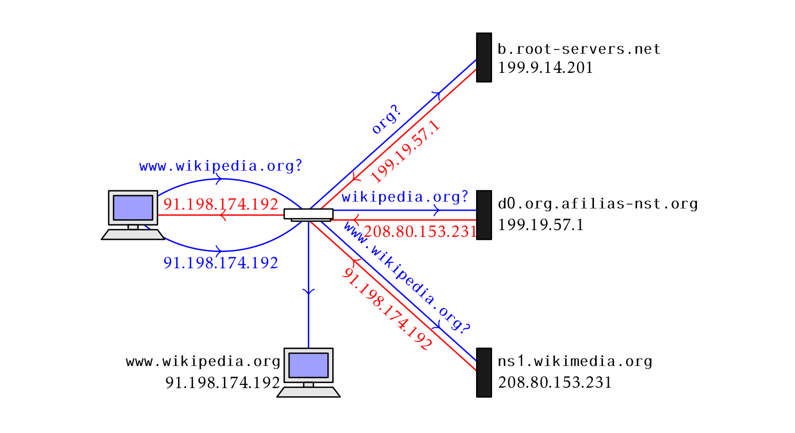

[pdf](./reseau_cours.pdf)

## Réseau

Lorsqu'on relie plusieurs ordinateurs on dit qu'ils sont en **réseau**.

La laison entre ces machines peut être filaire (un câble) ou non (ondes radio).

Nous allons étudier les protocoles qui sont employés sur internet afin de relier
les machines, à savoir TCP et IP

## Liaison physique

Dans l'usage courant, on rencontre :

- les câbles ethernet munis de port RJ45
- les réseaux domestiques Wi-Fi (Wireless Fidelity)
- les réseaux mobiles GSM (Global System for Mobile Communications)

## Adresse IP

**IP** pour, _Internet Protocol_ désigne à la fois le protocole utilisé et
l'adresse d'une machine sur un réseau IP.

### IPv4, IPv6

Commençons par le protocole dont vous avez tous entendu parlé, IPv4.

Ses adresses sont généralement présentées sous la forme de 4 nombres entre 0
et 255 donnés sous forme décimale et séparés par des points : `192.168.0.1`

**Adresse IPv4** : 4 nombres entiers entre 0 et 255 = 4 paquets d'un octet = 32 bits.

Il y a donc $256^4 = 2^{32} = 4~294~967~296$ adresses IPv4 différentes.

Toute machine reliée à un réseau IP se voit attribuer une adresse IP permettant
de l'identifier.

Plus rarement, on donne l'adresse et un complément : `192.168.0.1/24`

Le `/24` permet de distinguer la partie **réseau** de la partie **machine**
dans cette adresse.

### Partie réseau, partie machine

Considérons une adresse IPv4 complète : `192.168.1.2/24`

Le `/24` signifie que les 24 premiers bits (= les 3 premiers octets = les 3 premiers
nombres) constituent la partie **réseau** et les 8 derniers ($32-24=8$) la partie
**machine**.

Aussi, la partie réseau est : `192.168.1.0` et ce réseau peut abriter $2^8=256$ machines
différentes. En pratique un peu moins, certaines adresses étant réservées.

Lorsque le nombre de bits de l'adresse réseau est multiple de 8 il n'y a aucune difficulté :

- `/8` : 8 premiers bits, adresse réseau de la forme `a.0.0.0` et jusqu'à $2^{24}$ machines
- `/16` : 16 premiers bits, adresse réseau de la forme `a.b.0.0` et jusqu'à $2^{16}$ machines
- `/24` : 24 premiers bits, adresse réseau de la forme `a.b.c.0` et jusqu'à $2^{8}$ machines

Cela devient plus complexe avec une adresse réseau occupant un autre nombre. On
utilise alors un **masque de sous réseau**.

#### Masque de sous réseau

Traitons rapidement le cas d'une adresse en `/22`

La partie réseau occupe 22 bits et la partie machine 10 bits.

Par exemple pour `122.34.170.45/22`

On converti l'adresse IP en binaire, complétés par des 0 à gauche pour occuper
un octet :

`01111010.00100010.10101010.00101101`

Ensuite, on écrit le **masque de sous réseau**, constitué de 22 bits à 1 et 10
bits à 0 :

`11111111.11111111.11111100.00000000`

On réalise ensuite un ET logique, bit par bit entre l'adresse IP et son masque :

```
    01111010.00100010.10101010.00101101
ET  11111111.11111111.11111100.00000000
---------------------------------------
=   01111010.00100010.10101000.00000000
```

Soit : `122.34.168.0`

Et ceci nous donne l'adresse réseau.

De toute évidence, ce n'est pas difficile à programmer, c'est plus difficile
pour un humain.

#### Épuisement des adresses IPv4

C'est une difficulté majeure, on ne dispose que de 4 milliards d'adresses, moins
qu'il n'existe de machines actuellement connectées à internet.

Aussi, il faut trouver des solutions pour reconnaître les machines
sur internet.

Une approche est de modifier la norme IPv4 afin de proposer davantage d'adresses.

### IPv6

Cette nouvelle norme utilise 128 bits (au lieu de 32) soit largement assez
pour donner une adresse unique à chaque machine.

Il y a donc $2^{128}$ adresses IPv6 disponibles...

La partie réseau occupe toujours les 64 premiers bits et la partie machine les
64 derniers bits.

Les adresses IPv6 sont généralement données en hexadécimal : `43:2f:5b:df:b2:f4`

### Réseaux publics et privés

Internet est un ensemble de réseaux publics, chaque machine raccordée à internet
peut transmettre des données à une autre machine.

Les données transitent par des routeurs qui sont des machines raccordant plusieurs
réseaux entre eux. Ces routeurs ont donc plusieurs adresses IP, une par
réseau.

Un routeur peut relier plusieurs réseaux publics ou relier un réseau privé
à un réseau public.

Lorsqu'on effectue une recherche depuis un poste du lycée vers une machine
distante, c'est le routeur qui se charge de transmettre les données.

$\;$

## Protocole IP

Le rôle du protocole IP est de transmettre des **paquets IP** provenant d'une
couche supérieure (nous reviendrons sur ce terme) .

Ces paquets sont **encapsulés** avant d'être transmis sur le réseau puis
**décapsulés** par la machine qui les reçoit.

Ce protocole est dit "non orienté", cela signifie qu'aucune route prédéfinie
n'est établie à l'avance. Deux paquets qui se suivent peuvent emprunter
deux chemins différents et arriver dans le désordre. Charge à la machine
les recevant de les réordonner.

Pour simplifier grandement, IP, c'est comme la poste.

### Fiabilité

Ce protocole est dit "non fiable", cela ne signifie pas que les données
sont déteriorée ou perdues mais qu'aucune règle ne permet de s'assurer :

- qu'ils sont arrivés à bon port
- qu'ils sont arrivés dans l'ordre d'émission

Cette fiabilité est assurée par un autre protocole... TCP.

## TCP/IP

TCP/IP désigne l'ensemble des deux protocoles principaux sur internet.

C'est un modèle en quatre couches :

| numéro | Couche        | Exemple                  |
| ------ | ------------- | ------------------------ |
| 4      | Application   | HTTP, FTP, DNS, SMTP,... |
| 3      | **Transport** | TCP, UDP,...             |
| 2      | **Réseau**    | IP, ARP,...              |
| 1      | Liaison       | Ethernet, Wi-Fi          |

Ainsi, lorsqu'on surfe sur le web, le navigateur utilise le protocole
HTTP. Il n'a pas de contrôle sur les autres protocoles utilisés en dessous
de lui.

En pratique cela signifie qu'on verra apparaître la même page qu'on soit
raccordé en Wi-Fi ou en Ethernet.

### Encapsulation

Considérons le fichier html suivant :

```html
<html>
  </head>
    </title>Titre</title>
  </head>
  <body>
    <h1>Super</h1>
  </body>
</html>
```

1. HTTP ajoute une entête à cette page :

   ```html
   HTTP/1.1 200 OK
   Content-Length: 327
   Date: Thu, 05 Aug 2021 06:58:21 GMT
   Server: Google Frontend
   accept-ranges: bytes
   cache-control: public, max-age=3600
   content-type: text/html
   expires: Thu, 05 Aug 2021 07:58:21 GMT
   last-modified: Thu, 24 Jun 2021 16:54:03 GMT

   <!DOCTYPE html>
   <html>
     </head>
       </title>Titre</title>
     </head>
     <body>
       <h1>Super</h1>
     </body>
   </html>
   ```

   Cette entête contient une information importante, la taille du contenu : `Content-Length: 327`

2. TCP encapsule cette page dans différents **segments** TCP

   Il ajoute quelques informations avant le contenu (généralement sur $6 \times 32$ bits)

3. IP encapsule ce ou ces segments en différents **paquets** IP

4. Ces paquets sont encapsulés par la couche laision, ajoutant une entête physique

5. Ces paquets sont transmis à la machine de destination via la couche liasion

6. la machine de destination lit l'entête physique et décapsule

7. La machine de destination décapsule les paquets IP

8. La machine destination décapsule les segments TCP et les réordonne

9. Le navigateur interprète ces données et les lit.



### TCP

On l'a dit, le protocole TCP (Transmission Control Protocol) est un protocole
de transport "fiable" et "connecté" :

- fiable : TCP assure que les segments sont tous arrivés à destination et
  rétabli l'ordre correct.
- connecté : une session de communication comportant un début, une fin et
  une phase de validation des données.

Le rôle de TCP est donc de s'assurer que les données arrivent à bon port
et sont correctes. Les segments TCP comportent donc des informations permettant
de s'assurer de la validité des donneés qu'ils transportent.

Chaque segment envoyé par une machine A vers une machine B est suivie d'un
accusé de réception de la machine B vers la machine A.

En l'absence de celui-ci, la machine A recommence et renvoie le même segment.

### Trajet sur le réseau

$\:$

Les données, découpées et encapsulées sont transmises sur le réseau par
le protocole IP. Les paquets n'empruntent pas forcément le même chemin
et n'arrivent pas forcément dans l'ordre.

Une fois décapsulées, elles sont réordonnées par TCP.

#### Ports

Une machine peut établir plusieurs connexions TCP en même temps. Afin de
les distinguer on ajoute une information supplémentaire, le **port réseau.**

TCP n'est pas le seul protocole à utiliser ces ports.

Les ports sont des nombres sur 16 bits, généralement notés en décimal, entre 0 et $2^{16} = 65536$

Ils sont généralement ajoutés à la fin de l'adresse IP après le symbole `:` (deux points)

`192.168.1.2:80`

Remarquez bien la différence avec le masque, qu'on indique avec un slash.

Chaque fois que vous ouvrez deux onglets dans le navigateur, celui-ci établi une
connexion avec une machine différente et se voit attribuer un port de réception
différent.

### Modèle OSI

Le modèle TCP/IP n'est pas le seul modèle servant à décrire les étapes de connexion
sur un réseau. Un autre modèle théorique existe, appelé OSI et constitué de 7 couches.

Il n'a jamais vraiment été mis en oeuvre, les grands acteurs d'internet et de l'informatique
ne sont pas parvenus à s'entendre sur ce sujet.

$\:$

TCP/IP est donc représenté par les couches `segments` et `packets` du modèle OSI.

### Principes

#### Les grandes règles du modèle OSI

- Chaque couche est indépendante
- Chaque couche ne peut communiquer qu'avec une couche adjacente

### Chaque couche est indépendante

- Les informations d'une couche ne peuvent être utilisées dans une autre
- Exemple : l'adresse IP (couche 3) ne pourra être utilisée ailleurs
- Cela permet l'évolution des communications dans le temps
- Elles sont interchangeables : IPv4 va devenir IPv6 sans qu'on doive tout réécrire

### Chaque couche ne peut communiquer qu'avec une couche adjacente

**Exemple :** on entre `google.com` dans le navigateur.

Le navigateur (application) s'est adressé aux couches réseau (1 à 4) pour qu'elles transmettent l'information à l'application sur la machine demandée (le serveur web de google)

## Protocole du bit alterné

Le **protocole du bit alterné** est un protocole simplifié assurant la fiabilité
de la communication de TCP. Il permet, dans une certaine mesure, de s'assurer
qu'un segment a bien été reçu.

Le destinataire confirme la bonne réception d'un message. Ce protocole n'utilise
qu'un bit.

- Lors de l'envoi d'un message (paquet dans le diagramme), on ajoute un bit
  (0 pour le premier paquet, ensuite 1, ensuite 0 etc.)
- Lors de la réception d'un paquet, le destinataire renvoie un paquet `ACK`
  suivi du bit contraire (1 pour le premier, puis 0, puis 1 etc.)
- Si l'expéditeur reçoit `ACK | 1` comme attendu, il poursuit en envoyant `paquet_suivant | 1`
- Si l'expéditeur ne reçoit pas`ACK | 1`, il recommencé avec `premier_paquet | 0`

Après l'expédition de chaque paquet, l'expéditeur compte à rebours. S'il ne reçoit
pas l'acquittement attendu avant d'être arrivé à 0, il recommence.

_De gauche à droite : transmission sans erreur, erreur d'émission, erreur lors de l'acquittement_

$\;$

## Compléments

Présentons quelques protocoles utilisés couramment :

Ils sont classés en haut en bas dans le modèle TCP/IP

### SMTP

SMTP pour _simple mail transfer protocol_ est, avec POP et IMAP un des protocoles
utilisés pour envoyer des emails. Que vous utilisiez une application en ligne
(un webmail comme hotmail ou gmail) ou une application native sur votre téléphone
ou ordinateur, SMTP sera généralement employé pour envoyer un mail.

SMTP utilise la couche transport TCP. SMTP ajoute les adresses d'expédition,
de destination, les adresses de copie et l'objet à un mail.

TCP ne peut
transférer que du texte, généralement sur 8 bits. On parvient à transférer
des pièces jointes en convertissant leur contenu sous forme de texte.

Une image est donc transformée en texte avant d'être transférée.

Considérons l'image de la pile OSI vue plus haut, elle va être transformée en :

```
iVBORw0KGgoAAAANSUhEUgAAAf4AAAJYCAIAAAAMoBMcAAAABGdBTUEAALGPC/xhBQAAACBjSFJN
AAB6JgAAgIQAAPoAAACA6AAAdTAAAOpgAAA6mAAAF3CculE8AAAABmJLR0QA/wD/AP+gvaeTAACA
AElEQVR42uydZ3wUVReH7/aa3c1m0za9N9ILaUBIQpWOIiAWul1pymsDFBQpdkUBQaWIqCC9hZpO
KiQhvSebbHazvdf3w+AS00hCeu7zy4fsnTszd87M/...
```

Cette image occupe 64ko et, une fois convertie en texte, 85ko.

### UDP

UDP pour _user datagram protocol_ est un autre protocole de la couche transfert,
comme TCP.

Il envoie les données sous forme de _datagrammes_ entre deux machines définies
par une adresse IP et un numéro de port. C'est un protocole déconnecté qui n'assure
pas la fiabilité des Communications.

Il est utilisé pour transférer des données en flux (streaming, jeux vidéos),
généralement après avoir établi une communication via un autre procédé.

### DNS

DNS pour _Domain Name System_ est un service effectué par une machine d'un réseau
pour attribuer des noms à des adresses IP. C'est donc _une machine_ qui effectue
ce travail pour tout un réseau. Chaque machine d'un réseau se voit attribuer un ou plusieurs
serveur DNS. Un premier sur son réseau local (généralement votre box), un second sur
internet (généralement celui de votre fournisseur d'accès à internet).

Le DNS local connait le nom des machines de votre réseau, le DNS distant permet
de trouver le nom des machines sur internet.

C'est ce serveur qui traduit l'adresse d'une requête http comme `https://google.com`
en une adresse IP : `2a00:1450:4007:811::200e`

Cette résolution DNS se fait étape par étape, depuis la racine vers le domaine
(de droite à gauche en lisant l'adresse).

Par exemple pour `www.wikipedia.org` :

$\;$

#### Blocage DNS

DNS permet ainsi facilement de bloquer certaines adresses.
Par exemple pour bloquer "phishing.pirate.com" pointant vers l'adresse
fictive `1.2.3.4`, le DNS ne répond pas lorsqu'on lui demande l'adresse.

Il est possible de changer de serveur DNS pour utiliser des DNS publics (comme 8.8.8.8)
afin de contourner certains blocages.

### ICMP

ICMP pour _internet control message protocol_ est un protocole utilisé pour
assurer qu'il existe une laison entre deux machines.

C'est un protocole qui utilise IP.

Il est utilisé par deux applications principalement : `ping` et `traceroute`. Ce sont des applications
CLI (command line interface = la console).

- `ping` permet de connaître le temps de latence entre deux machine, le délais d'un
  aller retour.

- `traceroute` permet de connaître les routeurs empruntés lors d'un trajet.

### Les adresses sur un réseau

En particulier, les adresses IP (_Internet Protocol_) et l'adresse MAC (_Media Access Control_).

Toutes deux servent à identifier des appareils sur un réseau mais elles le font à des niveau différents et pour des usages différents.

#### Adresse MAC

Chaque interface réseau (carte réseau Ethernet ou Wi-Fi) possède une adresse MAC unique et définitive attribuée par le constructeur lors de sa création. Elle sert à identifier cette interface sur le réseau local qui contient cette interface.

#### Adresse IP

Comme on l'a dit, il existe deux normes concurrentes pour les adresses IP, IPv4 (192.168.1.1) et IPv6 (3a01:afbb:1234:2200:7e06:1075:fe2d:f32a). Elles servent à identifier une machine sur un réseau qui utilise le protocole Internet.

La transmission de l'information sur un réseau est découpé en couche (voir modèle OSI). L'adresse MAC correspond à la couche "liaison", niveau 2. L'adresse IP correspond à la couche "réseau", niveau 3. Elles sont donc complémentaires.

En pratique, le switch sur lequel est raccordé l'interface retient les adresses MAC de ses machines et leur adresse les messages qui leur sont destinées. Le routeur, lui, connaît les adresses IP.

## Commandes réseau de base

### Comment reproduire ces commandes ?

Nous allons présenter des commandes UNIX et ou Windows.

- Si vous disposez d'une machine sous Linux raccordée à un réseau, elle _devrait_
  être équippée des logiciels nécessaires.
- Sous windows, toutes les machines disposent de `ping` et `ipconfig`. Généralement elles disposent aussi de `tracert`.

Attention ! Dans un réseau particulier, comme celui du lycée, il se peut que
les commandes soient bloquées...

| Commande                            | Unix               | Windows    |
| ----------------------------------- | ------------------ | ---------- |
| Vérifier la connexion à une machine | `ping`             | `ping`     |
| Configurer le réseau de la machine  | `ip` ou `ifconfig` | `ipconfig` |
| Connâitre la route empruntée        | `traceroute`       | `tracert`  |

### Consulter et manipuler le réseau depuis la ligne de commande

Il existe de nombreuses commandes UNIX permettant de configurer et vérifier
le bon fonctionnement d'un réseau. Nous allons présenter les plus courantes.

### `ip a` et `ifconfig` ou `ipconfig` sous windows.

Ces commandes permettent de connaître l'adresse IP, l'adresses MAC et la configuration
d'un réseau (passerelle, masque, serveur DNS etc.)

Par exemple

```bash
$ ip a
1: lo: <LOOPBACK,UP,LOWER_UP> mtu 65536 qdisc noqueue state UNKNOWN group default qlen 1000
    link/loopback 00:00:00:00:00:00 brd 00:00:00:00:00:00
    inet 127.0.0.1/8 scope host lo
       valid_lft forever preferred_lft forever
    inet6 ::1/128 scope host
       valid_lft forever preferred_lft forever
2: enp3s0: <BROADCAST,MULTICAST,UP,LOWER_UP> mtu 1500 qdisc fq_codel state UP
      group default qlen 1000
    link/ether 44:8a:5b:5d:b2:f4 brd ff:ff:ff:ff:ff:ff
    inet 192.168.1.21/24 brd 192.168.1.255 scope global dynamic noprefixroute enp3s0
       valid_lft 76903sec preferred_lft 76903sec
    inet6 2a01:cb0c:9d3:1300:7282:7c64:fe4d:5c3f/64 scope global dynamic noprefixroute
       valid_lft 1800sec preferred_lft 600sec
    inet6 fe80::9f94:147f:291e:4f2/64 scope link noprefixroute
       valid_lft forever preferred_lft forever
3: vboxnet0: <BROADCAST,MULTICAST> mtu 1500 qdisc noop state DOWN group default qlen 1000
    link/ether 0a:00:27:00:00:00 brd ff:ff:ff:ff:ff:ff
```

1, 2, 3 : les interfaces

- `1: lo:` la **boucle locale** une fausse adresse attribuée par mon OS
  à ma propre machine. Tous les OS font ça. Cela me permet de me
  connecter à mes propres serveurs, généralement utilisant le nom `localhost`
  ou l'adresse IP `127.0.0.1`. C'est aussi utilisé lorsqu'on développe un serveur
  incomplet qu'on ne souhaite pas exposer à tout le monde : en limitant l'accès
  à `localhost` seule ma machine peut y accéder.

- `2: enp3s0` (ou plus souvent `2: eth0`) l'interface ethernet branchée en RJ45.
  C'est l'adresse IP de ma machine sur mon réseau local.

- `3: vboxnet0` : c'est l'interface virtuelle crée par le logiciel VirtualBox
  qui fait fonctionner des machines virtuelles. Remarquons qu'elle est `DOWN`
  parce qu'aucune machine virtuelle ne fonctionne en ce moment sur mon ordinateur.

Un autre extrait issu d'une autre machine :

```bash
$ ifconfig
eth0: flags=4099<UP,BROADCAST,MULTICAST>  mtu 1500
        ether b8:27:eb:7e:b6:ca  txqueuelen 1000  (Ethernet)
        RX packets 0  bytes 0 (0.0 B)
        RX errors 0  dropped 0  overruns 0  frame 0
        TX packets 0  bytes 0 (0.0 B)
        TX errors 0  dropped 0 overruns 0  carrier 0  collisions 0

lo: flags=73<UP,LOOPBACK,RUNNING>  mtu 65536
        inet 127.0.0.1  netmask 255.0.0.0
        inet6 ::1  prefixlen 128  scopeid 0x10<host>
        loop  txqueuelen 1000  (Local Loopback)
        RX packets 21001080  bytes 1131867856 (1.0 GiB)
        RX errors 0  dropped 0  overruns 0  frame 0
        TX packets 21001080  bytes 1131867856 (1.0 GiB)
        TX errors 0  dropped 0 overruns 0  carrier 0  collisions 0

wlan0: flags=4163<UP,BROADCAST,RUNNING,MULTICAST>  mtu 1500
        inet 192.168.1.12  netmask 255.255.255.0  broadcast 192.168.1.255
        inet6 fe80::6cf8:8e4d:3af1:3118  prefixlen 64  scopeid 0x20<link>
        inet6 2a01:cb0c:9d3:1300:7123:e217:7019:9426  prefixlen 64  scopeid 0x0<global>
        ether b8:27:eb:2b:e3:9f  txqueuelen 1000  (Ethernet)
        RX packets 13040422  bytes 1456638732 (1.3 GiB)
        RX errors 0  dropped 0  overruns 0  frame 0
        TX packets 14266666  bytes 1383792158 (1.2 GiB)
        TX errors 0  dropped 0 overruns 0  carrier 0  collisions 0
```

Le découpage est similaire, on voit plus d'informations. On voit aussi une nouvelle
interface `wlan0` `Wireless Local Area Network 0` : l'interface wifi.

Cette machine n'est raccordée qu'en Wi-Fi, ce qu'`ifconfig` ne permet que de deviner...

### `ping`

Cette commande est employée pour s'assurer qu'une liaison existe avec une machine
distante et connaître la durée d'un trajet aller retour.

```bash
$ ping google.com
PING google.com(par21s17-in-x0e.1e100.net (2a00:1450:4007:808::200e)) 56 data bytes
64 bytes from par21s17-in.1e100.net (2a00:1450:4007:808::200e): icmp_seq=1 ttl=116 time=10.1 ms
64 bytes from par21s17-in.1e100.net (2a00:1450:4007:808::200e): icmp_seq=2 ttl=116 time=10.5 ms
64 bytes from par21s17-in.1e100.net (2a00:1450:4007:808::200e): icmp_seq=3 ttl=116 time=10.1 ms
64 bytes from par21s17-in.1e100.net (2a00:1450:4007:808::200e): icmp_seq=4 ttl=116 time=10.1 ms
64 bytes from par21s17-in.1e100.net (2a00:1450:4007:808::200e): icmp_seq=5 ttl=116 time=10.3 ms

--- google.com ping statistics ---
5 packets transmitted, 5 received, 0% packet loss, time 4007ms
rtt min/avg/max/mdev = 10.067/10.213/10.502/0.171 ms
```

`ping` a envoyé 5 paquets de 64 octets à google (l'adresse ayant été résolue par un serveur DNS),
tous sont revenus et la latence s'élève à 10.2 ms en moyenne.

L'information `ttl=116`, pour _time to live_ indique le nombre de routeurs qu'un paquet ICMP
peut emprunter avant d'être abandonné par celui-ci.

Chaque routeur enlève 1 à ce TTL avant de transmettre. Le routeur qui arrive à 0 abandonne
le paquet.

### `traceroute`

`traceroute` permet de connaître les routeurs empruntés lors d'une connexion.

1. Un paquet `ICMP` est d'abord envoyé vers cette destination avec un TTL de 1.
   Le premier routeur répond avec son adresse et abadonne ce paquet.
2. Un second paquet `ICMP` est envoyé avec un TTL de 2. Le premier routeur enlève 1
   puis transmet. Le second routeur répond et abandonne.
3. Un troisième paquet est envoyé avec un TTL de 3. etc.

Et on continue comme ça jusqu'à destination.

Rien n'oblige une machine à répondre, on verra alors une `*` dans la sortie de `traceroute`

```bash
$ traceroute ovh.fr
traceroute to ovh.fr (54.39.46.56), 30 hops max, 60 byte packets
 1  Livebox (192.168.1.1)  0.291 ms  0.369 ms  0.466 ms
 2  80.10.239.193 (80.10.239.193)  1.840 ms  1.922 ms  2.976 ms
 3  ae123-0.nclil102.rbci.orange.net (193.253.89.254)  4.456 ms  4.539 ms  4.530 ms
 4  ae42-0.nrlil102.rbci.orange.net (193.252.160.201)  3.122 ms  3.113 ms  3.194 ms
 5  ae41-0.nolil102.rbci.orange.net (81.253.129.9)  2.913 ms  2.997 ms  3.168 ms
 6  be102.rbx-5-a72.fr.eu (94.23.122.225)  7.391 ms  7.339 ms  7.211 ms
 7  be106.rbx-g1-nc5.fr.eu (94.23.122.236)  10.203 ms be106.rbx-g2-nc5.fr.eu
    (94.23.122.238)  9.459 ms be106.rbx- g4-nc5.fr.eu (91.121.131.29)  6.193 ms
 8  lon-drch-sbb1-nc5.uk.eu (54.36.50.230)  10.658 ms  10.830 ms  10.731 ms
 9  be103.gra-g1-nc5.fr.eu (91.121.215.178)  11.439 ms  11.524 ms
    be103.gra-g2-nc5.fr.eu (213.251.128.64)  11.425
 ms
10  * * *
11  * * *
12  * * *
13  www.ovh.fr (54.39.46.56)  9.314 ms  9.391 ms  9.286 ms
```

13 sauts sont nécessaires pour que ma machine puisse joindre `ovh.fr`.

Ma machine est à Lille, le serveur d'OVH est à Roubaix, soit à 15km de chez moi... et pourtant
les paquets sont passés par la Belgique et l'Angleterre.

### `nmap`

`nmap` permet de connaître les ports en écoute sur une machine. Chaque serveur attend de recevoir
des connexions en ouvrant un port TCP prédéfini (80 pour un serveur web non sécurisé, 443 pour un
serveur web sécurisé, 22 pour ssh etc.)

`nmap` indique quel port courant est ouvert sur une machine.

Par exemple pour une imprimante en réseau (c'est un ordinateur...)

```bash
$ nmap Printer
Starting Nmap 7.91 ( https://nmap.org ) at 2021-08-05 10:06 CEST
Nmap scan report for Printer (192.168.2.34)
Host is up (0.0031s latency).
Not shown: 993 closed ports
PORT     STATE SERVICE
80/tcp   open  http
427/tcp  open  svrloc
515/tcp  open  printer
631/tcp  open  ipp
2000/tcp open  cisco-sccp
5200/tcp open  targus-getdata
9100/tcp open  jetdirect

Nmap done: 1 IP address (1 host up) scanned in 0.14 seconds
```

Cette imprimante désuette de 2005 a donc 7 services en cours, attendant une
connexion.
