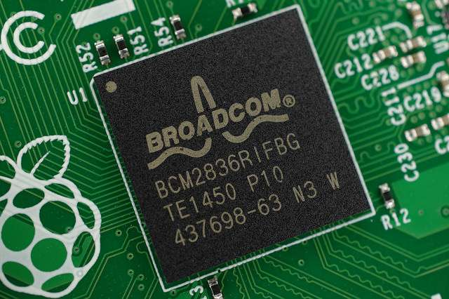

pdf : [pour impression](/uploads/docnsitale/composants/composants_socs.pdf)

## Cours introductif

[Cours introductif](./cours_tp_system_on_chip.pdf) écrit par David Sallé.

### Vidéos du cours

* [Transistors NPN PNP](http://www.youtube.com/watch?v=Uqvk7x6nmfg&t=1m17s)
* [Portes logiques](https://www.youtube.com/watch?v=L_EFljkLz_M&t=1m4s)
* [Calculateurs](https://www.youtube.com/watch?v=L_EFljkLz_M&t=5m02s)
* [SoC](https://www.youtube.com/watch?v=NKfW8ijmRQ4)

    Activer les soustitres traduits automatiquement. Le narrateur s'exprime assez clairement pour que la traduction soit de qualité.

## Composants et systèmes sur puce

### Microprocesseur et mémoire

### L'architecture de base

Le fonctionnement d'un outil numérique, quelle que que soit sa nature
(ordinateur tablette, téléphone, assistant GPS, appareil photo...) est basé sur
deux éléments fondamentaux : 

* le **processeur**

    Aussi appelé microprocesseur (car sa taille miniaturisée lui permet d'être
    intégré à n'importe quel élément numérique actuel), c'est lui qui est
    en charge d'effectuer les calculs élémentaires nécessaires à tout
    fonctionnement.

    Le processeur porte aussi le nom de CPU (_Central Processing Unit_).
*   la **mémoire**

    Elle est chargée de stocker (de manière plus ou moins statique selon sa
    nature), les données nécessaires à toute opération.

En utilisant ces deux éléments un principe de base permet l'activité numérique :
tout programme est une suite d'opérations simples qui ont toutes la même forme :

1. une instruction élémentaire à effectuer est chargée de la mémoire sur le
    processeur
2. les opérandes (données sur lesquelles va être fait le calcul) sont chargées
    de la mémoire sur le processeur
3. le calcul de l'opération élémentaire est effectué
4. le résultat de l'opération est stocké en mémoire

### Les microprocesseurs

Au niveau technique, le microprocesseur est un circuit électronique intégré
qui effectue des opérations. Sa taille est de plus en plus réduite.

Les opérations qu'est capable d'effectuer un microprocesseur sont son jeu
d'instructions.

La vitesse d'un microprocesseur est définie par son horloge : l'horloge fournit
le rythme des tâches élémentaires effectuées, en Hz (nombre de pulsations par
seconde).

**Concept :**

> La rapidité à effectuer des instructions par un microprocesseur s'exprime
> en MIPS (Millions d'Instructions Par Seconde).

Historiquement, deux familles de microprocesseurs sont disponibles sur le
marché, basées sur des fonctionnements opposés :

* Les processeurs RISC (_Reduced Instruction Set Computer_) proposent un nombre
    restreint d'instructions, qu'il est possible d'effectuer efficacement et
    très rapidement.
* Les processeurs CISC (_Complex Instruction Set Computer_) disposent d'un
    nombre d'instructions plus important et plus élaborées, mais sont donc
    moins rapides pour effectuer ces instructions.

Le choix du processeur selon le besoin a donc une importance, mais notons que
les dernières évolutions en termes de rapidité permettent de créer des RISC
très puissants dont l'utilisation peut être comparée à celle des CISC, rendant
la spécificité de chaque famille moins évidente.

### Les mémoires

La mémoire est le support, principalement magnétique (disques durs) ou
électronique (RAM, Clé USB, disques SSD, ROM) qui contient les programmes et
les données.

**Concept :**

> La mémoire peut être de deux natures :
>
> - **permanente** : les données sont conservées lorsque la machine est éteinte
>
> - **volatile** : les données ne sont conservées que pour la durée de leur
> utilisation

Dans un ordinateur plusieurs grandes familles de mémoire sont utilisées.

Par _vitesse croissante / taille décroissante_, on peut citer :

* Le **stockage** est constitué des dispositifs qui permettent de conserver de
    manière permanente toutes les données (système d'exploitation, application,
    données).
* La **mémoire vive** contient les programmes et données nécessaires au
    microprocesseur. C'est un mémoire volatile, mais accessible très rapidement.
* Le **cache** est une mémoire très rapide, dans laquelle sont stockées des données
    auxquelles le microprocesseur a besoin d'accéder souvent, permettant ainsi
    un gain de temps.
* Le **registre** est une mémoire, de taille réduite, mais directement intégrée
    dans le microprocesseur, pour un gain d'accès très important. Pour les
    microprocesseurs actuels, la taille du registre est un facteur important
    de choix et de prix.

### Les systèmes sur puces : les SoCs

### Le principce

Rendu possible par la miniaturisation permanente des composants électroniques,
l'idée de base est d'intégrer dans une seule puce plusieurs éléments, de
natures et de rôles différents, pour créer un système autonome capable
d'effectuer une tâche spécifique.

Ces dispositifs portent le nom de systèmes sur puce, ou _System On a Chip_
d'où l'appellation de SoCs.

**Contept :**

> Le principe élémentaire d'un système sur puce est d'effectuer une tâche
> définie, de manière complète, robuste et rapide. Ce sont ces objectifs qui
> définissent les éléments à intégrer dans le SoC

Les éléments qui peuvent être intégrés dans un SoC sont extrêmement nombreux :
des microprocesseurs, de la mémoire, des dispositifs de communication sans fil,
des dispositifs d'entrée/sortie, des capteurs.

### Exemples

Nous prenons ici quelques exemples de natures différentes pour illustrer
l'apport des SoCs dans les appareils actuels.

1. Certains appareils de **photo numérique** intègrent des SoCs très complets
    de traitements d'image, offrant des fonctions qui devaient auparavant
    être réalisées par des applications logicielles.
2. Des fabricants ont mis sur le marché des **ordinateurs miniaturisés**
    complets, dits nano-ordinateurs, basés sur l'utilisation de SoCs très
    complets, voire sur un seul SoC qui regroupe toutes les fonctionnalités
    d'un ordinateur habituel.
3. Dans les **smartphones** un seul SoC peut être en charge de toutes les
    communications.
4. Les microprocesseurs actuels, dits **processeurs multi cœurs**, sont équipés
    de plusieurs unités de travail indépendantes, appelées cœurs : ils sont
    capables d'effectuer plusieurs opérations simultanément, c'est-à-dire qu'il
    est devenu possible d'effectuer le nombre plus élevé d'instructions que
    l'horloge ne donne de pulsations.

### Des avantages nombreux

Les avantages des systèmes sur puce sont nombreux :

* La **vitesse de traitement** et donc l'efficacité sont accrues. En effet, la
    proximité des composants sur le circuit électronique miniaturisé réduit les
    distances, l'utilisation d'éléments moins génériques améliore l'efficacité.
* Le regroupement des éléments ne nécessite plus d'alimentations multiples,
    la **consommation énergique** est réduite de manière significative,
    entraînant une baisse du coût d'énergie et une amélioration de la gestion
    de l'énergie (principalement pour l'informatique mobile et les smartphones,
    pour lesquels la gestion des performances de la batterie est importante).
    Comme conséquence immédiate, on peut généralement se passer d'un système
    de refroidissement actif (un ventilateur...).
* Même si les coûts d'ingénierie sont plus élevés sur la phase de conception,
    les **coûts de matières premières et de fabrication** sont eux aussi réduits
    par rapport à une architecture classique.
* Les possibilités de **miniaturisation** des ordinateurs et de tous les autres
    équipements numériques sont encore accrus, offrant ainsi un fort potentiel
    d'innovation.
* L'**adaptation au besoin** est affinée : la spécificité de chaque système
    permet une efficacité optimale.

Les inconvénients existent aussi :

* en concentrant nombre de composants sur une seule puce, on rend la maintenance
    beaucoup plus difficile. Il est quasi impossible de remplacer un SoC
    soi-même. Généralement, une panne oblige à remplacer toute la carte mère,
* les SoC sont complexes et nécessitent une grande technicité pour assembler
    une machine. Contrairement aux PC où les composants sont interchangeables
    et les améliorations possibles.

### Schéma de circuit d'un SoC

Physiquement, qu'est-ce qu'un SoC ?

### Quelques images des composants d'un RPI

Voici un raspberry Pi (vous l'étudierez plus en détail en TD)

Et un agrandissement de son oC

Pour se faire une idée des dimesions :

Il n'est pas simple de trouver un schéma de circuit compréhensible et utile
d'un raspberry pi.

Voici ce qui s'approche le plus du modèle de Von Neumann (cf [première](/docs/nsi/cours_premiere/architecture/vo_neumann/)).

Comme on peut le voir, le CPU est regroupé en un seul bloc, comportant aussi un GPU.

On y voit que les entrées / sorties sont séparées en deux parties, l'I/O au sens
large et le bus USB.

Physiquement, ça se taduit comme ça :

Et on remarque (entre autres) que le SoC utilisé ne comporte pas de RAM...

### Un schéma de circuitun peu plus détaillé

Vous pouvez remarquer que l'on retrouve bien sur ce schéma un CPU et de la
mémoire (on a différents types de mémoires, mais ce sujet ne sera pas abordé
ici).

