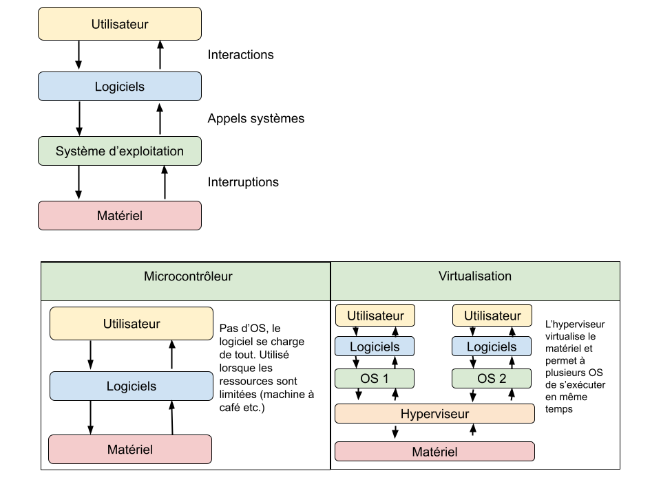
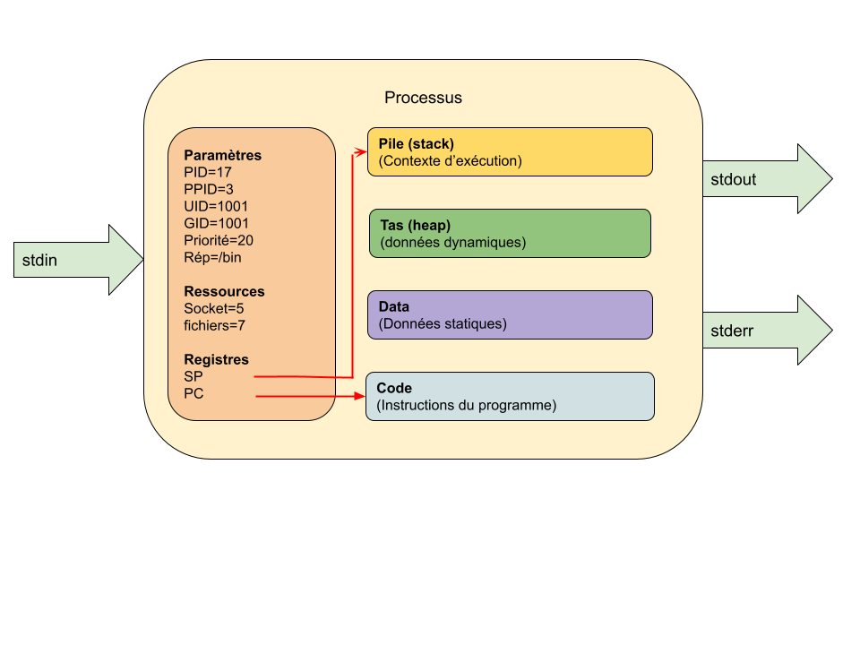
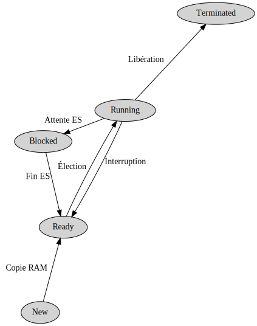

[pdf](./2_processus_etats.pdf)

# Système d'exploitation

L'OS est chargé d'assurer la liaison entre les ressources matérielles, l'utilisateur
et les logiciels.

Plusieurs situations existent :



## Rôles

Les rôles principaux d'un OS sont :

* La gestion du **processeur**,
* La gestion de la **mémoire vive**,
* La gestion des **entrées / sorties**,
* La gestion des **processus** (programme en cours d'exécution),
* La gestion des **droits**,
* La gestion des **fichiers** et du **système de fichier**.

## Composants d'un OS

* Le **noyau** (_kernel_) contient les fonctions principales d'un OS (mémoire, processus, fichiers, IO, communication etc.)
* Le **shell** (_shell_ pour coquille...) permet la communication des via un intermédiaire.

  * **CLI** (_Command Line Interface_ : la console !) : interpréteur de commandes
    en ligne. Exécute les commandes une par une (`[quentin@pc] $ ls`) ou depuis
    un script. Le shell le plus couramment utilisé est BASH.
  * **GUI** (_Graphical User Interface_ : les fenêtres) : interface graphique proposant un pointeur, des fenêtres, des icônes, des boutons pour rendre la manipulation conviviale et aisée.

## Statistiques d'utilisation

**Bureau et portable**

| OS        | Part |
|-----------|------|
| Windows   | 78%  |
| OS X      | 17%  |
| Unix like | 3%   |
| Autres    | 2%   |

**Mobile**

| OS              | Part |
|-----------------|------|
| Android (Linux) | 72%  |
| iOS             | 27 % |
| Autres          | 1%   |

**Serveur internet**

| OS      | Part |
|---------|------|
| UNIX    | 75%  |
| Windows | 25%  |

**Mainframes** : utilisés pour l'organisation des ressources et les transactions financières.

| OS              | Part |
|-----------------|------|
| z/OS (IBM UNIX) | 100% |

L'utitilisation des mainframes est sur le déclin depuis 2010 mais ils jouent un
rôle majeur dans les transactions commerciales.

**SuperComputer** :  ordinateur conçu pour atteindre les plus hautes performances possibles. Utilisés pour la météo, la modélisation d'objets chimiques, les simulations physiques (simulations aérodynamiques, calculs de résistance des matériaux, simulation d'explosion d'arme nucléaire, étude de la fusion nucléaire, etc.), la cryptanalyse ou les simulations en finance et en assurance.

| OS            | Part |
|---------------|------|
| Linux         | 99%  |
| UNIX (autres) | <1%  |

Cette évolution est récente, en 1996, UNIX équippait 100% des super calculateurs

**IOT** (_Internet Of Things_) : les objets embarqués.

Les sources divergent mais c'est le marché le plus fragmenté.
On trouve les acteurs habituels : android, linux, windows etc.

**Serveurs dans le cloud**

Les grandes entreprises utilisent leurs propres datacenters ou des ordinateurs
hébergés chez de grandes entreprises. Les leaders sont Amazon Web Service,
Microsoft Azure, Google Cloud Platform, Alibaba Cloud et IBM Cloud.

On peut déployer un ordinateur windows dans le cloud mais la très grande majorité
des machines utilisent un linux virtualisé dans Docker et orchestré par Kubernetes.

**Autres**

Google utilise un OS pour _datacenter_ appelé BORG.
C'est un projet assez secret mais qui a contribué à la création de Kubernetes.

# Processus

**Programme**

> Du texte exécutable par la machine

**Processus**

> Un programme en cours d'exécution


## Lancement

L'exécution d'un programme consiste à copier son code en mémoire et à faire
pointer le CPU sur la première instruction.

Celles-ci sont ensuite exécutées une par une jusqu'à épuisement ou jusqu'à
l'arrêt du programme par le système d'exploitation.

L'utilisateur peut lancer un programme depuis le GUI en double cliquant dessus
ou depuis le CLI en l'appelant avec 

```bash
$ ./nom_du_programme
$ ./nom_du_programme &
```

En ajoutant une esperluette (_ampersand_ &) on exécute le programme en tâche
de fond et on récupère la main sur le terminal.


## Format d'exécutable

Chaque système d'exploitation dispose de son propre format pour rendre un fichier
exécutable.

| Windows | UNIX | OS X   |
|---------|-------|--------|
| PE      | ELF   | Mach-O |

ELF (Executable and Linkable Format, est un format de fichier binaire utilisé pour l'enregistrement de code compilé.

Chaque fichier ELF est constitué d'un en-tête fixe, puis de segments et de sections. Les segments contiennent les informations nécessaires à l'exécution du programme contenu dans le fichier.

Ainsi le système d'exploitation sait où trouver les informations dont il aura
besoin lors de l'exécution.

Mach-O et PE utilisent des principes similaires.

## Composants d'un processus

Un processus est constitué :

* d'un ensemble d'**instructions** à exécuter (section CODE),
* d'un espace d'adressage en **mémoire vive** (sections pile, tas et data)
* de **ressources** (fichiers ouverts, sockets réseau, connexion bdd etc.)
* des **flux** d'entrée (_stdin_) et de sortie (_stdout, stderr_) utilisés
  pour communiquer avec l'extérieur.



Les détails d'un processus sont accessibles dans le dossier `/proc` où
chaque chaque processus se voit attribuer un dossier selon son PID
durant son exécution.

par exemple :

```haskell
$ sudo ln -l /proc/17
cmdline     (line de commande utilisée pour lancer le processus)
environ     (variables d'environnement)
maps        (zone de mémoire du processus)
fd          (fichiers ouverts et connexions)
net         (statistiques réseau)
status      (état et statistiques du processus)
syscall     (appels systèmes utilisés par le programme)
```

Pour afficher le contenu de ces fichiers on peut, par exemple :

```bash
$ sudo cat /proc/17/status
```

## Arborescence des processus

Au lancement de l'OS, un premier processus est crée, il sera
l'ancetre de tous les autres. Il se nomme `init` et son PID est 1.

Ensuite l'OS va créer des processus fils à partir du père `init` de
deux types :

* **démon** (service sous windows) : processus qui tournent en continu,
* **utilisateurs** : lancés à partir du shell.

On peut consulter cette arborescence avec la commande `pstree`.

## Processus crées depuis Python

Python, comme tous les langages modernes, permet de manipuler les processus : d'en créer, de les tuer, de les synchroniser de récupérer leur sortie.

### Lancement d'un processus simple

```python
import os
os.system("/usr/bin/mousepad")
# le programme python est _bloqué_ jusqu'à la terminaison du processus...
```

La bibliothèque `os` contient des fonctions permettant de réaliser
des appels systeme.

### Lancement d'un processus et manipulation des entrées sorties :

```python
import subprocess

sortie = subprocess.run(["ln", "-l"], capture_output=True)
print(sortie)
```

Ce programme va créer un processus, l'exécuter, enregistrer sa sortie
puis l'afficher.

### Faire tourner une fonction dans un processus à part

```python
from multiprocessing import Process

# cette fonction sera _embarquée_ dans un processus fils
def saluer(nb_fois: int):
    """Affiche `nb_fois` la ligne 'bonjour' """
    for _ in range(nb_fois):
        print("bonjour")

# création d'un processus embarquant la fonction saluer
p1 = Process(target=saluer, args=(5,))

# lancement du processus
p1.start()

# attente de la fin du processus (=synchronsation)
p1.join()
```

## Cycle de vie d'un processus

Lors de l'exécution d'un programme, un processus change réculièrement d'état.
C'est l'ordonnanceur qui est responsable de  ces changements d'état.




* **new** : le processus vient d'être crée,
* **ready** : complètement copié en RAM, il attend que l'ordonnanceur lui donne
  la main sur le processeur,
* **running** : le processus est en cours d'exécution sur le processeur,
* **blocked** : le processus est bloqué par la lecture d'une entrée
  (clavier, lecture fichier)
* **terminated** : le processus s'est terminé normalement ou le système l'a
  arrêté et ses ressources ont été libérées,


Il existe d'autres états :

* **sleeping** : lors de l'exécution d'une fonction d'attente (`time.sleep(1)`)
* **swapped** : le processus est transféré de la RAM sur le _swap_ (partition
  du disque dur servant à compléter la RAM)
* **zombie** : le père de ce processus s'est terminé avant lui. Le système utilise
  cet état pour récupérer les ressources.


## Consulter les processus en cours d'exécution

On peut souhaiter consulter une liste statique plus ou moins riche d'informations
ou un tableau dynamique.

|                 | Windows                | UNIX  |
|-----------------|------------------------|-------|
| Liste statique  | `tasklist`             | `ps`  |
| Liste dynamique | Gestionnaire de tâches | `top` |

* `top` va afficher la liste des processus en cours, on peut les trier selon
  des critères et les interrompre

  ```bash
  top - 13:24:53 up 4 days, 18:42,  1 user,  load average: 0,23, 0,57, 0,53
  Tasks: 316 total,   1 running, 315 sleeping,   0 stopped,   0 zombie
  %Cpu(s):  3,7 us,  1,7 sy,  0,0 ni, 94,1 id,  0,1 wa,  0,4 hi,  0,1 si,  0,0 st
  MiB Mem :  15941,6 total,   3286,3 free,   9520,8 used,   3134,5 buff/cache
  MiB Swap:      0,0 total,      0,0 free,      0,0 used.   5433,7 avail Mem

      PID USER      PR  NI    VIRT    RES    SHR S  %CPU  %MEM     TIME+ COMMAND
   727329 quentin   20   0  515024  57008  38592 S   3,0   0,3  14:22.76 alacritty
     5698 quentin   20   0  517296  42560  12592 S   2,3   0,3  99:56.19 alacritty
    12627 quentin   20   0 2307648  22096   1120 S   2,0   0,1 133:21.57 winedevice.exe
     1722 quentin   20   0 1520044 513336 147164 S   1,7   3,1 105:00.75 chrome
   728335 quentin   20   0  210100  98620   7992 S   1,7   0,6   8:33.93 nvim
      917 root      20   0 6729416 192076  65736 S   1,3   1,2 147:52.23 Xorg
     1505 quentin   20   0  585356   6544   2088 S   1,3   0,0  98:54.53 conky
     1760 quentin   20   0  398148  89088  28652 S   1,3   0,5  46:07.75 chrome

  ```

  `htop` est une version plus moderne et souvent utilisée :

  ```bash
      1[|||                                            3.9%]   Tasks: 187, 1094 thr; 1 running
      2[||||                                           4.6%]   Load average: 0.23 0.50 0.51
      3[||                                             2.6%]   Uptime: 4 days, 18:43:20
      4[||||                                           5.9%]
    Mem[||||||||||||||||||||||||||||||||||||||||9.94G/15.6G]
    Swp[                                              0K/0K]

      PID USER      PRI  NI  VIRT   RES   SHR S CPU% MEM%   TIME+  Command
   727329 quentin    20   0  502M 57008 38592 S  2.6  0.3 14:27.48 alacritty -e ranger
   785093 quentin    20   0 10588  6604  3536 R  2.0  0.0  0:00.30 htop
     1505 quentin    20   0  571M  6544  2088 S  1.3  0.0  1h38:55 conky
     1536 quentin    20   0  571M  6544  2088 S  1.3  0.0  1h14:43 conky
     ...
  F1Help  F2Setup F3SearchF4FilterF5Tree  F6SortByF7Nice F8Nice F9Kill  F10Quit

  ```


* `ps` va afficher différentes informations selon les paramètres donnés.

  On utilise couramment `ps aux` et `ps -ef`

  ```bash
  $ ps aux
  USER         PID %CPU %MEM    VSZ   RSS TTY      STAT START   TIME COMMAND
  root           1  0.0  0.0 171940  7988 ?        Ss   juin21   0:39 /sbin/init
  root           2  0.0  0.0      0     0 ?        S    juin21   0:00 [kthreadd]
  root           3  0.0  0.0      0     0 ?        I<   juin21   0:00 [rcu_gp]
  root           4  0.0  0.0      0     0 ?        I<   juin21   0:00 [rcu_par_gp]
  root           6  0.0  0.0      0     0 ?        I<   juin21   0:00 [kworker/0:0H-kblockd]
  root           8  0.0  0.0      0     0 ?        I<   juin21   0:00 [mm_percpu_wq]
  root           9  0.0  0.0      0     0 ?        S    juin21   0:53 [ksoftirqd/0]
  root          10  0.0  0.0      0     0 ?        S    juin21   0:00 [rcuc/0]
  root          11  0.0  0.0      0     0 ?        I    juin21   2:27 [rcu_preempt]
  root          12  0.0  0.0      0     0 ?        S    juin21   0:00 [rcub/0]
  ...
  ```

  ```bash
  $ ps -ef
  UID          PID    PPID  C STIME TTY          TIME CMD
  root           1       0  0 juin21 ?       00:00:39 /sbin/init
  root           2       0  0 juin21 ?       00:00:00 [kthreadd]
  root           3       2  0 juin21 ?       00:00:00 [rcu_gp]
  root           4       2  0 juin21 ?       00:00:00 [rcu_par_gp]
  root           6       2  0 juin21 ?       00:00:00 [kworker/0:0H-kblockd]
  root           8       2  0 juin21 ?       00:00:00 [mm_percpu_wq]
  root           9       2  0 juin21 ?       00:00:53 [ksoftirqd/0]
  ...
  ```

  Ces listes étant souvent conséquentes
  (318 processus en cours d'exécution sur ma machine...) on filtre souvent
  avec `grep` :

  ```bash
  $ ps -ef | grep python
  root        1097       1  0 juin21 ?       00:03:15 /usr/bin/python3 /home/qmonit_client.py
  quentin     1367       1  0 juin21 ?       00:00:01 /usr/bin/python /usr/bin/blueman-applet
  quentin     1602       1  0 juin21 ?       00:00:01 /usr/bin/python /usr/bin/blueman-tray
  quentin     6214    5699  0 juin21 pts/6   00:09:11 /usr/bin/python3 ./iot.py
  quentin   727330  727329  0 08:07 pts/1    00:00:01 /usr/bin/python -O /usr/bin/ranger
  ```

## Envoyer un signal au processus

Avec `ps -ef | grep mon_binaire` on peut accéder au PID d'un processus,
ensuite on peut lui envoyer un signal.

Par exemple, dans la dernière liste ci-dessus, si je veux tuer `iot.py`,
son PID est 6214, je peux exécuter :

```bash
kill 6214
```

qui va lui envoyer un signal `TERM` lui demandant de s'interrompre de lui même.

Si le processus est planté et ne répond pas à ce signal, on peut forcer son
interruption avec :

```bash
kill -9 6214
```

C'est à réserver aux situations critiques, le processus n'ayant pas la possibilité
d'enregister quoi que ce soit de son exécution...

Il existe d'autres signaux, `kill`, comme -1 (HUP) qui relance le programme
en question.

On peut aussi tuer les processus par leur nom avec `killall nom`. C'est pratique
lorsqu'on est certain qu'un programme n'est lancé qu'une seule fois.

On peut, enfin, récupérer les PID des programmes avec `pidof`

```bash
$ pidof alacritty
727329 5698 5366
```

Et enchaîner :

```bash
$ kill -9 $(pidof alacritty)
```

Va tuer toutes les instances d'alacritty...


