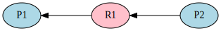
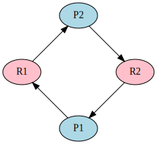
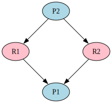

[pdf](./3_interblocage.pdf)

# Interblocage

Il arrive fréquement que des processus se bloquent l'un l'autre. Sans intervention extérieure (de l'utilisateur ou de l'OS) cette situation est insoluble. C'est _l'interblocage_.

[foot](foot.jpg)

_L'arbitre vient séparer les joueurs qui pourraient rester indéfiniment ainsi..._

## Partage des ressources

Nous avons dits précédemment que des processus peuvent avoir besoin de la même ressource.

Dans de nombreuses situations, deux processus (ou davantage) peuvent souhaiter
accéder à la même donnée (sur le disque dur ou autre) :

- Les deux processus ont _uniquement besoin de lire la donnée_ : celle-ci est alors partagée, sans problème complexe.
- Les deux processus ont _besoin de la donnée de manière exclusive_, pour la modifier, par exemple.
- Les deux processus ont _besoin de communiquer entre eux_ : l'un doit attendre un résultat de l'autre.

**Exemple 1**

Deux processus P1 et P2 ont tous les deux besoin de la même donnée D pour la
modifier, c'est-à-dire de manière exclusive. Le premier à y accéder est P1,
D lui est alloué par le système d'exploitation. Lorsque P2 souhaite accéder à
D, la ressource n'est pas disponible : P2 est alors bloqué jusqu'à la fin de
l'utilisation de D par P1.


### Représentation graphique



- P1 et P2 sont les processus,
- R1 est la ressource 

- Une flêche de R1 à P1 signifie que _P1 a acquis la ressource R1_ 
- Une flêche de P2 à R1 signifie que _P2 a demandé la ressource R1_.

Comprenez bien :

- P1 est prêt ou est exécuté. Il n'est pas bloqué 
- P2 est bloqué jusqu'à la libération de la ressource R1 par P1.

Dans cette situation, P2 attend... mais P1 va bien s'arrêter un jour et lui permettre d'avancer. 

Aucun blocage.

**Exemple 2**

Deux processus P1 et P2 ont tous deux les besoin de deux ressources, R1 et R2.\
Chaque processus bloque une donnée et doit attendre d'avoir accès à la seconde pour se terminer et les libérer.

Si la chronologie est la suivante :

- P1 demande R1 et l'aquiert
- P2 demande R2 et l'aquiert
- P1 demande R2 et l'attend
- P2 demande R1 et l'attend

Alors aucun des deux processus ne pourra avancer. C'est **l'interblocage**.
Rien ne pourra avancer sans une intervention extérieure.

Face à cette problématique la plupart des systèmes d'exploitation ont choisir
de ne pas essayer d'éviter les interblocages mais de les détecter s'ils
surviennent et de les solutionner.



## Détecter une situation d'interblocage

Afin de résoudre _conceptuellement_ ce problème on peut utiliser un **graphe orienté**.

- On sépare les processus et les ressources : ce sont les noeuds du graphe.
- Lorsqu'un processus attend une ressource, un arc est tracé partant de ce
  processus vers la ressource,
- Lorsqu'un processus acquiert une ressource, un arc est tracé partant de la
  ressource vers le processus. On efface l'arc dans l'autre sens s'il existe.


**L'interblocage se produit lorsqu'il existe un cycle dans le graphe**


Ce graphe présente un cycle et les processus sont bloqués.



Ce graphe ne présente pas de cycle, il n'y a pas d'interblocage.


Pas non plus de cycle et donc pas d'interblocage.


### Conclusion sur l'interblocage





L'interblocage est une situation qui conduit à la paralysie de plusieurs processus.

L'éviter totalement est presque impossible. Pour la résoudre lorsqu'elle se produit il faut une intervention extérieure (utilisateur, OS).

 vs 

Pour la repérer, on peut dessiner un graphe orienté. **Présence d'un cycle = interblocage**.


## Race condition (_situation de compétition_) - HP

L'interblocage n'estpasle seul problème créée par l'exécution parallèle de plusieurs processus.

Un autre problème majeur lié à l'ordre d'exécution est la _situation de compétition_.

C'est une situation dans laquelle le résultat d'une série d'opération
dépend de _l'ordre_ dans lequel celles-ci sont effectuées...

Des situations de compétition existent dans les logiciels mais aussi _dans le matériel_.

Lorsque un processus principal crée plusieurs processus fils, il ne contrôle
pas l'ordre dans lequel ils sont exécutés. S'il a besoin des résultats de ceux
ci, il ne pourra pas prédire le résultat final.

```python
from multiprocessing import Process
from random import random
from time import sleep


def hello():
    for _ in range(5):
        print("hello")
        sleep(random())


def bonjour():
    for _ in range(5):
        print("bonjour")
        sleep(random())


p1 = Process(target=hello)
p2 = Process(target=bonjour)

p1.start()
p2.start()

p1.join()
p2.join()
```

Première exécution :

```bash
hello
bonjour
hello
bonjour
hello
hello
bonjour
bonjour
bonjour
hello
```

Seconde exécution :

```bash
hello
bonjour
bonjour
bonjour
hello
hello
hello
hello
bonjour
bonjour
```

On peut arguer que ces programmes ne font rien d'essentiel, mais s'ils doivent
écrire dans le même fichier, c'est plus génant.

Il est délicat d'illustrer simplement les bugs engendrés par les situations
de compétition.

En voilà une avec une notion hors programme, les `threads` (_processus légers_) :

```python
import threading


def increment_global():
    global x
    x += 1


def task():
    for _ in range(500000):
        increment_global()


def race(nb: int):
    global x
    x = 0
    t1 = threading.Thread(target=task)
    t2 = threading.Thread(target=task)

    t1.start()
    t2.start()

    t1.join()
    t2.join()

    print(f"after race number {nb}, x = {x}")


def main():
    for i in range(5):
        race(i)


if __name__ == "__main__":
    main()
```

Ce programme est supposé compter jusqu'à 1 million.

Que fait-il ?

- dans `race` on crée une variable globale `x` valant 0.
- On lance deux threads exécutant `task` qui incrémentent le même `x` 500000 fois chacun.

  On devrait trouver $x = 500000 + 500000 = 1000000$ à la fin...

Mais en fait :

```bash
$ python competition.py
after race number 0, x = 712104
after race number 1, x = 850346
after race number 2, x = 893592
after race number 3, x = 813423
after race number 4, x = 761881

```

D'où vient le problème ? `x += 1` réalise plusieurs opérations :

- lire la valeur de `x`
- lui ajouter 1
- écrire le résultat dans `x`

Imaginons un déroulé :

- thread1 lit quand `x` vaut 123,
- thread2 lit quand `x` vaut 123,
- thread1 ajoute 1 : 124
- thread2 ajoute 1 : 124
- thread1 écrit : `x = 124`
- thread2 écrit : `x = 124`

Deux incrémentations ont eu lieu, `x` devrait valoir 125... mais la valeur en mémoire
est 124...

Ce problème est _majeur_ et demande beaucoup de rigueur pour être évité.

Il existe de nombreuses approches mais la plus courante est d'employer des `mutex`
ou des `lock` qui vérouillent une exécution tant que le `mutex` n'est pas acquis.

C'est la raison pour laquelle on ne travaille pas avec des threads en NSI,
vous verrez ça plus tard :) !

### Threads vs Processus

Ce sont des séquences d'instructions indépendantes.

- Un thread (_processus léger_ en français) s'exécute dans le même processus que le processus parent, il partage la mémoire du processus.
- Un processus fils est un autre processus, dépendant du parent, qui dispose de sa propre mémoire.

Un processus est plus _lourd_ pour le système qu'un thread... mais peut s'exécuter
sur un coeur de processeur différent et donc en parallèle.

Un thread est généralement cantoné au processeur sur lequel s'exécute le processus
qui l'a crée.

