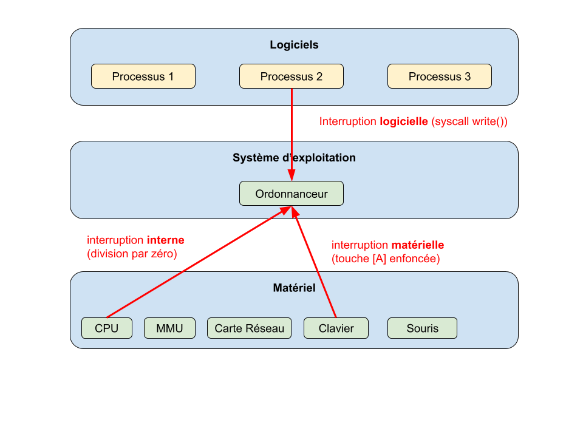

[pdf](./4_ordonnancement.pdf)

## Les processus (rappels)

**Objectifs**

Pour permettre le fonctionnement d'un ordinateur, de nombreuses tâches ou
applications doivent être exécutées simultanément, par le système
d'exploitation et les différents utilisateurs.

Notons aussi qu'une même application (programme) doit pouvoir s'exécuter
plusieurs fois simultanément (par plusieurs utilisateurs par exemple), ou que
plusieurs applications doivent pouvoir accéder à un même périphérique sans
conflit.

Pour permettre cela, le système d'exploitation génère de nombreux processus,
puis gère leur exécution.

**Concept :**

> Un processus est un programme en cours d'exécution.
>
> Les notions de programme et de processus sont différentes : le même programme
> exécuté plusieurs fois (dans le temps ou par plusieurs utilisateurs
> simultanément) générera plusieurs processus.

Chaque processus possède en mémoire les instructions à exécuter et ses données.

## Commutation de contexte

La commutation de contexte consite à remplacer un processus P1 travaillant
sur le processeur par un autre processus P2. Le système d'exploitation
doit alors :

1. Sauvegarder l'état d'un processus P1 (registres CPU) quelque part en mémoire,
  par exemple sur sa pile d'exécution,
2. retrouver le contexte de P2 (par exemple depuis sa pile),
3. restaurer le contexte de P2 sur le processeur,
4. reprendre l'exécution de P2 juste après sa dernière instruction.


Un bloc de contrôle de processus ou PCB (de l'anglais process control block) est une structure de données du noyau d'un système d'exploitation représentant l'état d'un processus donné.

Diverses implémentations existent selon les systèmes d'exploitation, mais un PCB contient en général :

- L'ID du processus (PID), l'ID du processus parent (PPID) et l'ID de l'utilisateur du processus (UID) ;
- Les valeurs des registres correspondant au processus (l'état courant du processus, selon qu'il est élu, prêt ou bloqué) ;
- Le compteur ordinal du processus ;
- Le pointeur de pile : indique la position du prochain emplacement disponible dans la pile mémoire ;
- L'espace d'adressage du processus ;
- La liste des descripteurs de fichiers (= les fichiers ouverts par le processus. Attention, sous Linux le matériel est présenté comme un fichier !);
- La liste de gestion des signaux ;

D'autres informations telles que le temps CPU accumulé par le processus, etc.

Lors d'un changement de contexte, le processus en cours est arrêté et un autre processus peut utiliser le CPU. Le noyau doit arrêter l'exécution du processus en cours, copier les valeurs des registres hardware dans le PCB, et mettre à jour les registres avec les valeurs du nouveau processus.


## Coopératif vs préemptif

L'ordonnanceur peut fonctionner selon deux modes :

* **coopératif** : les programmes doivent alors prévoir de passer eux-mêmes
  la main aux autres,
* **préemptif** : l'ordonnanceur peut à tout moment couper un processus
  dans son travail et le remplacer par un autre (avec la _commutation de contexte_).


Dans votre petit logement universitaire, impossible d'étaler tous les cours ou de préparer à manger en même temps : le bureau est aussi la table ainsi que le plan de travail !

Après les révisions :

- vous notez bien jusqu'où vous avez apris,
- vous rangez tous le classeurs.

Pour préparer le repas :

- vous consultez l'état du frigo : "ah, je n'ai plus d'oeufs, je vais faire des pâtes",
- vous sortez le matériel adéquat 
- vous préparez une sauce
etc.

Lorsque le repas est terminé :

- vous lavez et rangez,
- vous resortez les classeurs,
- vous consultez votre avancée.

C'est la _commutation de contexte_.


## L'ordonnancement

Le système d'exploitation doit permettre à toutes les applications et tous 
les utilisateurs de travailler en même temps, c'est-à-dire donner l'impression
à chacun qu'il est seul à utiliser l'ordinateur et ses ressources physiques.
Cette gestion complexe des processus est réalisée par une partie spécifique
du noyau : **l'ordonnanceur.**

Dans les systèmes d'exploitation, l’ordonnanceur désigne le composant du noyau
du système d'exploitation choisissant l'ordre d'exécution des processus sur les
processeurs d'un ordinateur. En anglais, l'ordonnanceur est appelé _scheduler._

Le changement d'un processus à l'autre est appelé _commutation de contexte_.

**Concept :**

> Comme une ressource (le processeur ou un périphérique) ne peut pas être
> partagée, c'est son temps d'utilisation qui va l'être ; le temps d'utilisation
> d'une ressource est partagé en intervalles très courts, pendant lesquels
> l'ordonnanceur l'alloue à un seul utilisateur.

L'ordonnanceur permet :

* de minimiser le temps de traitement du processus d'un utilisateur
* de garantir l'équité entre les différents utilisateurs
* d'optimiser l'utilisation de la ressource
* d'éviter les blocages.

Plusieurs algorithmes d'ordonnancement sont possibles, parmi les plus répandus
nous pouvons citer :

* le **tourniquet** (_round robin_) : la ressource est affectée à chaque processus à tour
    de rôle. Pour l'exécuation simultanée des processus, c'est la rapidité
    de ce tour qui va donner l'impression à chaque utilisateur que son processus
    est seul à utiliser le processeur. Cette méthode ancienne a les avantages
    de sa simplicité, de sa rapidité de gestion et de sa robustesse.

    * Processus 1 : `z` instructions à réaliser
    * Processus 2 : `y` instructions à réaliser
    * Processus 3 : `t` instructions à réaliser

        Imaginons que `z < y < t`

    | Exécution par le microprocesseur            |
    |---------------------------------------------|
    | P1. instruction 1                           |
    | P2. instruction 1                           |
    | P3. instruction 1                           |
    | P1. instruction 2                           |
    | P2. instruction 2                           |
    | P3. instruction 2                           |
    | ...                                         |
    | P1. instruction `z`                         |
    | P2. instruction `z`                         |
    | P3. instruction `z`                         |
    | ...     (P1 a fini, P2 et P3 continuent...) |
    | P2. instruction `y`                         |
    | P3. instruction `y`                         |
    | ...     (P2 a fini, P3 continue...)         |
    | ...                                         |
    | P3. instruction `t`                         |

* La gestion du **premier entré, premier sorti** (FIFO : _First In, First Out_).
    L'exemple le plus évident de cet algorithme est la file d'impression des
    documents sur une imprimante.

    Si P1, P2 et P3 ont chacun trois instructions à réaliser cela donnera :

    | Exécution par le processeur |
    |-----------------------------|
    | P1. instruction 1           |
    | P1. instruction 2           |
    | P1. instruction 3           |
    | P2. instruction 1           |
    | P2. instruction 2           |
    | P2. instruction 3           |
    | P3. instruction 1           |
    | P3. instruction 2           |
    | P3. instruction 3           |

* L'algorithme du "**plus court d'abord**" (_shorted job first_): plus efficace
    pour satisfaire au mieux les utilisateurs. Il n'est pas toujours simple
    d'évaluer le temps d'exécution d'une tâche avant son début.

    Plutôt que de mesurer les temps d'exécution, on peut se limiter au _nombre_
    d'instructions à réaliser :

    Si P1 a 4 instructions, P2 2 instructions et P3 3 instructions cela donnera :

    | Exécution par le processeur |
    |-----------------------------|
    | P2. instruction 1           |
    | P2. instruction 2           |
    | P3. instruction 1           |
    | P3. instruction 2           |
    | P3. instruction 3           |
    | P1. instruction 1           |
    | P1. instruction 2           |
    | P1. instruction 3           |
    | P1. instruction 4           |

Ces algorithmes présentent d'importants défauts et ne sont pas utilisés en pratique. L'ordonnanceur de Linux, version bureau, appelé "Completely Fair Scheduler" ou CFS cherche à minimiser le temps d'attente de chaque processus à l'état "prêt".

* La mise en place d'un système de **priorités** : l'ordre d'affectation
    de la ressource sera alors fonction de la priorité de la tâche. Cette
    méthode est très équitable, mais définition du niveau de priorité de la
    tâche doit être objective. Sous UNIX cette notion porte le nom de
    _niceness_.

Plus de détails sur le [CFS](https://docs.kernel.org/scheduler/sched-design-CFS.html)

Parallélement à l'évolution des performances des microprocesseurs,
l'ordonnancement est aussi un moyen d'amélioration de la rapidité de traitement :
des algorithmes récents, de plus en plus complexes ont est proposés.

## Interruption

En plus de la gestion des tâches, l'ordonnanceur doit souvent prendre en compte les
interruptions qui peuvent être de trois types :

* **logicielle** : un événement extérieur au programme se produit (timer, signal envoyé
  par l'OS) ou le programme souhaite faire un appel système (_syscall_).
* **interne** processeur : gestion d'erreurs (division par zéro, faute de mémoire) aussi
  appelée "exception" ou "trap" en anglais.
* **matérielle** : communication avec le matériel via des IRQ (Interrupt ReQuest) pour 
  gérer les entrées/sorties de manière plus efficace que la scrutation active (_polling_).


## Temps partagé vs temps réel

C'est bien tout ça... mais quand même... quand on encode une vidéo, copie
des fichiers énormes ou qu'on lance un jeu très gourmand, l'ordinateur est ralenti.

Imaginons l'ordinateur d'un airbus, on souhaite qu'il fonctionne avec une grande
régularité et qu'une procédure critique ne soit pas ralentie par une autre opération.

On utilise pour cela des systèmes **en temps réel.**

Un système en temps réel est capable de contrôler (ou piloter) un procédé
physique à une vitesse adaptée à l'évolution du procédé contrôlé.

Les systèmes informatiques temps réel se différencient des autres systèmes
informatiques par **la prise en compte de contraintes temporelle**s dont le respect
est aussi important que l'exactitude du résultat, autrement dit le système ne
doit pas simplement délivrer des résultats exacts, **il doit les délivrer dans
des délais imposés.**

Les systèmes informatiques temps réel sont aujourd'hui présents dans de nombreux secteurs d'activités :

* l'industrie de production par exemple, au travers des systèmes de contrôle de procédé (usines, centrales nucléaires) ;
* les salles de marché au travers du traitement des données boursières en « temps réel » ;
* l'aéronautique au travers des systèmes de pilotage embarqués (avions, satellites) ;
* l’automobile avec le contrôle de plus en plus complet des paramètres moteur, de la trajectoire, du freinage, etc.

