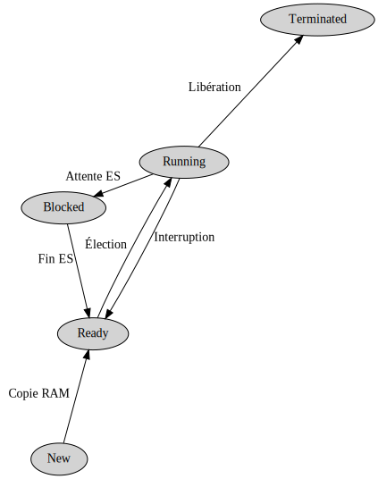
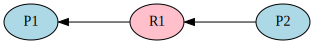
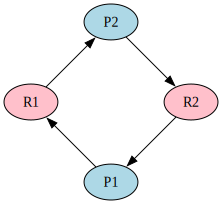

[pdf](./processus_6_resume.pdf)

---

## Processus

### Programme et processus



Un **programme** est une description statique d'une suite d'instruction : du code, généralement en binaire




Un **processus** est un programme en cours d'exécution.
C'est une activité dynamique. Un processus a une _vie_ : création, exécution, fin.


Un même programme peut-être exécuté plusieurs fois en même temps (ex chrome : un processus par onglet).

### Cycle de vie des processus 





- lancement du programme, son code binaire est copié en ram, le processus est "nouveau" (_new_).
- copie terminée, le processus est "prêt" (_ready_),
- son tour est arrivé, l'ordonnanceur le sélectionne et exécute des instructions... il est "en cours" (_running_),
- le processus demande à lire une fichier, l'ordonnanceur l'interrompt, il devient "bloqué" (_blocked_),
- le fichier est disponible, le processus redevient "prêt",
- son tour est arrivé, l'ordonnanceur le sélectionne et exécute des instructions... il est "en cours" (_running_),
- etc.
- ses instructions sont toutes exécutées, on libère la mémoire qui lui était allouée, il est "terminé" (_terminated_).


### Ressources du processus

Ressources du processus :

> _matérielles_ : processeur, mémoire, périphériques...
>
> _logicielles_ : variables etc.


Les ressources indispensables sont :

* la mémoire propre (virtuelle)
* contexte d'exécution  (= état instantané)

Une ressource peut-être libre ou occupée. Une ressource peut (ou non) avoir
plusieurs accès concurrents.

### Attributs d'un processus

| Attribut     | Description                        | Remarque                                                     |
|--------------|------------------------------------|--------------------------------------------------------------|
| PID          | _Process IDentifier_               | numéro unique entier                                         |
| propriétaire | celui qui a lancé le processus     | détermine les droits du processus = ceux de son propriétaire |
| commande     | La commande exécutée pour le lance | `/usr/bin/python pong.py`                                    |
| path         | répertoire de travail              | origine des chemins relatifs                                 |
| PPID         | identifieur du Parent              | tous les processus ont un ancêtre commun "`init` : PID 1"    |


## Consulter et manipuler les processus sous UNIX

La commande `ps` permet de consulter les processus en cours d'exécution.

```sh
$ ps aux

USER         PID %CPU %MEM    VSZ   RSS TTY      STAT START   TIME COMMAND
root           1  0.0  0.0 178824  7692 ?        Ss   mai20   4:50 /usr/lib/systemd/systemd
root           2  0.0  0.0      0     0 ?        S    mai20   0:00 [kthreadd]
root           3  0.0  0.0      0     0 ?        I<   mai20   0:00 [rcu_gp]
root           4  0.0  0.0      0     0 ?        I<   mai20   0:00 [rcu_par_gp]
root           6  0.0  0.0      0     0 ?        I<   mai20   0:00 [kworker/0:0H-kblockd]
...
```

`PID` : Processus Identification : numéro unique.

Filtrer avec `grep` : **tous les processus python**

```sh
$ ps aux | grep python
quentin      892  0.0  0.0 454308 14848 tty1     Ss+  mai20  19:35 /usr/bin/python /home/quentin/prog1.py
quentin     1201  0.0  0.0  16604  5452 ?        S    mai20   8:32 /usr/bin/python /home/quentin/prog2.py
```

Tuer un processus avec `kill`

```sh
$ kill 892
```

On envoie un _signal_ au processus qui décide de son interprétation. Il existe de nombreux signaux possibles qui servent à communiquer avec le processus.

## Ordonnancement

### Processeur



Le **processeur** est l'entité matérielle qui réalise les instructions. Il permet de faire progresser le processus.


C'est une ressource utilisée par le processus. À un instant donné, **un seul processus est exécuté.**

Afin de faire progresser plusieurs processus sans paralyser le système, il faut les faire progresser régulièrement.

Le système d'exploitation décide de **l'ordonnancement** des processus.

```
sur un seul processeur :
séquentielle :          1 1 1 1 2 2 2 2
entrelacée   :          1 2 1 2 1 2 1 2

sur deux processeurs en parallèle :
processeur 1 :          1 1 1 1
processeur 2 :          2 2 2 2
```

L'exécution peut-être séquentielle ou entrelacée.
Si plusieurs processeurs sont disponibles, une exécution parallèle est possible.

L'avancement du processus dépend de la disponibilité du processeur.
Lorsque plusieurs processus s'exécutent en même temps, le processeur n'est capable d'en faire avancer qu'un à la fois.

Les processeurs étant rapides et les OS bien développés, on a l'illusion que la machine réalise plusieurs choses en même temps :

les vidéos ne s'arrêtent pas lorsqu'on lance un téléchargement... mais en fait, on ne devrait plus rien voir à l'écran durant le téléchargement s'il était le seul à avancer.

Dans le noyau du système réside un programme appelé "ordonnanceur" dont le rôle est de donner la parole à un processus et de l'arrêter si nécessaire.

On parle de _commutation de contexte_.

De nombreuses stratégies existent :

### Stratégies 

- FIFO,
- Round Robin,
- Shortest First,
etc.


Le CFS (Completely Fair Scheduler) est l'ordonnanceur utilisé par Linux de 2006 à 2023. Il utilise un arbre binaire rouge et noir (qui a la propriété de s'équilibrer automatiquement et de maintenir un ordre) afin de simuler une _file de priorité_. Le prochain processus a être exécuté est celui "qui a attendu le plus longtemps". En pratique, bien sûr, c'est plus compliqué.


## Interblocage

**Exemple 1**

Deux processus P1 et P2 ont tous les deux besoin de la même donnée D pour la
modifier, c'est-à-dire de manière **exclusive**. Le premier à y accéder est P1,
D lui est alloué par le système d'exploitation. Lorsque P2 souhaite accéder à
D, la ressource n'est pas disponible : P2 est alors bloqué jusqu'à la fin de
l'utilisation de D par P1.


### Représentation graphique



- P1 et P2 sont les processus,
- R1 est la ressource 

- Une flêche de R1 à P1 signifie que _P1 a acquis la ressource R1_ 
- Une flêche de P2 à R1 signifie que _P2 a demandé la ressource R1_.

Comprenez bien :

- P1 est prêt ou est exécuté. Il n'est pas bloqué 
- P2 est bloqué jusqu'à la libération de la ressource R1 par P1.

Dans cette situation, P2 attend... mais P1 va bien s'arrêter un jour et lui permettre d'avancer. 

**Aucun blocage.**

**Exemple 2**

Deux processus P1 et P2 ont tous deux les besoin de deux ressources, R1 et R2.\
Chaque processus bloque une donnée et doit attendre d'avoir accès à la seconde pour se terminer et les libérer.

Si la chronologie est la suivante :

- P1 demande R1 et l'aquiert
- P2 demande R2 et l'aquiert
- P1 demande R2 et l'attend
- P2 demande R1 et l'attend

Alors aucun des deux processus ne pourra avancer. C'est **l'interblocage**.
Rien ne pourra avancer sans une intervention extérieure.

Face à cette problématique la plupart des systèmes d'exploitation ont choisir
de ne pas essayer d'éviter les interblocages mais de les détecter s'ils
surviennent et de les solutionner.

### Détecter l'interblocage




- On sépare les processus et les ressources : ce sont les noeuds du graphe.
- Lorsqu'un processus attend une ressource, un arc est tracé partant de ce
  processus vers la ressource,
- Lorsqu'un processus acquiert une ressource, un arc est tracé partant de la
  ressource vers le processus. On efface l'arc dans l'autre sens s'il existe.


**L'interblocage se produit lorsqu'il existe un cycle dans le graphe**


Ce graphe présente un cycle et les processus sont bloqués.


Ce graphe ne présente pas de cycle, il n'y a pas d'interblocage.


