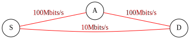

* [pour impression](/uploads/docnsitale/routage/routage_print.pdf)
* [diaporama](/uploads/docnsitale/routage/routage_slides.pdf)

# Protocoles de routage de l'information

## Principe

Les _protocoles de routage de l'information_ permettent aux **routeurs** qui
interconnectent les réseaux de **partager des informations** relatives à
l'**acheminement du trafic** entre ces réseaux.

## Comparaison

| Protocole  	| RIP                                   	| OSPF                              	|
|------------	|---------------------------------------	|-----------------------------------	|
| Depuis     	| ~1970                                 	| 1988                              	|
| Algorithme 	| Bellman-Ford                          	| Dijkstra                          	|
| Métrique   	| nombre de sauts                       	| bande passante                    	|
| Couche OSI 	| Réseau                                	| Réseau                            	|
| Utilise    	| UDP (transport)                       	| IP (réseau)                       	|
| Taille max 	| LAN < 16 routeurs                     	| LAN < ~1000 routeurs              	|
| Avantage   	| Simplicité                            	| Souplesse                         	|
| Défauts    	| Gaspille la BP, n'en tient pas compte 	| Gourmand (CPU, mémoire), complexe 	|

## Mais qu'est-ce que le routage ?

## Mais qu'est-ce que le routage ?

## Mais qu'est-ce que le routage ?

### Le routage permet de faire circuler des paquets à un point A vers un point B.

### Pour cela un routeur ou un PC s'appuie sur sa _table de routage_.

## La table de routage

Elle se compose de 5 éléments :

* Le réseau que l'on souhaite atteindre
* Le net masque du réseau à atteindre
* Le chemin à emprunter (le routeur suivant qui permet de rejoindre
    la destination et par quelle interface l'atteindre)
* Sa distance administrative = niveau de
    confiance (minimiser),
    (1: statique, 110: ospf, 120: RIP…)
* Le protocole utilisé : S pour statique, O pour OSPF, R pour RIP...

R     192.168.1.0/24  [120/1] via  10.1.1.2, 00:00:13, FastEthernet0/0 

Et si la route n'existe pas, on attribue une route par défaut.

## Métrique

> **Metrique** :
> Unité de mesure de la distance qui sépare un routeur d'un réseau de destination

Lorsqu'il établi ses tables de routage, le protocole utilise un algorithme
pour construire le plus court chemin selon cette métrique.

Il privilégie toujours la route ayant **la plus petite** métrique pour
rejoindre un réseau.

## RIP utilise le nombre de sauts

**RIP** utilise le **nombre de sauts** comme métrique :

Deux chemins possibles pour aller de $S$ (source) jusqu'en $D$ (destinatation) :

* $S-A-B-C-D$ : métrique 4 (car 4 étapes),
* $S-E-F-G-H-D$ : métrique 5

RIP choisira le premier chemin.

_Limite_ : **maximum 15 sauts**. Au delà, le routeur est considéré comme
inatteignable.

## OSPF utilise la bande passante

**OSPF** utilise la **bande passante** comme métrique.

Sa plus petite métrique est 1. Par défaut, la référence est 100M (100 Mbit/s)

**Formule** : métrique = $\dfrac{\text{vitesse reference}}{\text{vitesse lien}}$

Métriques :

* A : lien en 100 M, métrique 1,
* B : lien en 10 M, métrique 10,
* C : lien 1 G, métrique 0.1, ramenée à 1 par OSPF.

OSPF choisir A ou C

# IGP

## RIP et OSPF sont des réseaux _intérieurs_

Ce protocole est classifié par l'_IETF_ (Internet Engineering Task Force) comme
protocole de passerelle intérieure (_IGP_, Interior Gateway Protocol).

L'_IGP_ est l'un des protocoles destinés au transfert de données dans un réseau
de systèmes autonomes plus vaste ; par exemple, le réseau d'une entreprise
composé de plusieurs réseaux locaux distincts, reliés entre eux au moyen de
routeurs.

# RIP

## Fonctionnement général

Chaque routeur _RIP_ gère une **table de routage**. Celle-ci contient une
_liste répertoriant toutes les destinations_ (ou réseaux) connues du routeur,
ainsi que _l'itinéraire_ qui y mène et _la distance_ qui l'en sépare.

Le RIP a recours à un algorithme distance-vecteur pour déterminer l'itinéraire
que doit emprunter un paquet jusqu'à sa destination. Il enregistre dans la
table de routage la distance qui le sépare de chaque réseau qu'il sait
atteindre, ainsi que l'adresse du routeur du prochain saut ("next hop")
sur l'itinéraire, à savoir le prochain routeur présent sur l'un des réseaux
interconnectés, par lequel le paquet doit transiter pour atteindre sa
destination.

## Mises à jour

S'il reçoit un changement d’itinéraire et si le nouveau parcours est plus
court, l'entrée de la table est mise à jour de façon à indiquer les nouvelles
distance et adresse du prochain saut.

## Convergence

Toutes les 30 secondes, chaque routeur RIP envoie sa table de routage complète
à ses voisins immédiats. A leur tour, ces routeurs transmettent ces
informations à leurs plus proches voisins, et ainsi de suite, jusqu'à ce que
tous les hôtes RIP du réseau disposent des mêmes informations concernant les
chemins de routage. Ces étapes se nomment _convergence_.

## Panne et coupure

En cas de panne d'un routeur ou de coupure d'une connexion, le réseau est
informé : en effet, le routeur cesse alors d'envoyer des mises à jour à ses
voisins, ou d'envoyer/recevoir des mises à jour au niveau de la connexion
interrompue.

Lorsqu'un itinéraire donné de la table de routage ne fait l’objet
d’aucune actualisation pendant six cycles de mise à jour consécutifs
(c'est-à-dire pendant 180 secondes), un routeur RIP abandonne cette route et
en informe les autres routeurs du réseau par le biais de ses propres mises à
jour.

Il recommence alors le processus de convergence sur une nouvelle
topologie réseau.

## Métrique

Pour déterminer une distance sur le réseau, RIP utilise un nombre de sauts
modifié. Ce qualificatif signifie que les ingénieurs réseau peuvent attribuer
à certains chemins une métrique – un « coût » – plus élevée.

Par défaut,
si le voisin d'un routeur est propriétaire d'un réseau de destination
(autrement dit, s'il peut livrer des paquets directement au réseau de
destination sans passer par d'autres routeurs), l'itinéraire ne compte
qu'un saut et se voit donc attribuer la métrique de 1. Le protocole RIP
n'autorise que 15 sauts par itinéraire. Si un paquet n'atteint pas sa
destination en 15 sauts, celle-ci est considérée comme inatteignable.

## Limites

Trois inconvénients majeurs :

* **bande passante** : envoie sa table de routage toutes les 30 secondes
* **taille** : limité à 15 sauts donc limité en taille.
* **convergence** : lent à converger (l'algorithme employé n'est pas le plus rapide)

On peut par contre modifier _manuellement_ les métriques pour tenir compte des
vitesses. Cela reste peu pratique.

# OSPF

## Fonctionnement général

Dans OSPF :

* chaque routeur établit des relations d'adjacence avec ses voisins
  immédiats en envoyant des messages _hello_ à intervalle régulier.
* Chaque routeur communique ensuite la liste des réseaux auxquels il est connecté
  par des messages Link-state advertisements (_LSA_) propagés de proche en proche à
  tous les routeurs du réseau.
* L'ensemble des _LSA_ forme une base de données de l'état des liens
  Link-State Database (_LSDB_) pour chaque aire, qui est identique
  pour tous les routeurs participants dans cette aire.
* Chaque routeur utilise ensuite l'algorithme de Dijkstra, Shortest Path First
  (_SPF_) pour déterminer la route la plus rapide vers chacun des réseaux connus
  dans la _LSDB_.

## Cohérence, mises à jour

Le bon fonctionnement d'OSPF requiert donc une **complète cohérence** dans le
calcul _SPF_, il n'est donc par exemple pas possible de filtrer des routes ou de
les résumer à l'intérieur d'une aire.

En cas de changement de topologie, de nouveaux _LSA_ sont propagés de proche en
proche, et l'algorithme _SPF_ est exécuté à nouveau sur chaque routeur.

# Quelques exemples

## Exemple 1

On cherche à joindre $D$ depuis $S$.

* **RIP** métrique : nombre de sauts.
    * $S \rightarrow D$ : 1 saut $\leftarrow$ _route choisie_
    * $S \rightarrow A \rightarrow D$ : 2 sauts.

* **OSPF** métrique : vitesse du lien.
  * $S \rightarrow D$ : 10 Mbit / s
  * $S \rightarrow A \rightarrow D$ : 100 Mbits /s  $\leftarrow$ _route choisie_

## Exemple 2

Dessiner le plan du réseau depuis cette table de routage

## Exemple 2 correction

## Exemple 2 - routage

1. Depuis $PC_1$ joindre $PC_2$ : quelle route sera employée ?

* Le protocole est **RIP** (R et [120/1] dans la table). On doit compter les sauts.
* Le chemin retenu est alors $$PC_1 \rightarrow R_1 \rightarrow R_3 \rightarrow R_5 \rightarrow PC_2$$

2. On modifie la configuration des routeurs pour qu'ils utilisent **OSPF**. Même trajet.

    "FastEthernet0" signifie 100Mbits/s et "Serial" est en 10Mbit/s

* Le protocole étant devenu **OSPF** on s'intéresse à la vitesse des liens.
* Le chemin retenu est alors $$PC_1 \rightarrow R_1 \rightarrow R_2 \rightarrow R_3 \rightarrow R_4 \rightarrow R_5 \rightarrow PC_2$$

## Exemple 3 - Lecture d'une table de routage

~~~bash
R1(Zebra)> show ip route
Codes: K - kernel route, C - connected, S - static, R - RIP, O - OSPF,
       B - BGP, > - selected route, * - FIB route

C>* 100.0.0.0/8 is directly connected, eth1
R>* 101.0.0.0/8 [120/2] via 100.0.0.2, eth1, 00:08:11
C>* 102.0.0.0/8 is directly connected, eth2
C>* 127.0.0.0/8 is directly connected, lo
C>* 192.168.1.0/24 is directly connected, eth0
R>* 192.168.2.0/24 [120/2] via 100.0.0.2, eth1, 00:08:11
R1(Zebra)>
~~~
