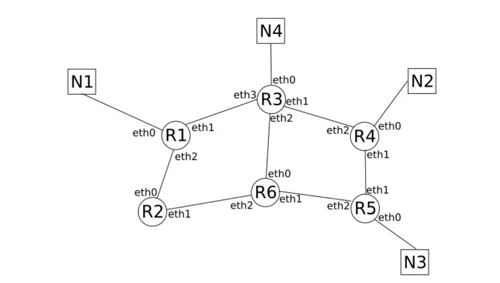

[pdf](./routage_td.pdf)

**Compétence :** _Analyser un datagramme IP_

## Exercice 1

Nous avons utilisé le logiciel WireShark (analyse de trames) pour capturer
les datagrammes échangés sur un réseau local. Nous étudions le datagramme suivant :

```
Frame 12: 98 bytes on wire (784 bits), 98 bytes captured (784 bits) on interface enp3s0, id 0
    Interface id: 0 (enp3s0)
    Encapsulation type: Ethernet (1)
    Arrival Time: Oct 11, 2020 13:56:25.823292748 CEST
    [Time shift for this packet: 0.000000000 seconds]
    Epoch Time: 1602417385.823292748 seconds
    [Time delta from previous captured frame: 0.192323401 seconds]
    [Time delta from previous displayed frame: 0.192323401 seconds]
    [Time since reference or first frame: 1.013317818 seconds]
    Frame Number: 12
    Frame Length: 98 bytes (784 bits)
    Capture Length: 98 bytes (784 bits)
    [Frame is marked: False]
    [Frame is ignored: False]
    [Protocols in frame: eth:ethertype:ip:icmp:data]
    [Coloring Rule Name: ICMP]
    [Coloring Rule String: icmp || icmpv6]
Ethernet II, Src: Micro-St_5d:b2:f4 (44:8a:5b:5d:b2:f4), Dst: AnovFran_7f:95:56 (a4:3e:51:7f:95:56)
Internet Protocol Version 4, Src: 192.168.1.21, Dst: 192.161.1.26
    0100 .... = Version: 4
    .... 0101 = Header Length: 20 bytes (5)
    Differentiated Services Field: 0x00 (DSCP: CS0, ECN: Not-ECT)
    Total Length: 84
    Identification: 0x71b3 (29107)
    Flags: 0x4000, Don't fragment
    Fragment offset: 0
    Time to live: 64
    Protocol: ICMP (1)
    Header checksum: 0x457d [validation disabled]
    [Header checksum status: Unverified]
    Source: 192.168.1.21
    Destination: 192.161.1.26
Internet Control Message Protocol
    Type: 8 (Echo (ping) request)
    Code: 0
    Checksum: 0xd436 [correct]
    [Checksum Status: Good]
    Identifier (BE): 1 (0x0001)
    Identifier (LE): 256 (0x0100)
    Sequence number (BE): 19 (0x0013)
    Sequence number (LE): 4864 (0x1300)
    [No response seen]
    Timestamp from icmp data: Oct 11, 2020 13:56:25.000000000 CEST
    [Timestamp from icmp data (relative): 0.823292748 seconds]
    Data (48 bytes)

```

1. Quelle est la nature du réseau utilisé ?
2. Extraire l'adresse IP de l'émetteur et celle du destinataire.
3. Quelle est l'application qui a généré ce datagramme ?

***

**Compétence :** _Connaître le fonctionnement du protocole de routage RIP_

## Exercice 2


Un routeur a la table de routage suivante :

| Adresse de destination |   Passerelle  |   Interface  | Vecteur de distance |
|:----------------------:|:-------------:|:------------:|:-------------------:|
|       192.8.13.20      | 192.168.1.254 |  192.168.1.3 |          3          |
|       192.168.1.0      | 192.168.1.254 |  192.168.1.3 |          1          |
|       180.18.0.0       |  180.18.1.254 |  192.168.1.1 |          1          |
|       180.19.0.0       |  180.19.1.254 |  192.168.1.1 |          2          |
|       180.19.3.0       |  180.19.1.254 |  192.168.1.1 |          2          |
|        _défaut_        | 192.168.1.254 | 192.168.1.13 |          1          |

1. Donner le message RIP émis par ce routeur.

## Exercice 3

Soit le réseau suivant :


Donner la table de routage RIP du routeur 1

## Exercice 4

Soit le réseau suivant :


1. Expliquer comment, lorsqu'il reçoit un datagramme sur l'une de ses interfaces
    le routeur R2 retransmet ce datagramme en fonction de son destinataire.
2. Donner la table de routage RIP du routeur R2.
3. Donner la table de routage RIP du routeur R4.
4. Donner la table de routage RIP du routeur R6.

## Exercice 5

La socitété IMPORT3000 est spécialisée dans l'import de produits numériques et
dans leur revente sur le marché français. Son réseau informatique est structuré
en 3 parties :

* Le réseau administratif abritant tous les postes de travail et les serveurs de 
    fichier et de gestion (réseau 192.168.1.0)
* Le réseau commercial (réseau 142.7.0.0)
* la zone démilitarisée (DMZ) hébergeant les serveurs web accessibles par
    internet (réseau 19.0.0.0)

L'organisation de ce réseau est la suivante :


1. Donner la ligne de la table de routage d'un hôte du réseau administratif
    nécessaire pour qu'il puisse joindre tout hôte du réseau commercial.
2. Donner la ligne de la table de routage de cet hôte du réseau administratif
    nécessaire pour qu'il puisse joindre le serveur Web
3. Donner la ligne de la table de routage d'un hôte du réseau commercial
    nécessaire pour qu'il puisse joindre le serveur Web

**Compétence :** _Analyse une situation réelle de routage_

## Exercice 6

Sur un serveur Linux, la commande qui permet d'afficher la table de routage
est `route`.

Dans cet exercice, nous exécutons `route` sur un serveur en activité, le 
résultat est le suivant :

```
Destination     Passerelle      Genmask         Indic Metric Ref    Use Iface
192.169.1.36    0.0.0.0         255.255.255.0   UH    0      0        0 eth0
192.169.1.0     0.0.0.0         255.255.255.0   U     1      0        0 eth0
195.1.1.0       0.0.0.0         255.255.255.0   U     1      0        0 eth1
70.0.1.0        0.0.0.0         255.0.0.0       U     3      0        0 eth1
127.0.0.1       0.0.0.0         255.0.0.0       U     0      0        0 lo
default         0.0.0.0         0.0.0.0         UG    1      0        0 eth0

```

À combien de réseau ce routeur est-il relié ?


## Exercice 7 - 2024, sujet 0a, Exercice 1


_Cet exercice est tiré d'un sujet d'écrit, le sujet 0 de 2024. Il rapporte 6 points sur 20_


_Cet exercice porte sur l’architecture matérielle, les réseaux, les routeurs et les protocoles de routage._

On considère un réseau local N1 constitué de trois ordinateurs M1, M2, M3 et dont les adresses IP sont les suivantes :

- M1 : 192.168.1.1/24 ;
- M2 : 192.168.1.2/24 ;
- M3 : 192.168.2.3/24.

On rappelle que le “/24” situé à la suite de l’adresse IP de M1 signifie que l’adresse réseau du réseau local N1 est 192.168.1.0.

Depuis l’ordinateur M1, un utilisateur exécute la commande ping vers l’ordinateur M3 comme suit :

```
util\@M1 \~ % ping 192.168.2.3

PING 192.168.2.3 (192.168.2.3): 56 data bytes
Hôte inaccessible

```

1. Expliquer le résultat obtenu lors de l’utilisation de la commande ping (on part du principe que la connexion physique entre les machines est fonctionnelle).

On ajoute un routeur R1 au réseau N1 :

> _“Un routeur moderne se présente comme un boîtier regroupant carte mère, microprocesseur, ROM, RAM ainsi que les ressources réseaux nécessaires (Wi-Fi, Ethernet…). On peut donc le voir comme un ordinateur minimal dédié, dont le système d’exploitation peut être un Linux allégé. De même, tout ordinateur disposant des interfaces adéquates (au minimum deux, souvent Ethernet) peut faire office de routeur s’il est correctement configuré (certaines distributions Linux minimales spécialisent la machine dans cette fonction).”_  
>   
> Source : Wikipédia, article “Routeur”

2. Définir l’acronyme RAM.

3. Expliquer le terme Linux.

4. Expliquer pourquoi il est nécessaire d’avoir “au minimum deux” interfaces réseau dans un routeur.

Le réseau N1 est maintenant relié à d’autres réseaux locaux (N2, N3, N4) par l’intermédiaire d’une série de routeurs (R1, R2, R3, R4, R5, R6) :

 

5. Attribuer une adresse IP valide à l’interface eth0 du routeur R1 sachant que l’adresse réseau du réseau N1 est 192.168.1.0.

---

Dans un premier temps, on utilise le protocole de routage RIP (Routing Information Protocol). On rappelle que dans ce protocole, la métrique de la table de routage correspond au nombre de routeurs à traverser pour atteindre la destination.

**Table de routage du routeur R1 :**

| destination | interface de sortie | métrique |
|:-----------:|:-------------------:|:--------:|
|      N1     |         eth0        |     0    |
|      N2     |         eth1        |     2    |
|      N2     |         eth2        |     4    |
|      N3     |         eth1        |     3    |
|      N3     |         eth2        |     3    |
|      N4     |         eth1        |     1    |
|      N4     |         eth2        |     3    |

6. Déterminer le chemin parcouru par un paquet de données pour aller d’une machine appartenant au réseau N1 à une machine appartenant au réseau N2.

Le routeur R3 tombe en panne. Après quelques minutes, la table de routage de R1 est modifiée afin de tenir compte de cette panne.

7. Dresser la table de routage du routeur R1 suite à la panne du routeur R3.

---

Le routeur R3 est de nouveau fonctionnel. Dans la suite de cet exercice, on utilise le protocole de routage OSPF (Open Shortest Path First). On rappelle que dans ce protocole, la métrique de la table de routage correspond à la somme des coûts :

$$
\text{coût} = \frac{10^8}{d}
$$

(où $d$ est la bande passante d’une liaison en bit/s).

Le réseau est constitué de 3 types de liaison de communication :

- Fibre avec un débit de 1 Gbit/s ;
- Fast-Ethernet avec un débit de 100 Mbit/s ;
- Ethernet avec un débit de 10 Mbit/s.

8. Calculer le coût de chacune de ces liaisons de communication.

**Table de routage du routeur R1 :**

| destination | interface de sortie | métrique |
|:-----------:|:-------------------:|---------:|
|      N1     |         eth0        |      0,0 |
|      N2     |         eth1        |     10,1 |
|      N2     |         eth2        |      1,3 |
|      N3     |         eth1        |     11,3 |
|      N3     |         eth2        |      0,3 |
|      N4     |         eth1        |     10,0 |
|      N4     |         eth2        |      1,2 |

D’autre part, le type des différentes liaisons inter-routeurs sont les suivantes :

- R1 - R2 : Fibre ;
- R1 - R3 : Ethernet ;
- R2 - R6 : INCONNU ;
- R3 - R6 : Fast-Ethernet ;
- R3 - R4 : Fibre ;
- R4 - R5 : Fast-Ethernet ;
- R5 - R6 : Fibre.

9. Déduire de la table de routage de R1 et du schéma du réseau le type de la liaison inter-routeur R2 - R6.

Des travaux d’amélioration ont été réalisés sur ce réseau : la liaison inter-routeur R1-R3 est désormais de type Fibre.

10. Modifier la table de routage de R1 en tenant compte de cette amélioration.

On ajoute un réseau local N5 et un routeur R7 au réseau étudié ci-dessus. Le routeur R7 possède trois interfaces réseaux eth0, eth1 et eth2. eth0 est directement relié au réseau local N5. eth1 et eth2 sont reliés à d’autres routeurs (ces liaisons inter-routeur sont de type Fibre).

Les deux tableaux suivants présentent un extrait des tables de routage des routeurs R1 et R3 :

**Extrait table de routage du routeur R1**

| destination | interface de sortie | métrique |
|-------------|---------------------|----------|
| …           | …                   | …        |
| N5          | eth1                | 1,2      |
| N5          | eth2                | 0,2      |

**Extrait table de routage du routeur R3**

| destination | interface de sortie | métrique |
|-------------|---------------------|----------|
| …           | …                   | …        |
| N5          | eth1                | 1,3      |
| N5          | eth2                | 1,1      |
| N5          | eth3                | 0,3      |

11. Recopier et compléter le schéma du réseau (rappelé ci-dessous) en ajoutant le routeur R7 et le réseau local N5.

     


## Exercice 8 - Bilan

HTTP est le protocole de base du Web : c'est lui qui transmet les requêtes
de pages Web et assure le transport de ces pages Web entre le serveur et le
client, pour que le navigateur de celui-ci puisse les afficher.

Les transferts générés par HTTP ne sont pas sécurisés : il a donc éé nécessaire
de lui ajouter des outils assurant la sécurité des transmissions des requêtes
et pages.

La sécurité a été ajoutée à HTTP par les protocoles SSL, puis TLS, donnant
un complexe qui a pris le nom d'HTTPS.

HTTPS intègre la sécurité aux différents niveaux d'un échange, par l'utilisation
des techniques de chiffrement :

* l'échange sécurisé de clés,
* l'authentification du client et du serveur,
* la confidentialité des transmissions (requêtes et pages) par un mécanisme
    de chiffrement.

1. Sachant que HTTPS assure la confidentialité des données par un chiffrement
    symétrique, représenter par un schéma la transmission sécurisée de la
    requête d'une page Web d'un client à destination d'un sereur Web
2. Ajouter à ce schéma la transmission de la page Web du serveur vers le
    client.
3. Nous avons dit que la clé publique utilisée par le client et le sereur pour
    cette transmission des pages est générée au départ de l'échange par le
    serveur, puis transmise au client.

    Quelle est la problématique qui se pose à ce niveau ?
4. Proposer une solution pour sécuriser cette transmission de la clé publique
    de chiffrement symétrique.
5. Compléter le schéma de 2. en intégrant la diffusion de la clé publique
    symétrique.

[Correction de Math93.com](./BACNSI2024_Sujet0_A.pdf)
