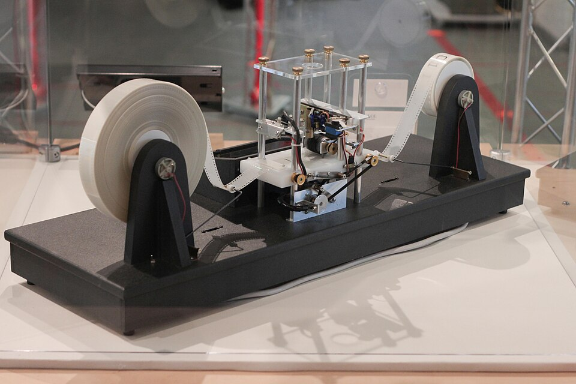
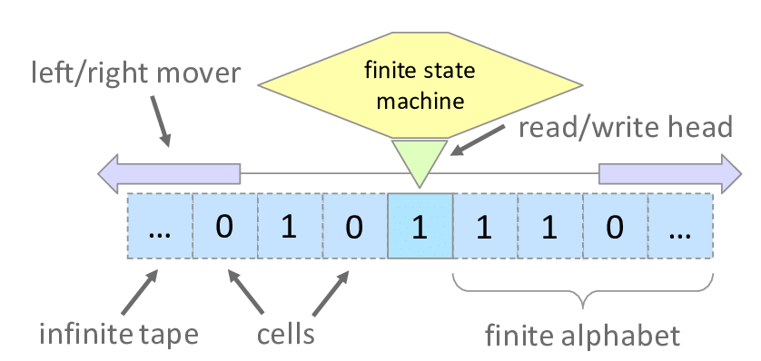
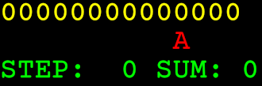

# Calculabilité - Problème de l'arrêt en Python

## Programme officiel




> _Parallèlement, on montre l’universalité et les limites de la notion de calculabilité._ 
> 
> ### Contenus 
> 
> _Notion de programme en tant que donnée. Calculabilité, décidabilité_ 
> 
> ### Capacités attendues 
> 
> _Comprendre que tout programme est aussi une donnée. Comprendre que la calculabilité ne dépend pas du langage de programmation utilisé. Montrer, sans formalisme théorique, que le problème de l’arrêt est indécidable._ 
> 
> ### Commentaires 
> 
> _L’utilisation d’un interpréteur ou d’un compilateur, le téléchargement de logiciel, le fonctionnement des systèmes d’exploitation permettent de comprendre un programme comme donnée d’un autre programme._ 



## Un programme en tant que donnée



Un _programme_ est un texte écrit en langage machine et que la machine peut exécuter. 

Généralement les programmes prennent la forme de fichiers exécutables.

Le code source d'un programme est transformé par un _compilateur_ en un _programme_.
Ce résultat est donc la donnée de sortie d'un compilateur.


```bash 
$ cat hello.c             # affiche le contenu du fichier texte hello.c
#include <stdio.h>

int main(void) { 
    printf("Hello, World!\n"); 
}

$ gcc hello.c -o hello    # compile hello.c en un fichier binaire hello
$ chmod +x hello          # rend le fichier `hello` exécutable 
$ ./hello                 # exécute `hello`
Hello, World!
```


Pour exécuter ce programme, je le localise sur ma machine, par exemple avec un _explorateur de fichiers_, puis je l'exécute.

Cependant, compiler soi même ses programmes n'est pas courant. Généralement on télecharge des programmes déjà compilés avec un navigateur ou un gestionnaire de téléchargement... ensuite on l'installe (c'est à dire qu'on copie ses fichiers au bons endroits).

Ce téléchargement transfère donc les données du programme pour en faire un fichier exécutable sur notre machine.


Les programmes sont donc _des données_ de ces logiciels (navigateur, gestionnaire de téléchargement, explorateur de fichier, compilateur etc.)


## Équivalence des langages de programmation

Les différents langages de programmation disposent tous d'une propriété commune : ils sont **Turing Complets**. 


**Cela signifie qu'un problème qu'on peut résoudre dans l'un est résoluble dans un autre.**


Attention, cela ne dit rien de l'_efficacité_ des langages. Python est lent et n'est pas adapté à l'écriture de pilotes matériels... mais pourrait le faire.

Ainsi, Python est généralement interprété par un programme (`python.exe` sous windows) qui est programmé en C. Cet interpréteur pourrait être écrit en Python lui même... [et ça existe](https://github.com/pypy/pypy).

### Turing Complet ?


Que signifie le terme "Turing Complet" ?

Malheureusement, définir précisément ce terme dépasse largement le cadre du programme. Cela n'a rien d'infaisable mais notre ambition n'est pas de faire de vous des informaticiens théorique.

Ceci étant dit, on peut tenter une approche.

Il existe de nombreux modèles théoriques dont on a démontré mathématiquement l'équivalence. C'est la thèse de Church-Turing.

À l'origine, trois modèles étaient en compétition pour définir ce qu'une machine devait être capable de faire.

- les machines de Turing,
- le $\lambda$-Calcul d'Alonzo Church, ($\lambda$ = lambda)
- les "fonctions récursives générales" de Kurt Gödel et Stephen Kleene. (_Attention, on ne parle pas uniquement de fonction qui s'appelle elle-même, comme nous le faisons dans le chapitre sur la récursion._)

Church et Turing ont démontré que ces modèles étaient _équivalents._

Ainsi, on pourrait construire une machine de Turing qui serait, par exemple, un interpréteur Python. Ce serait un travail colossal... mais théoriquement faisable.

Oui mais... qu'est-ce qu'il faut au minimum ?

En simplifiant énormément les contraintes des _fonctions récursives générales_ :


Si un langage permet de :

- définir la constante `0`,
- incrémenter (`x <- x + 1`),
- affecter une variable et accéder à son contenu,
- concaténer des programmes (c'est-à-dire mettre des instructions les unes après les autres),
- écrire des boucles for décroissantes : `for (x to 0) do ... end`
- écrire des boucles while `while (x != 0) do ... end`

Alors ce langage est Turing-Complet.


Remarquons que tout ça est trivial en Python, ce qui prouve bien que Python est Turing-Complet.

### Exemples 

Les langages modernes sont tous Turing-Complets, les assembleurs ARM et x86 aussi.

- HTML seul ne l'est pas. Mais HTML+CSS l'est.
- SQL est Turing-Complet,
- TeX (un langage de description de documents employé par tous les matheux qui se respectent) est Turing-Complet,
- Excel l'est aussi.

Certains _jeux_ sont Turing-Complet :

- Dwarf Fortress,
- Cities: Skylines,
- Minecraft (red stone etc. chercher Minecraft turing machine),
- Magic: The Gathering,
- une grille infinie de démineur,
- baba is you,

D'autres trucs plus ésotériques :

- le jeu de la vie de John Conway,
- le formatage des chaînes de caractères du C, utilisé notamment dans `printf` est Turing-Complet,
- l'instruction `MOV` de l'assembleur x86 est Turing-Complete. Cela signifie qu'on pourrait écrire TOUS les programmes de la terre avec une seule instruction...


Comme on s'en apperçoit, les conditions minimales ne sont pas très restrictives, raison pour laquelle il existe autant de langages de programmation.

## Terminaison

On dit qu'une fonction **termine** si elle renvoie une valeur ou si elle lève une exception (par exemple `ZeroDivisionError` si une division par zéro est tentée).

Ainsi, une fonction qui **ne termine pas** est une fonction qui entre dans une boucle infinie.

Avec cette définition, seulement deux situations peuvent se présenter lorsqu'on appelle une fonction :

- Elle _termine_,

ou

- Elle _continue de calculer indéfiniment_

### Remarque 

Ici, on n'envisage que des programmes très simples, **sans intéraction avec l'utilisateur**.

Ainsi, la boucle principale d'une application utilisateur :

```python 
mise_en_route()

while True:
    lire_les_entrees()
    mettre_a_jour_l_etat()
    afficher()
```
N'est pas envisagée.

Justement parce que dans `lire_les_entrees` on dispose d'un moyen de signaler qu'on veut arrêter le programme... et que dans `mettre_a_jour_l_etat` on l'arrête si nécessaire.

---


Ainsi, la fonction `ma_fonction` (voir ci-dessous), termine pour un entier `n` inférieur ou égal à 10 (elle renvoie `None`) et ne termine pas pour `n` strictement plus grand que 10.

En outre, cette fonction termine pour une chaîne de caractères `n` (en levant l'exception `TypeError` à cause de l'opération `+`).

```python
def ma_fonction(n):
  while n != 10 :
    n = n + 1
```

## Décidabilité 

### Prédicat et problème de décision

Avant d'aborder la décidabilité_, il nous faut un peu de vocabulaire.


Un _prédicat_ est une fonction qui part d'un ensemble $E$ et renvoie un booléen.



Un _problème de décision_ est la donnée d'un ensemble $E$, l'ensemble des instances et d'un sous-ensemble de $E$, appellé "ensemble des instances positives" et noté $E^+$.


Considérons le problème : "un nombre entier est-il premier ?" appelé "primalité".


Un nombre entier naturel est _premier_ s'il a exactement deux diviseurs.

0 et 1 ne sont pas premiers (ils ont respetivement une infinité et un seul diviseur.)

La suite des nombres premiers commence par :

$2, 3, 5, 7, 9, 11, 13\ldots$

Les nombres premiers interviennent souvent en informatique, en particulier dans la sécurisation des communications.

Parmi les problèmes rencontrés :

- Déterminer si un nombre donné est premier,
- Déterminer un nombre premier entre deux bornes très grandes,
- Obtenir la factorisation en nombres premiers d'un entier donné,
- Lister tous les nombres premiers inférieurs à une borne etc.


Ici, $E = \mathbb{N}, E^+ = \mathcal{P} :$ les nombres premiers.

On peut alors définir un _prédicat_ partant de $\mathbb{N}$ :

```python
def est_premier(n: int) -> bool:
    """vrai ssi n est premier"""
    ...
```

Un autre exemple : "une chaîne de caractères donnée est-elle un code Python sans erreur de syntaxe ?"

```python 
def est_bien_forme(code: str) -> bool:
    """vrai ssi le code est sans erreur de syntaxe Python"""
    ...
```


### Problème de décision _décidable_


Un problème de décision est _décidable_ si on peut programmer le prédicat associé en Python.



Voici un prédicat (très très inefficace !) pour le problème de la primalité.

```python 
def est_premier(n: int) -> bool:
    """Vrai ssi n est un nombre premier"""
    # on élimine les cas triviaux
    if n < 2: 
        return False
    if n < 4 : 
        return True
    # on teste tous les diviseurs possibles (il y a beaucoup plus efficace !)
    for d in range(3,n,2):
        if n % d == 0: 
            return False
    return True
```

Et pour le second, `python.exe` lui même contient un tel prédicat puisqu'il refuse d'exécuter du code mal formaté.


Ces deux problèmes (primalité et code bien formé) sont donc _décidables_.

La question qui subsiste est alors : _existe-il des problèmes indécidables ?_ 

La réponse est oui et nous allons en construire un : _le problème de l'arrêt._

## Calculabilité

En langage simple :

> _Que peut-on faire faire à une machine ?_
> _Et que ne peut-on pas lui faire faire ?_


Une fonction $f$ est _calculable_ s'il existe un algorithme qui, étant donné une entrée $x$, permet d'obtenir $f(x)$.


Python étant un langage Turing-Complet, on peut s'en servir pour illustrer cette notion :


Une fonction est calculable si elle est programmable en Python.


### Décidabilité et calculabilité 


Un problème de décision est décidable si son prédicat est calculable. Autrement dit, si son prédicat peut être programmé en Python.



### Quel intérêt ?

Jusqu'ici, tous les problèmes qu'on a pu aborder avaient une solution. Parfois très lente, parfois très difficile mais nous sommes parvenus à répondre à tous les problèmes.


Existe-t-il des fonctions non calculables ?



## Problème de l'arrêt

### De l'utilité d'une fonction `arret`

On pourrait penser qu'il serait utile d'avoir en Python une fonction `arret` :


- qui termine sur toutes les entrées possibles,
- telle que `arret(f, x)` renvoie `True` si le calcul de `f(x)` termine
- et `False` sinon.


Une telle fonction, si elle était ajoutée au langage, permettrait d'éviter les boucles infinies en faisant un simple test.

Si on voulait programmer une telle fonction, il serait naturel que la fonction `arret` accède au code de la fonction `f` (ce qui est possible grâce au module `dis`), et analyse ce code, par quelque moyen compliqué, pour en déduire si oui ou non le calcul de `f(x)` va un jour terminer.

## Le Problème de l'arrêt...

La question :


_Est-il possible de programmer la fonction `arret` ?_


est connue sous le nom du **problème de l'arrêt**.

## C'est impossible

Nous allons montrer qu'une telle fonction ne peut pas exister.

Pour cela, nous allons employer un _raisonnement par l'absurde_.


**Raisonnement par l'absurde.**

L'idée est de supposer _le contraire de ce qu'on souhaite prouver_ et de démontrer que cela est impossible _en aboutissant à une contradiction_, une absurdité_.

Un exemple vous éclairera davantage qu'une définition formelle :

#### Énoncé : "$0$ n'a pas d'inverse".

_Rappel : l'inverse_ d'un nombre réel $x$ est l'unique nombre réel $y$ tel que $x \times y = 1$.

#### Preuve : 

**Supposons le contraire, à savoir que $0$ a un inverse** (Hypothèse du raisonnement par l'absurde)

Notons $a$ cet inverse.

Alors $0 \times a = 1$ par définition de l'inverse.

Mais...$0 \times a = a \times 0$. (le produit des réels est commutatif)

D'autre part, $a \times (0 + 0) = a \times 0 + a \times 0$. (simple distributivité)

Donc $a \times (0 + 0) = 1 + 1$ d'après le résultat précédent et $a \times (0 + 0) = 2$.

Mais $0 + 0 = 0$. ($0$ est l'élément neutre de l'addition des réels.)

Donc $a \times (0 + 0) = a \times 0$.

En utilisant les résultats précédents cela dit que $2 = 1$.

Cette dernière affirmation **est fausse** et contredit la construction des nombres réels.

Donc le raisonnement est faux... mais où est l'erreur ? Dans la supposition initiale : "_Supposons que $0$ à un inverse_".

Donc la supposition de départ est fausse et $0$ n'a pas d'inverse.


### Hypothèse

Supposons que quelqu'un ait réussi à programmer cette fonction `arret`.

```python
def arret(f, x) -> bool:
    """
    Prend une fonction f et ses paramètres x en entrée.
    * Termine toujours
    * Renvoie `True` si `f(x)` termine
    * Renvoie `False` si `f(x)` ne termine pas.
    """
    ...
```

### La fonction `strange`

Nous pouvons alors l'utiliser pour programmer la fonction `strange` suivante :

```python
def strange(f, x):
  if arret(f, x):
    while True:
      pass
```

Cette fonction teste si le calcul de `f(x)` termine.

- si `f(x)` termine, elle rentre dans une boucle infinie dans laquelle elle ne fait rien.

- Sinon, elle ne fait rien et termine.

**Autrement dit, `strange(f, x)` termine si et seulement si `f(x)` ne termine pas.**

### La fonction `paradox`

La précédente fonction nous permet d'en définir une nouvelle, la fonction `paradox`.

```python
def paradox(f):
  strange(f, f)
```

Par construction, le calcul de `paradox(f)` termine si et seulement si le calcul de `f(f)` ne termine pas. Appelons (1) cette propriété.

> (1) _le calcul de `paradox(f)` termine si et seulement si le calcul de `f(f)` ne termine pas_

### `paradox(paradox)` ?

Maintenant, demandons-nous si le calcul de `paradox(paradox)` termine.

Pour cela, dans la propriété (1), remplaçons `f` par `paradox`.

La propriété devient :

> _Le calcul de paradox(paradox) termine si et seulement si le calcul de paradox(paradox) ne termine pas._

Cette dernière propriété est évidemment absurde (elle se contredit elle même).

Nous pouvons donc conclure notre raisonnement par l'absurde et affirmer qu'il est impossible de programmer la fonction `arret`.

## Autres sources

- [Version intéressante de Gilles Lassus](https://glassus.github.io/terminale_nsi/T2_Programmation/2.3_Calculabilite_Decidabilite/cours/)
- Une [vidéo](https://www.youtube.com/watch?v=a5MNIzu9Ia4) de l'université de Rennes qui expose la preuve précédente.

## Compléments

_Ces compléments sont hors programmes mais certains peuvent faire l'objet d'un sujet de grand oral ou d'un exercice de l'épreuve écrite_



### Limitation du problème

Le problème de l'arrêt reste impossible même si on se limite à ce que les arguments de arrêt soient une fonction `f` des entiers dans les entiers et un entier `x`.

Pourquoi ? Simplement parce que n'importe quelle valeur de n'importe quel type sera représentée en machine par une suite d'octet, soit à peu près un entier naturel.

### Historique

La résolution du problème de l'arrêt par Alonzo Church et Alan Turing, en 1936 a eu de nombreuses conséquences
en informatique et en mathématiques. Cela a conduit Alan Turing à créer les machines de Turing, modèle mathématiques à l'origine des ordinateurs modernes, afin de construire un exemple de fonction non calculable.

En particulier, il n'est pas possible d'écrire un assistant de programmation qui repère tous les problèmes qu'un code présente avant de l'avoir exécuté.


### Ramasse miettes 

Il n'est pas non plus possible d'écrire un ramasse miette (_garbage collector_) qui soit parfait.
Un ramasse miette cherche à libérer des zones de la mémoire après leur dernière utilisation dans un programme.
Ces outils existent dans beaucoup de langages modernes (python, java, Golang etc.) mais ne sont jamais parfaits, en effet, l'existence d'un ramasse miette parfait est équivalente au problème de l'arrêt.


Pourquoi utiliser des ramasses-miettes s'ils sont, par essence, imparfaits ?

Parce qu'ils font généralement mieux qu'un développeur, même très bon.

Mieux que quoi ?

La cause _majeure_ de bugs dans les programmes modernes est la gestion de la mémoire.
Dans un langage où il faut gérer la mémoire à la main, comme C ou C++, il faut allouer (=réserver) de la mémoire pour enregistrer les données avec `malloc` ou autre.
Après l'utilisation des données, il faut la libérer avec `free`

Easy.

Sauf que non. En pratique :

1. on en réserve trop (on risque alors de gaspiller des ressources précieuses), 
1. on n'en réserve pas assez (on risque alors d'accéder en dehors de l'espace réservé = buffer overflow),
1. on tente de la libérer plusieurs fois (UB : Undefined Behavior, on n'a aucune de ce qui peut se passer...)
1. on oublie de libérer la mémoire et le programme en consomme de plus en plus, finissant par paralyser le système,

Le ramasse miette tente de résoudre ce problème. Certes il ne sera jamais parfait mais... il évite de fait les problèmes 1, 2 et 3. Pour le problème 4, c'est insoluble _parfaitement_. Généralement, il le fait très bien.

Mais par exemple :

```python 
class A:
  def __init__(self):
    self.a = None 

class B:
  def __init__(self):
    self.b = None 

x = A()
y = B()

x.a = y 
y.b = x

# suite du programme, on n'utilise plus x ou y
```


Après la ligne `y.b = x`, les variables `x` et `y` ne sont plus jamais employées.

Le ramasse miette _devrait_ les libérer pour nous. Il ne le fera jamais car `y.b -> x` et `x.a -> y`, ces deux variables se réfèrent elles-mêmes.

Un autre inconvénient du ramasse miette est qu'à des moments difficiles à prédire, il s'exécute et parcourt la mémoire à la recherche d'espaces à libérer. Cela peut être coûteux en ressources.

Alors... si pas de ramasse miette, existe-t-il d'autres solutions ?

Oui, par exemple, le _borrow checker_ de Rust. Une approche totalement différente dans laquelle la construction de l'exemple plus haut est proscrite. Ce n'est _pas non plus parfait_ et cela demande un temps d'adaptation.



### Machine de Turing 

On l'a déjà dit : une machine de Turing est un modèle _abstrait_ du fonctionnement des appareils de calcul, comme les ordinateurs.

Si c'est un modèle créée sur le papier, on a depuis preque réussi à en fabriquer. 




Presque parce qu'il faudrait un ruban _infini_ ce qui n'est pas possible en pratique.


Dans son modèle le plus simple, une machine de Turing est constituée :

- d'un ruban infini comportant des cases où l'on peut écrire 0 et 1,
- d'une tête de lecture écriture pouvant lire et modifier une case à la fois et pouvant se déplacer d'une case à la fois,
- d'un automate (finite state machine) qui décrit les transitions d'un état à l'autre selon ce qu'on a lu sur le ruban.



Une [simulation en ligne](https://turingmachine.io/) vous permettra peut-être de mieux comprendre.

#### Écrire 1/3 en binaire 

La machine suivante produit la notation binaire d'1/3, la suite de nombres 0101010101010101...

Elle a deux états et deux symboles (0 et 1)

| Ancien état | Symbole écrit | Mouvement | Nouvel état |
|-------------|---------------|-----------|-------------|
| a           | 0             | Droite    | b           |
| b           | 1             | Droite    | a           |

En notant en gras la position de la tête de lecture/écriture sur le ruban on obtient :

| Étape | État | Ruban     |
|-------|------|-----------|
| 1     | a    | **0**     |
| 2     | b    | 0**1**    |
| 3     | a    | 01**0**   |
| 4     | b    | 010**1**  |
| 5     | a    | 0101**0** |
| 6     | b    | 01010**1** |

etc.

Détaillons :

La machine commence dans l'état a.

Etape 1 : la transition ne dépend pas de la valeur lue mais seulement de l'état : a. Alors, on écrit un 0, on va à droite et on passe dans l'état b.

Etape 2 : depuis l'état b, on écrit un 0, on va à droite et on passe dans l'état a.

Etape 3 : depuis l'état a, on écrit un 1, on va à droite et on passe dans l'état b.

etc.

Ainsi, on écrit bien 0101010101010...

Or : 

$$0.010101010101\overline{01}_2 = 0 + 0\times\dfrac{1}{2} + 1\times\dfrac{1}{4}+ 0\times{1}{8} + 1\times\dfrac{1}{16} + \cdots$$

$$0.\overline{01} = \dfrac{1}{4} + \dfrac{1}{4^2} + \cdots + \dfrac{1}{4^k} + \cdots = \sum_{k=1}^{\infty} \dfrac{1}{4^k} = \dfrac{1}{4} \times \sum_{k=0}^{\infty} \dfrac{1}{4^k} = \dfrac{1}{4} \times \dfrac{1}{1-\dfrac{1}{4}} = \dfrac{1}{4}\times\dfrac{4}{3} = \dfrac{1}{3}$$

Remarquons que ce programme _ne termine pas_.

#### Utilisation 

On emploie toujours ces modèles en informatique théorique et il existe toujours une recherche active à ce propos.

**Castor affairé** : un _castor affairé_ est une machine de Turing qui, pour un nombre donné d'états et de symboles réalise le plus grand nombre possible d'étapes _avant de s'arrêter._ Comme vous le devinez peut-être, le problème "pour $n$ états et $p$ symboles, quel est le castor affairé ?" est indécidable.


**Exemple Busy Beaver 4, 2**

Busy Beaver 4, 2 = Castor affairé à 4 états et 2 symboles. Il prend 107 étapes. Cela signifie qu'il n'existe pas de machine de Turing à 4 états et 2 étapes qui font **plus** de 107 étapes **avant de s'arrêter**.

| Etat/valeur lue | A   | B   | C   | D   |
|-----------------|-----|-----|-----|-----|
| 0               | 1RB | 1LA | 1RH | 1RD |
| 1               | 1LB | 0LC | 1LD | 0RA |

"0RA" se lit : écrire un 0, aller à droite (right...) et passer dans l'état A.

L'état "H" signifie Halt pour s'arrêter.



### complément lambda calcul 


Bon... j'ai cherché des vulgarisations et n'ai pas trouvé grand chose d'abordable. Vous pouvez suivre des cours autour de ça, cela ne demande que très peu de connaissances théoriques. Mais cela reste très formel.

La seule vidéo que je trouve abordable pour vous [est en anglais](https://www.youtube.com/watch?v=eis11j_iGMs).

### Impact en mathématiques 

Les travaux de Gödel sur _l'indécidabilité_, qui sont les précurseurs des thèses de Church, Turing et Kleene, ont apporté une réponse négative à une tentative millénaire d'automatisation des mathématiques (fabriquer des machines pour tout démontrer) et correctement formalisés pour la première fois par David Hilbert au début du XX$^{eme}$ siècle.

Cela a jeté les mathématiciens dans un désarroi dont ils ne peuvent sortir.

Jusqu'ici, les énoncés étaient :

1. vrai ou faux.
2. démontrés ou non (on parle alors de conjectures),

Si le premier point ne change pas (une affirmation est vraie ou fausse), il se peut tout à fait qu'une affirmation soit _indécidable_. Il est vain de tenter de la démontrer ou de l'infirmer, on n'y arrivera jamais.

Il est généralement très difficile de démontrer qu'un énoncé complexe est indécidable.

Pour un mathématicien cela signifie qu'il peut passer un temps infini à tenter de démontrer un résultat pour lequel _il ne peut exister de preuve_...

