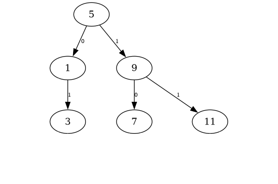
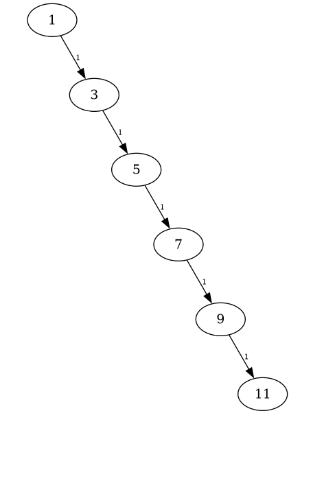

[pdf](./resume_arbre_binaire_algo.pdf)

## Rappels :

Un arbre binaire est soit :

- l'arbre vide,
- le triplet `(e, g, d)` où :
    - `e` est la valeur accrochée à l'arbre : _l'étiquette_ 
    - `g` est un arbre binaire, _le sous arbre gauche_,
    - `d` est un arbre binaire, _le sous arbre droit_.

### Exemple 

Un arbre binaire d'étiquette 5.

On n'a pas représenté les sous arbres vides accrochés aux feuilles.

## Différentes implémentations

### Arbre binaire avec des tuples

[Voir ici](./arbre_binaire_tuple.py)

Cette démarche est très peu pratique. Les arbres ne sont pas mutables : il faut les créer "d'un coup". C'est pénible à écrire à la main.

### Arbre binaire avec une classe

[Voir ici](./arbre_binaire_classe.py)

## Taille et hauteur

### Taille 

La _taille_ d'un arbre (binaire ou non) est son nombre de noeuds.

On la calcule récursivement pour un arbre binaire :

- 0 si l'arbre est vide,
- sinon c'est : 1 + la taille de gauche + la taille de droit

Dans l'exemple dessiné plus haut la taille est 6. (5, 3, 1, 9, 7, 11 : 6 éléments)

### Hauteur 

Plusieurs définitions possibles. _Un énoncé rappellera toujours la définition choisie, adaptez-vous_.

1. Soit c'est le nombre maximal **d'arcs** entre la racine et les feuilles,
1. Soit c'est le nombre maximal **de noeuds** entre la racine et les feuilles,

Avec la définition 1, la hauteur de l'exemple est 2. Avec la définition 2 la hauteur de l'exemple est 3.

taille d'une feuille :

1. définition 1: 0
2. définition 2: 1

Taille d'un arbre vide :

1. définition 1: -1 (!!!)
2. définition 2: 0 (!!!)

**Approche récursive de la définition 1 :**

La hauteur est :

- -1 si l'arbre est vide,
- sinon c'est : 1 + max( hauteur de gauche, hauteur de droit )

_Remarques :_ 

- les deux définitions différent de 1.
- elles sont cohérentes pour l'usage qu'on en fait.

## Différents parcours 

On distingue 4 parcours classiques sur les arbres binaires :

### Largeur d'abord 

On visite l'arbre "de haut en bas", "par niveaux successifs" et "de gauche à droite".

Dans l'exemple ci-dessus, cela donne : 5, $\hspace{5mm}$1, 9,$\hspace{5mm}$ 3, 7, 11

_Les espaces indiquent les différents niveaux_

### Préfixe, Infixe, Suffixe

Ce sont trois parcours en "profondeur d'abord" dans lesquels l'étiquette est "visitée" à un moment différent :

### Préfixe : e, g, d 

**Visiter l'étiquette**, parcourir gauche, parcourir droit.

Dans l'exemple : 5, 1, **3, 9**, 7, 11 (en gras la différence avec un parcours en largeur d'abord)

### Infixe : g, e, g 

Parcourir gauche, **visiter l'étiquette**, parcourir droit.

Dans l'exemple : 1, 3, 5, 7, 9, 11

### Suffixe (en anglais _postfix_) : g, d, e 

Parcourir gauche, parcourir droit, **visiter l'étiquette**.

Dans l'exemple : 3, 1, 7, 11, 9, 5

## Arbre binaire de recherche

Les _Arbres Binaires de Recherche_ (ABR) sont des arbres binaires dans lesquels les etiquettes sont rangées dans un certain ordre.

On distingue, selon le contexte, plusieurs définitions. Voici la plus courante :

Un arbre binaire est défini récursivement ainsi :

- l'arbre vide est un arbre binaire de recherche.

Sinon :

- les étiquettes du SAG sont toutes _inférieures ou égales_ à l'étiquette de l'arbre,
- les étiquettes du SAD sont toutes _supérieures_ à l'étiquette du SAD.
- les SAG et SAD sont encore des arbres binaires de recherche.

Remarques :

- Dans cette définition les ex-aequo sont acceptés. Ils sont alors rangés vers la gauche.
- Si on remplace _inférieures ou égales_ par _strictement inférieures_ alors il n'y a plus d'ex-aequo.

Exemple : l'arbre dessiné plus haut est un ABR. Le parcours infixe renvoie : 1 3 5 7 9 11

### Définition équivalente 

Un arbre binaire est un _arbre binaire de recherche_ si le _parcours infixe_ renvoie les valeurs par ordre croissant.

C'est beaucoup plus simple à programmer.

### Intérêt 

Un ABR est une structure très rapide pour tester la présence d'un élément dans une collection. Le principe est similaire à celui de la dichotomie (voir première).

_Attention :_ en pratique cela ne fonctionne que si l'arbre est _équilibré_.

On trouve aussi facilement son plus petit élément (aller à gauche jusqu'en bas) ou son plus grand élément (à droite jusqu'en bas).

### Implantation

On repart d'une classe implantant les arbres binaires et on y ajoute quelques méthodes:

- `contient(self, val) -> bool` vrai ssi l'arbre contient une valeur,
- `est_abr(self) -> bool` (en théorie inutile...) qui renvoie vrai si l'arbre est un ABR 
- `inserer(self, val)` qui insère une feuille en conservant la propriété de l'ABR.

On pourrait envisager "supprimer" mais c'est trop technique pour un résumé.

[Voir ici](./abr.py)

### Déséquilibrage

Selon l'ordre dans lequel on insère les éléments, on peut arriver à un arbre complètement filiforme.

Alors, la méthode `contient` perd tout son intérêt. Elle devient _linéaire_.

Si on parvient à maintenir l'équilibre de l'arbre alors la méthode contient est _logarithmique_.

Maintenir l'équilibre parfaitement est difficile à écrire. On emploie généralement des AVL mais leur implantation est HP.

Remarque : il existe beaucoup d'autres structures qui cherchent à maintenir une forme d'équilibrage sans trop ralentir l'insertion ou la suppression de valeurs. En particulier les "Red Black Tree".
