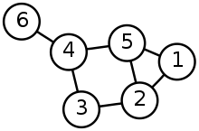

### pdf : [pour impression](/uploads/docnsitale/graphes/2_cours_print.pdf)

# Définitions

## Définition : Graphe simple



Un graphe _simple_ est un couple $G = (V, E)$ comprenant

*   $V$ un ensemble de _sommets_ (parfois appelés nœuds),
*   $E$ un ensemble d'_arêtes_ reliant ces sommets (parfois appelés _arcs_ ou _flèches_).

    Une arrête est simplement un couple de sommets ou un ensemble de deux sommets.

Les termes et notations anglais, que vous rencontrerez souvent sont :
sommet : _vertice_ et arête : _edge_. D'où les noms des ensembles.


### Exemple

Dans le graphe ci-dessus

* Les sommets sont : $V = \lbrace 1, 2, 3, 4, 5, 6\rbrace $
* Les arrêtes sont : $E = \lbrace  \lbrace 1, 2\rbrace , \lbrace 1, 5\rbrace , \lbrace 2, 3\rbrace , \lbrace 2, 5\rbrace , \lbrace 3, 4\rbrace , \lbrace 3, 5\rbrace , \lbrace 4, 5\rbrace , \lbrace 5, 6\rbrace $

## Définition : Graphe orienté


Lorsque les arêtes sont marquées d'une flèche, elles sont **orientées**.

Une arrête orientée ne se parcourt que dans le sens de la flèche.
Dans ce cas on note généralement les arrêtes avec des parenthèses pour désigner
des couples.

Par exemple l'arête $(1, 2)$ _part_ de $1$ et _arrive_ en $2$.

Si c'est un réseau de transport, on peut se rendre de 1 vers 2, mais pas dans
l'autre sens.


## Définition : Graphe pondéré

Dans certains cas, toutes les arêtes ne se valent pas.
(Un trajet "Lille-Paris" ne _coûte_ pas autant qu'un "Paris-Lyon".)

Dans ce cas on attribue aux arrêtes un _poids_, souvent noté _w_ (pour _weight_).


Ici l'_arête_ $(E, b)$ a un _poids_ de $10$.

Et le _trajet_ $(E, b, d, S)$ pèse $10+2+6 = 18$

# Structure de donnée graphe

## Introduction

De quoi a-t-on besoin de pour décrire des graphes ?

De toute évidence, il nous faut pouvoir représenter

* les sommets,
* les arrêtes.

Lors de notre représentation des _arbres binaires_ nous avions
choisi de ne considérer que les nœuds et nous avions essentiellement
une structure sous forme de triplet :

`arbre = (contenu, sous_arbre_gauche, sous_arbre_droit)`

Cela ne fonctionne plus ici, il n'y a généralement pas de sommet privilégié
dans un graphe... Tous les nœuds jouent le même rôle.

Il faut donc envisager un moyen de représenter l'ensemble des sommets
et l'ensemble des arrêtes.

Les **sommets** d'un graphe peuvent être enregistrés dans n'importe quelle "collection" :

* liste,
* tuples,
* dictionnaires,
* ensemble

etc.

Pour les **arêtes**, c'est différent.

Il existe plusieurs manières de les décrire et toutes ont leur utilité.
Nous devons apprendre à passer de l'une à l'autre.

## Ensemble d'arêtes

La méthode la plus simple et la plus courante pour décrire les arêtes est d'en
donner une _collection_. En mathématiques un ensemble, en informatique,
n'importe quelle structure sur laquelle itérer.

Par exemple : $G = (V, E)$ avec $V = \lbrace 1, 2, 3, 4\rbrace $
et $E = \lbrace (1, 2), (2, 3), (3, 4), (2, 4)\rbrace $


**Remarque :** Guido Von Rossum (créateur de Python) préconise d'utiliser un
dictionnaire.

Pour le graphe précédent :

```python
aretes = {
  1: [2],
  2: [1, 3, 4],
  3: [2, 4],
  4: [3, 2],
}
```

## Matrice d'adjacence

Il est courant et souvent pratique de représenter les arêtes dans une matrice.

**Définition :**

> Pour un graphe simple $G = (V, E)$ avec $n$ sommets, la **matrice d'adjacence**
> de $G$ est une matrice de dimension $n \times n$ dont l'élément $a_{ij}$ est 1
> si les sommets $i$ et $j$ sont reliés par une arrête et 0 sinon.

_Cette définition, simplifiée, ne s'applique qu'aux graphes simples_

**Exemple :**

Dans l'exemple du graphe ci-dessus, cela donne :

$$\begin{pmatrix}
  0 & 1 & 0 & 0\\\
  1 & 0 & 1 & 1\\\
  0 & 1 & 0 & 1\\\
  0 & 1 & 1 & 0
\end{pmatrix}$$

Comment remplir la première ligne ?

* 1 n'est pas relié à 1 donc le premier nombre est 0.
* 1 est relié à 2 donc le second nombre est 1.
* 1 n'est pas relié à 3, le troisième nombre est 0.
* 1 n'est pas relié à 4, le quatrième nombre est 0.

On obtient bien la première ligne : $(0\quad 1\quad 0\quad 0)$.

Lorsque les sommets sont numérotés, il est naturel de choisir l'ordre
correspondant, mais lorsque les sommets portent des noms ("Lille", "Paris",
"Marseille"), l'ordre peut varier. On obtient alors une autre matrice
d'adjacence qui lui est équivalente.

**De la matrice d'adjacence à la représentation**

Partant d'une matrice d'adjacence comme

$$
\begin{pmatrix}
  0 & 1 & 1 & 1 & 0\\\
  1 & 0 & 1 & 1 & 1\\\
  1 & 1 & 0 & 1 & 0\\\
  1 & 1 & 1 & 0 & 1\\\
  0 & 1 & 0 & 1 & 0\\\
\end{pmatrix}
$$

Il existe un _unique_ graphe qu'elle représente :


_Remarque_ : si on change l'ordre des sommets on obtient
une autre matrice d'adjacence ! La matrice d'adjacence est unique
_à l'ordre près des sommets._

### Cas des graphes orientés

Lorsque les graphes sont **orientés** on doit tenir compte de l'ordre.


**Définition :**

> Dans le cas d'un **graphe orienté**, la matrice d'adjacence contient 1
> à la ligne $i$, colonne $j$ s'il existe une arrête reliant le sommet $i$
> au sommet $j$.

*   Les _lignes_ donnent les points de _départ_. La deuxième ligne de la matrice
    d'adjacence contient 1 pour chaque arête qui **part** de 2.

*   Les _colonnes_ donnent les points d'_arrivée_. La deuxième colonne de la
    matrice d'adjacence contient 1 pour chaque arête qui **arrive** en 2.


$$
\begin{pmatrix}
  0 & 1 & 1 & 0\\\
  0 & 0 & 0 & 1\\\
  1 & 0 & 1 & 0\\\
  0 & 0 & 1 & 0
\end{pmatrix}
$$

Le graphe ci-dessus présente une boucle $3 \rightarrow 3$. Dans sa matrice
d'adjacence on peut le voir parce qu'il y a un 1 sur la diagonale en $a_{3, 3}$


### Application de la matrice d'adjacence

Si $A$ est la matrice d'adjacence d'un graphe alors:

$a_{i,j} = 1 \Longleftrightarrow \text{Il existe un arc de } i \text{ vers } j$.

Lorsqu'on apporte aux matrices une opération supplémentaire, le _produit_, on
obtient le résultat suivant :


**Théorème:**

> Le nombre de parcours de longueur exactement $k$ allant de $i$ à $j$ est le
> coefficient en position $(i, j)$ de la matrice $A^k$.


Exemple :

Pour le graphe précédent dont la matrice $A$ est :

$$A = \begin{pmatrix}
        0 & 1 & 1 & 0\\\
        0 & 0 & 0 & 1\\\
        1 & 0 & 1 & 0\\\
        0 & 0 & 1 & 0
      \end{pmatrix}
$$

On a $A^3 = \begin{pmatrix}
1 & 1 & 3 & 0 \\\
0 & 0 & 1 & 0 \\\
2 & 1 & 3 & 1 \\\
1 & 1 & 2 & 0
\end{pmatrix}$ aussi :

* Il n'existe aucun chemin de longueur exactement trois reliant 1 à 1,
* il existe exactement un chemin de longueur 3 reliant 1 à 3 : $(1, 2, 4, 3)$.

etc.

Malheureusement, les opérations sur les matrices ne sont pas au programme de NSI
et nous n'aurons pas l'occasion d'approfondir le sujet.

## Apparté : opérations matricielles

### La somme

> La **somme** de deux matrices de mêmes dimension est effectuée coefficient par coefficient.

Exemple : si $A = 
\begin{pmatrix}
    1 & 2\\\
    2 & -3
\end{pmatrix}, 
B = \begin{pmatrix}
    3 & 1\\\
    -2 & -4
\end{pmatrix}
$
alors $A + B =
\begin{pmatrix}
    4 & 3\\\
    0 & -7
\end{pmatrix}
$

> Le **produit par un scalaire** est aussi défini coefficient par coefficient, comme pour les vecteurs.

### Le produit de deux matrices

> Le produit de deux matrices $A_{n, p}$ et $B_{q, r}$ est défini si $p = q$. Autrement dit,
> le nombre de colonnes de la première doit correspondre au nombre de lignes de la seconde.

> Il est obtenu en faisant le produit scalaire de la ligne de gauche par la colonne de droite.

Si $C = A \times B$ alors, $\forall (i, j) \in  \lbrace 1, n\rbrace \times \lbrace 1, r\rbrace$
$$C_{i, j} = \sum_{k = 1}^{p} A_{i, k} \times B_{k, j}$$

Par exemple, pour les matrices données plus haut :

$C = 
\begin{pmatrix} 
    -1 & -7\\\
    12 & 14
\end{pmatrix}$

Par exemple, $C_{1, 2} = 1\times 1 + 2 \times -4 = -7$

### Structures mathématiques

* L'addition des matrices admet un **élément neutre**, la matrice nulle, noté $O_{n, p}$, une matrice remplie de 0.
* Le produit des matrices **carrées** admét un **élément neutre**, la matrice identité, notée $I_n$ une matrice dont la diagonale est remplie de 1 et le reste de 0.

* Le produit matriciel est **contre-intuitif** : il n'est pas commutatif (généralement $AB \neq BA$), le théorème du produit nul est faux (il existe $A\neq O, B\neq O$ tels que $AB = O$)

# Structure de donnée graphe

Pour travailler avec les graphes nous allons avoir besoin d'une structure de
donnée. Contrairement aux arbres, représentés depuis leur sommet,
nous allons créer un objet `Graphe` qui devra respecter certaines propriétés.

## Primitives

Quelles sont les primitives dont nous avons besoin pour créer un graphe ?

* créer un graphe (vide ou à partir d'une liste de sommets),
* ajouter un sommet,
* ajouter une arête,
* supprimer un sommet,
* supprimer une arête,
* le graphe est-il vide ?
* quels sont les sommets adjacents à un sommet donné ?

On peut aussi envisager :

* retourner la matrice d'adjacence d'un graphe,
* créer un graphe à partir d'une matrice d'adjacence.
* créer un graphe à partir de la liste de ses sommets (souvent appelée _liste d'adjacence_)

De nombreuses interfaces sont envisagéables. Certaines fonctionnent directement
à partir des arêtes et créent les sommets dont elles ont besoin.

Les applications étant innombrables, pourra ajouter :

* fixer une valeur à une arête,
* retourner la valeur d'une arête,

ou

* fixer une valeur à un sommet,
* retourner la valeur d'un sommet.

### Exemple

Pour le cas d'un graphe orienté, sans valeurs pour les sommets ni les arêtes,
on peut illustrer :

```python
>>> g = creer_graphe()
>>> g.est_vide()
True
>>> g.ajouter_sommet(1)
>>> g.est_vide()
False
>>> g.ajouter_sommet(2)
>>> g.ajouter_arete((1, 2)) # de 1 vers 2
>>> g.ajouter_arete((1, 3))
>>> g.ajouter_arete((3, 1)) # de 3 vers 1
>>> g.ajouter_arete((3, 2))
>>> g.voisins(1) # sommets qui accessibles depuis 1
[3, 2]
>>> g.voisins(2)
None
>>> g.matrice_adjacence()
[[0, 1, 1],
 [0, 0, 0],
 [1, 1, 0]]
```

Ce graphe est alors :


## Objectifs ultérieurs

1. **TD** Maîtriser les notions, le vocabulaires, découvrir quelques algorithmes,
2. **TP** Prendre en main `networkx` et tester les fonctionnalités intégrées,
3. **TD** Parcourir un graphe, résoudre un problème,
4. **TP** Implémenter les parcours de graphe, résoudre des problèmes,
5. **TP** Implémenter une structure de graphe,
6. **TP** Recherche de cycle.
