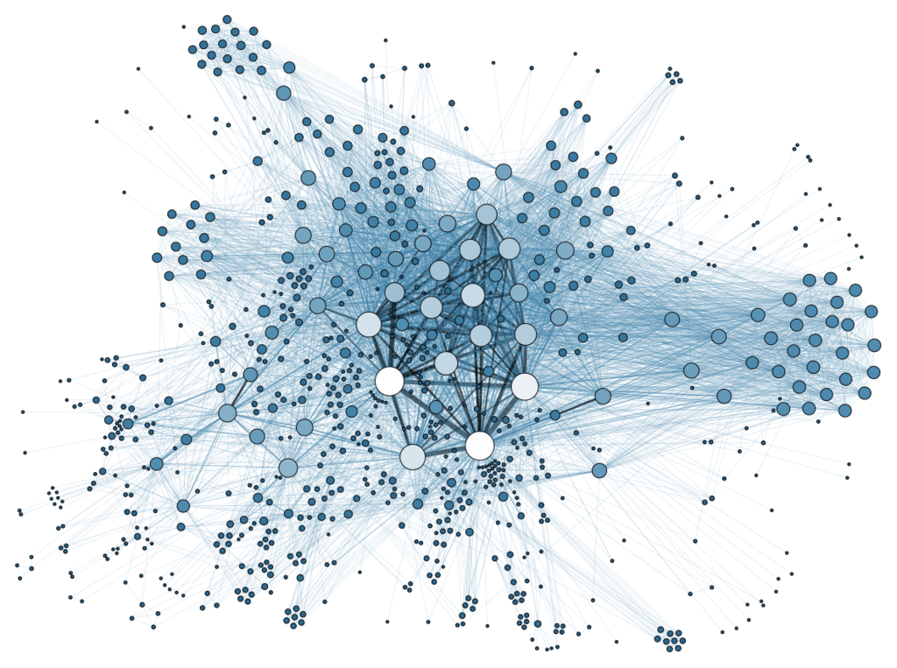
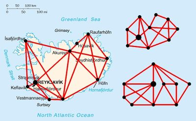
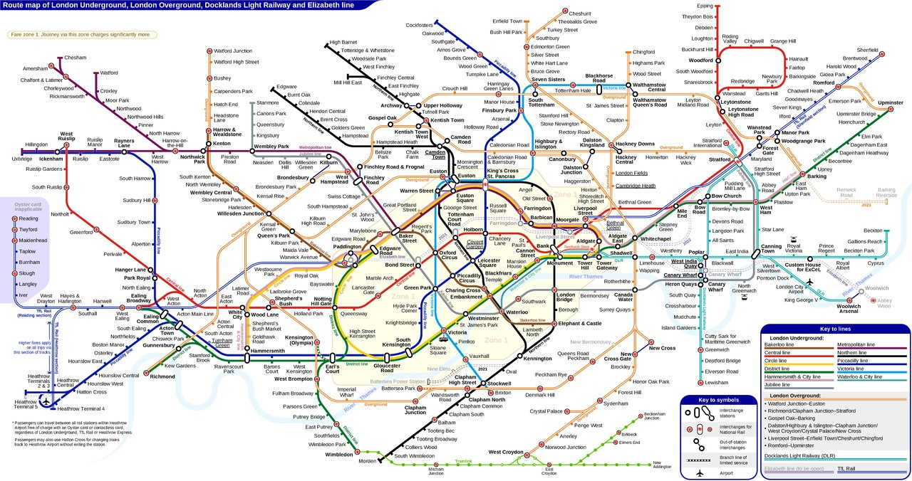
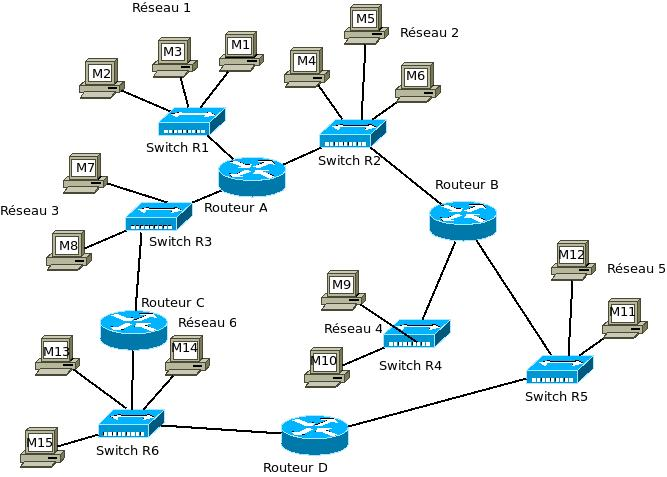
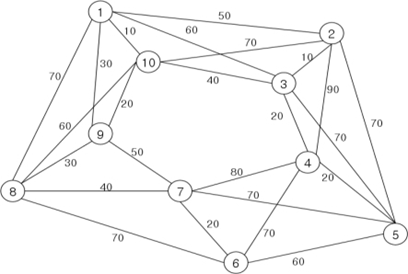
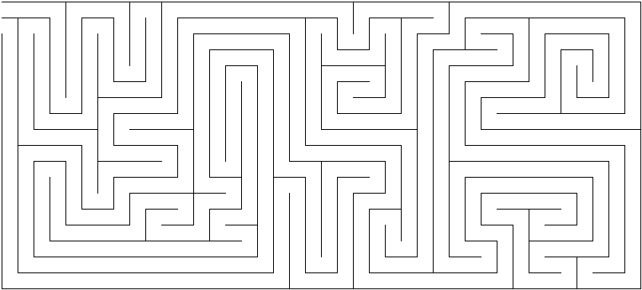
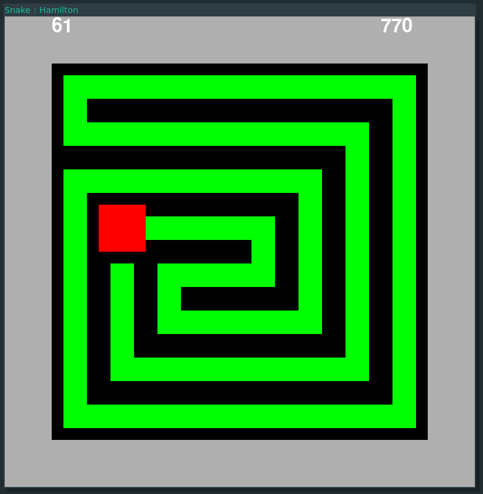
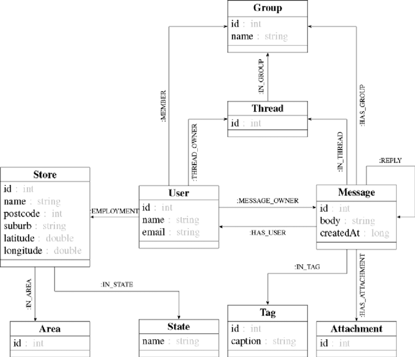

pdf : [pour impression](/uploads/docnsitale/graphes/1_intro_print.pdf)

## Les graphes : une longue introduction

### Présentation

La théorie des graphe est une théorie fondamentale de l'informatique et des
mathématiques.

On rencontre des graphes dans tous les domaines des sciences et leurs
applications sont innombrables :

*   le réseau routier d'un pays et le réseau de transport d'une ville forment
    un graphe :

     
*   internet peut être pensé comme un graphe,

*   les réseaux sociaux présentent naturellement des graphes entre les personnes,

    

## Utilisation des graphes en informatique

Parmi les problèmes fréquents faisant apparaître des graphes on rencontre :

1.  La recherche des chemin. Puis-je passer de l'état $A$ à l'état $B$ ?

    *   Comment résoudre un taquin ?

    

1.  L'exploration de graphe.

    *   Recherche d'une meilleure route dans un réseau.

        

    *   Recherche d'un trajet entre des villes sur une carte\
        Quelle est la meilleure route reliant 1 à 5 ?

        

3.  La recherche de cycles dans un graphe.

    *   Comment trouver la sortie sans tourner en rond ?

        

    *   Existe-t-il un moyen de toujours gagner à Snake ?

        

0.  Les algorithmes peuvent être vus comme des graphes :

    

1.  Mais aussi la manière d'enregistrer les données :

    

### Distinction mathématique, informatique

Les définitions des graphes en mathématique et en informatique sont similaires.
Les applications diffèrent souvent.

Nous (les informaticiens) cherchons souvent à exposer les solutions de nos problèmes.
Un algorithme doit fournir une solution en un temps fini.
En mathématiques, on se contente parfois de l'_existance_ d'une solution, sans
proposer de moyen de la construire. C'est souvent jugé insatisfaisant mais c'est
ainsi.

Autre nuance importante, nous cherchons généralement des algorithmes _rapides_.
Un algorithme qui termine mais prend des millions d'années n'a que peu d'intérêt.

Enfin, si la structure nous intéresse d'un point de vue abstrait, son
_implémentation_ est importante.

### Objectifs

Nous allons donc :

1.  Définir une **structure de donnée** permettant de manipuler les graphes.
2.  **Implémenter cette structure**.
3.  Résoudre des problèmes utilisant les graphes et donc :

    * proposer des **algorithmes** pour les résoudre,
    * **implémenter** ces algorithmes.

Parmi les problèmes que nous allons aborder :

1. L'exploration de graphe,
2. La recherche de chemin dans un graphe,
3. La recherche de cycles dans un graphe.
