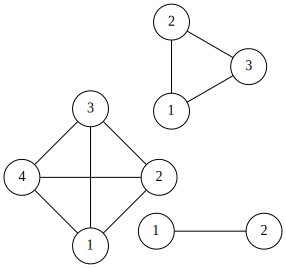

pdf: [pour impression](/uploads/docnsitale/graphes/3_td_bases.pdf)

# Exercices sur les graphes

## Exercice 1

On considère le graphe suivant :

1.  Est-ce un graphe _simple_ ? _orienté_ ?

2.  Quels sont les voisins de $1$ ?

3.  Construire sa matrice d'adjacence.

    

4. Combien peut-on ajouter d'arêtes à ce graphe ?

## Exercice 2

Un graphe _simple_ est dit _complet_ si tous ses sommets sont reliés.

Ci-dessous les graphes complets $K_2$, $K_3$ et $K_4$.

1.  Construire $K_5$ et $K_6$.
2.  Construire les matrices d'adjacence de $K_2$, $K_3$, $K_4$.
3.  Combient d'arêtes comportent-ils ?
4.  En examinant les matrices d'adjacence, déterminer le nombre maximum d'arêtes
    d'un graphe comportant $n$ sommets.

    

## Exercice 3

1.  Déterminer tous les chemins _élémentaires_ reliant $A$ à $D$

    *   Un chemin d'origine $A$ et d'extremité $D$ est une suite d'arcs consécutifs
        reliant $A$ à $D$.
    *   Un chemin est _élémentaire_ s'il ne passe pas deux fois par le même _sommet_.

    
2.  Déterminer tous les chemins _simples_ reliant $A$ à $D$

    *   Un chemin est _simple_ s'il ne passe pas deux fois par le même _arc_.

    

3.  Pour chaque sommet $y$, déterminer les autres sommets $x$ dont on peut
    partir pour atteindre $y$.

    
4.  Quelles arêtes peut-on ajouter pour pouvoir relier n'importe quelle couple
    de sommets par un chemin ?

    
## Exercice 3

\

Parmi les graphes ci-dessus lesquels représentent le même graphe ?

---
