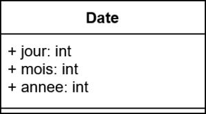
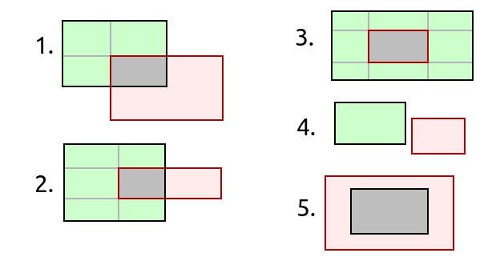

PDF : [pour impression](/uploads/docnsitale/poo/poo_td.pdf)

## Exercice 1 -- Utiliser une classe

On considère la classe suivante :

```python
class Point:
    def __init__(self, x, y):
        self.x = x
        self.y = y

    def deplace(self, dx, dy):
        self.x = self.x + dx
        self.y = self.y + dy

    def symetrique(self):
        return Point(-self.x, -self.y)

    def __repr__(self):
        return f"Point({self.x}, {self.y})"
```

1. Créer le point `a` d'abscisse 2 et d'ordonnée 4.
2. Quels sont les attributs et les méthodes de cette classe ? Compléter le tableau :

   | Nom       |
   |-----------|
   | -         |
   | Attributs |
   | -         |
   | -         |
   | Méthodes  |
   | -         |
   |           |

3. Donner la signature complète de la méthode `symetrique`

4. Qu'affichent les instructions suivantes dont la sortie a été effacée ?

    ```python
    >>> b = Point(1, 2)
    >>> b
    >>> b.deplace(3, 5)
    >>> b
    ```
5. Définir une méthode `abscisse` qui renvoie l'abscisse du point.
6. Recommencer avec la méthode `ordonnee`.

**Compétence:** _Savoir implémenter une Pile et une File sous forme de classe_

## Exercice 2

1. À partir de la structure abstraire Pile vue en cours, proposer une implémentation
    sous forme de classe.
2. On proposera de la même manière une implémentation de la file.

**Remarque :** On utilisera le type `list` de Python pour typer notre attribut
privé contenant les éléments.
Nous n'avons ici pas besoin d'accesseurs ou de mutateurs, seulement les méthodes
publiques.


**Compétence :** _Savoir formaliser un objet réel en classe_

## Exercice 3
Soit la classe Date  définie par le diagramme de classe UML suivant :



1. Implémenter cette classe en Python.
2. Créer deux dates le 20 janvier 2012 et le 14 février 2022.
2. Dans la méthode de construction de la classe, prévoir un dispositif pour éviter les dates impossibles (du genre 32/14/2020).
    Dans ce cas, la création doit provoquer une erreur, chose possible grâce à l’instruction `raise` (documentation à rechercher !).
3. Ajouter une méthode `__repr__ ` permettant d’afficher la date sous la forme "25 janvier 1989". Les noms des mois seront définis en tant qu’attribut de classe à l’aide d’une liste.
4. Ajouter une méthode `__lt__` qui permet de comparer deux dates.
    L’expression d1 < d2 (d1 et d2 étant deux objets de type Date) doit grâce à cette méthode renvoyer True ou False .

## Exercice 2 -- Classe Rectangle

1. Ecrire une classe `Rectangle` en langage Python, permettant de construire un rectangle dotée d'attributs longueur et largeur.
1. Créer une méthode `Perimetre` permettant de calculer le périmètre du rectangle et une méthode `Surface` permettant de calculer la surface du rectangle
3. Améliorer la classe `Rectangle` pour définir vos rectangles avec 2 couples d'entiers : `(x_A, y_A)` et `(largeur, hauteur)`. $A$ est le coin supérieur gauche du rectangle.
4. Créer une méthode `intersecte` qui prend un autre rectangle en paramètre et renvoie `True` si et seulement si les rectangles s'intersectent.

    Plusieurs cas sont à considérer :

    


