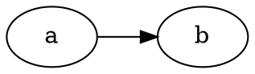
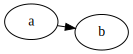
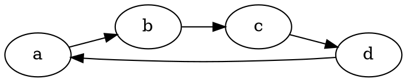
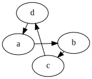

## SVG from a file

## graphviz `a -> b`

<!--

```graphviz
digraph {
    rankdir="LR";
    a -> b
}
```
-->

## graphviz `a -> b -> c -> d -> a`

<!--

```graphviz
digraph {
    rankdir="LR";
    a -> b
    b -> c
    c -> d
    d -> a
}
```
-->

