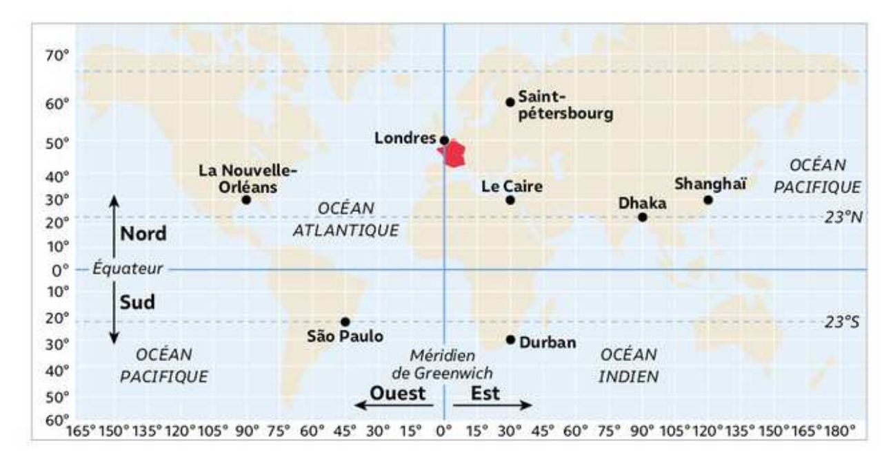
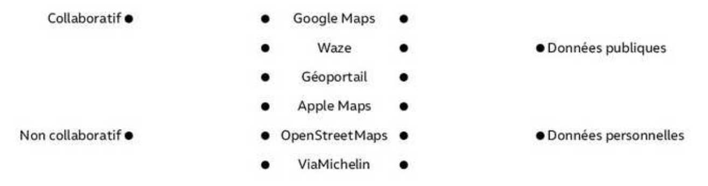
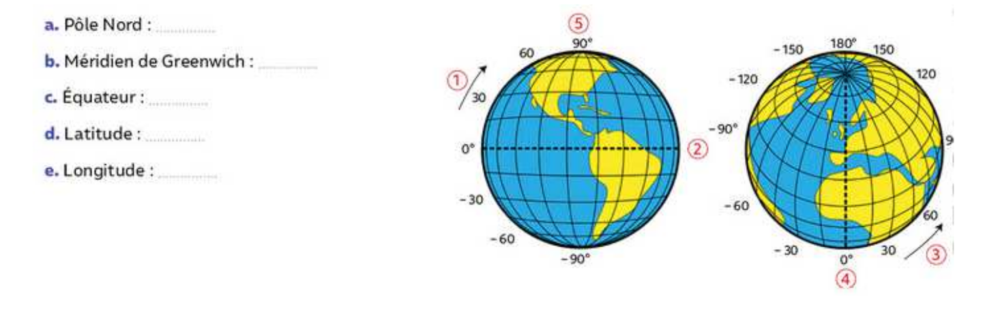
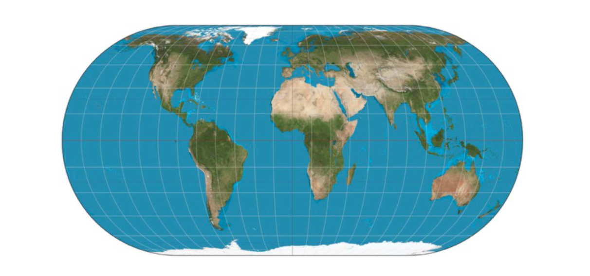

[pdf](./1_introduction.pdf)

## I. Introduction

Regarder cette vidéo : **[Géolocalisation, comment s'y retrouver?](https://youtu.be/iTfNhcC2vBA)** 
Répondez aux questions suivantes :

1. À quelle altitude sont situés les satellites utilisés dans le GPS ?
2. Que font les satellites ?
3. Comment fonctionne le GPS ?
4. Combien faut-il au minimum de satellites pour se géopositionner ? Et pourquoi ?
5. Quel est l’équivalent européen du GPS ?
6. Quand parle-t-on de géolocalisation ?
7. Quelles informations sont rassemblées par les cartes numériques couplées au GPS ?
8. Comment fonctionne le calcul d’itinéraire ?

## II. Cartographie

### a) Histoire de la cartographie

- Visionner la **[vidéo](https://www.youtube.com/watch?v=ez1xZWpY9NE)**.
- Utiliser le **[site suivant](http://www.frisechronos.fr/)** pour réaliser une frise chronologique illustrant les étapes importantes de l’histoire de la localisation. Vous y placerez les évènements clés, les principaux concepteurs (+ photo).
- Vous exporterez votre frise terminée en fichier PDF, que vous renommerez avec un nom du type Localisation-nom.pdf
- Vous rendrez votre fichier comme les autres documents.

### b) La cartographie

À l’aide de la carte, remplir le tableau ci-dessous :

| Ville     | LATITUDE | LONGITUDE |
|-----------|----------|-----------|
| Londres   |          |           |
| Le Caire  |          |           |
| Sao Paulo |          |           |
| Dhaka     |          |           |

Les coordonnées géographiques sont traditionnellement exprimées dans le système sexagésimal, parfois noté "DMS" : degrés (°) minutes (’) secondes (”).  
L’unité de base est le degré d’angle (1 tour complet = 360°), puis la minute d’angle (1°= 60’), puis la seconde d’angle (1°= 3600”).

Exemple : les coordonnées de Paris sont "48°51’12” N, 2°20’55” E" ; sa latitude est de 48,51°nord et sa latitude de 2,20°est.

Spécifier le latitude et la longitude de Barcelone dont les coordonnées sont 41°23’19” N, 2°9’32” E.

Pour quelles activités la cartographie est-elle importante ?

### c) La cartographie moderne

Les nouvelles cartographies s’appuient entièrement sur le numérique. Elles mettent en oeuvre des logiciels nommés SIG (Système d’informations Géographiques), bases de données gérant les catégories d’Objets. Ils permettent à l’utilisateur de composer lui-même en temps réel, le positionnement sur un fond de carte, les données qu’il veut voir apparaître en fonction de ses centres d’intérêts.

Quel outil permet de contribuer à la réalisation des cartes mondiales ?

Indiquer si chacun des services de cartographie ou de localisation suivants sont collaboratifs et si les données sont publiques ou personnelles.

Placer les définitions correspondantes à chaque numéro sur le globe.

## III. De la sphère à la carte plane

Pour passer d’une sphère à une carte plane, les cartographes utilisent une projection cartographique, c’est-à-dire un ensemble de techniques géodésiques permettant de représenter une surface non plane (surface de la Terre, d’un autre corps céleste, du ciel, ...) dans son ensemble ou en partie sur la surface plane d’une carte. Il existe différents types de projections. Mais quelque soit la projection utilisée, les déformations des distances, des formes et des angles sont inévitables.

Voir : **[Liste de projections cartographiques](https://fr.wikipedia.org/wiki/Liste_de_projections_cartographiques)**.

L’informatique a apporté des outils de calcul puissants pour traiter les problèmes de projection et le passage d’une représentation à une autre.  
Les angles Longitude et Latitude sont alors mis en relation avec des coordonnées sur ces cartes planes.

Exemple :

## IV. Latitude, longitude

Deux villes situées à une même latitude auront la même _durée_ du jour. 

1. Déterminer l'heure du lever et du coucher du soleil à Lille et à Marseille le 21 juin et le 21 décembre. Citer vos sources.

Il exite _un bureau des longitudes_ dont l'objectif était d'améliorer la détermination de la longitude en mer. 

2. Comment relever précisémet la _latitude_ en mer en n'utilisant aucune technologie moderne ?
3. Pourquoi cette methode ne fonctionne-t-elle pas pour la longitude ?
4. Quelle technologie a permis d'améliorer considérablement le relevé de la longitude ?

