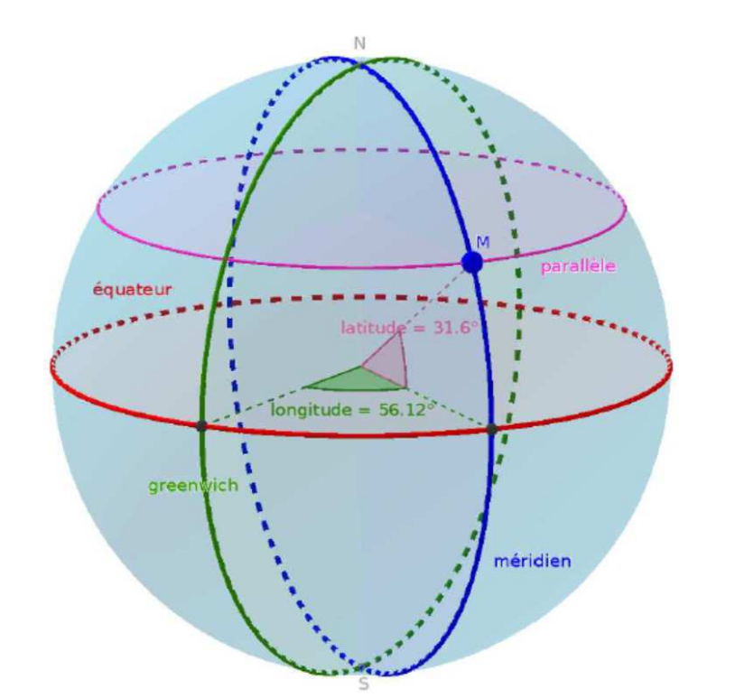
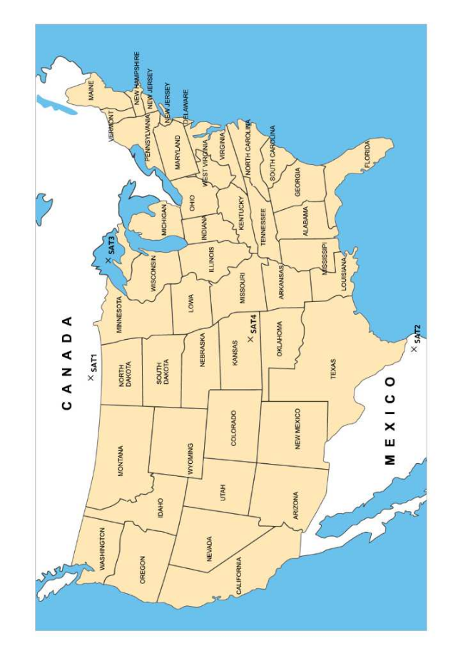
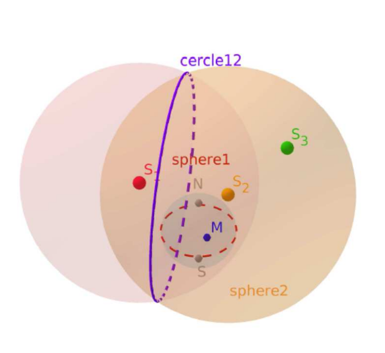

[pdf](./2_geolocalisation.pdf)

### Fichiers pour la séance 

- [coordgeo.ggb](coordgeo.ggb) 
- [satellites.ggb](satellites.ggb) 
- [villes.ggb](villes.ggb)

## I Fonctionnement de la géolocalisation :

La géolocalisation est un procédé qui permet de situer à distance un objet ou une personne en fonctions de ses coordonnées géographiques. Certains systèmes permettent également de connaître l’altitude. La géolocalisation est partout : dans les applications des smartphones, ordinateurs et tablettes, les cartes à puces, dans les voitures. Le système GPS (Global Positioning System) est le système de géolocalisation le plus fréquemment utilisé. Il fonctionne avec une constellation de 30 satellites américains en orbite autour de la Terre. Chaque satellite envoie sur Terre des signaux, messages qui comportent :

- la position dans l’espace du satellite,
- l’heure et la date d’émission du signal.

Une fois localisée, la position peut alors être transmise en temps réel vers une plateforme logicielle de géolocalisation ou enregistrée au sein du terminale équipé d’une connexion internet.

### Exercice 1

Retrouver la localisation de chaque personne sur la carte de la page suivante. Pour ce faire, à l’aide d’un compas, dessiner des arcs de cercle partant du centre de chaque satellite à la distance donnée dans le tableau ci-dessous. Inscrire dans quel état chaque personne se trouve.

| Nom      | Distance (cm) satellite 1 | Distance (cm) satellite 2 | Distance (cm) satellite 3 | Distance (cm) satellite 4 |
|----------|---------------------------|---------------------------|---------------------------|---------------------------|
| Abel     | 6,5                       | 14,3                      | 11,2                      | 9,5                       |
| Mathilde | 13                        | 8                         | 10                        | 7,8                       |
| Wilfried | 3,3                       | 10,3                      | 6                         | 3,9                       |
| Yasmine  | 6,8                       | 7,9                       | 9,2                       | 4                         |

### Exercice 2

Remplir le texte avec les mots manquants.

Avec Galileo, l’Europe vient de se doter de son propre système de $\ldots\ldots\ldots\ldots\ldots\ldots$ par satellites. Galileo sera plus $\ldots\ldots\ldots\ldots\ldots\ldots$ que tous les autres système de positionnement et de navigation par satellite. Comme les systèmes américains $\ldots\ldots\ldots\ldots\ldots\ldots$, russe $\ldots\ldots\ldots\ldots\ldots\ldots$ et chinois $\ldots\ldots\ldots\ldots\ldots\ldots$, il permet à un utilisateur muni d’un terminal de réception d’obtenir sa $\ldots\ldots\ldots\ldots\ldots\ldots$. Le segment spatial de Galileo sera constitué à terme de $\ldots\ldots\ldots\ldots\ldots\ldots$ dont 6 de rechange. Un des objectifs principaux du projet est de mettre fin à la $\ldots\ldots\ldots\ldots\ldots\ldots$ de l’Europe vis-à-vis du système américain. Contrairement à ce dernier, Galileo est uniquement $\ldots\ldots\ldots\ldots\ldots\ldots$.

\newpage 

### Exercice 3

La géolocalisation peut servir dans beaucoup de domaines très différents. Réfléchir à une application pratique pour chaque secteur :

- Le commerce : 

- Le sport : 

- Les transports : 

- Le tourisme : 

- L’agriculture : 

## II Repérage avec Geogebra :

Comment se repérer sur la surface terrestre ? Dans ce qui suit, on va assimiler la Terre à une boule de 6400 km de rayon.

- Ouvrez le fichier geogebra « coordgeo.ggb» fourni et observez :

  - La sphère "Terre", "planète bleue",
  - L’équateur, représenté par un cercle rouge.
  - En vert le méridien de référence, communément appelé "méridien de Greenwich". Il passe par les pôles Nord et Sud (les points N et S).
  - un point M (comme Mobile) à la surface de la terre,
  - le méridien passant par M, un cercle passant aussi par les pôles N et S.
  - Un parallèle passant par M, cercle " parallèle " à l’équateur.

Ce point M est repéré en coordonnées géographiques par :

- sa longitude, angle $\widehat{EOM}$ entre le méridien de référence et le méridien passant par M.
- sa latitude, angle $\widehat{MOP}$ entre l’équateur et le parallèle passant par M.

- Déplacez le point M à l’aide de la souris et observez les latitudes et les longitudes.

  - Si le point M est dans l’hémisphère nord, on dit qu’il a une "latitude Nord".
  - Si le point M est dans l’hémisphère sud, on dit qu’il a une "latitude Sud".
  - De même, on a des longitudes Est ou Ouest suivant qu’on soit à l’est ou à l’ouest du méridien de référence.

Sur le dessin ci-dessus, on dit que M a une latitude de 31,6°N et une longitude de 56,12°E.

- Complétez :

  - Les $\ldots\ldots\ldots\ldots\ldots$ sont des cercles constitués des points de même latitude.
  - Les $\ldots\ldots\ldots\ldots\ldots$ méridiens sont des cercles constitués des points de même longitude.

### Quelques grandes villes du monde

\newpage

- Ouvrez le fichier geogebra « villes.ggb » fourni et observez les villes de Tunis, Pékin, Paris, Padang, Quito, Moscou, Wellington, Oslo, Le Cap, Santiago, Londres, New-York, Sydney, Madrid.

- En déplaçant à l’aide de la souris le point « mobile » M, retrouvez les coordonnées géographiques de chacune de ces villes en complétant le tableau ci-dessous.

Notez bien qu’il est difficile d’obtenir exactement les coordonnées du tableau en superposant le point « mobile » M sur les différentes villes, mais en observant les latitudes et longitudes affichées, on y arrive facilement.

| Villes | Latitude     | Longitude    |
|--------|:-------------|:-------------|
|        | 51,5 °N      | 0 °O ou 0 °E |
|        | 48,9 °N      | 2,3 °O       |
|        | 40,4 °N      | 3,7 °O       |
|        | 40,6 °N      | 116,4 °E     |
|        | 39,9 °N      | 74,1 °O      |
|        | 56,8 °N      | 37,7 °E      |
|        | 0 °N ou 0 °S | 79 °O        |
|        | 34 °S        | 18,5 °E      |
|        | 33,5 °S      | 70,7 °O      |
|        | 34 °S        | 151,1 °E     |
|        | 41,3 °S      | 174,8 °E     |
|        | 59,9 °N      | 10,8 °E      |
|        | 36,8 °N      | 10,2 °E      |
|        | 1 °N         | 100,4 °E     |

### Se repérer grâce au positionnement par satellite

- Ouvrez le fichier geogebra « satellites.ggb » fourni et observez :

  - La sphère « Terre », de rayon 1,6 (pour simplifier, au lieu de 6400 km), les pôles N et S, notre point M à la surface de la terre.
  - trois points S1, S2 et S3, représentant des satellites du réseau GPS. Ils sont sur une sphère « orbite » à 20200 km d’altitude donc à 26600 km du centre de la terre soit sur une sphère orbite de rayon 4,15 dans geogebra.

Un récepteur GPS capte les signaux émis par S1, S2 et S3 et calcule les différences de temps en secondes, entre son horloge interne et les horloges atomiques des satellites.

- Remplir le tableau, en admettant que la vitesse de la lumière c est de 300000 km/s

  _Rappel :_ $vitesse = \dfrac{distance}{temps}$ donc $distance = \ldots\ldots\ldots\ldots\ldots\ldots$

  | Satellite | Différence de temps (s) | Distance (km) | Rayon pour geogebra |
  |-----------|-------------------------|---------------|---------------------|
  | S1        | 0,067500000             |               |                     |
  | S2        | 0,072233333             |               |                     |
  | S3        | 0,081533333             |               |                     |

- Créons donc dans geogebra :

  - La sphère sphere1 de centre S1 et de rayon ...
  - La sphère sphere2 de centre S2 et de rayon ...
  - Le cercle cercle12 intersection de sphere1 et sphere2.

Je vous conseille, pour mieux voir la suite, de masquer les sphères sphere1 et sphere2 en cliquant sur les sphères avec le bouton droit et en décochant « afficher l’objet ». Gardez le cercle cercle12 !

- Créons donc dans geogebra :

  - La sphère sphere3 de centre S3 et de rayon ...
  - Le cercle cercle23 intersection de sphere2 et sphere3.
  - Les points d’intersection des cercles cercle12 et cercle23.

  

Si vous ne vous êtes pas trompés, l’un des deux points est sur la surface de la terre !

- Déplacer le point « mobile » M pour trouver ses coordonnées.
- De quelle ville s’agit-il dans le tableau « quelques grandes villes du monde » ?
