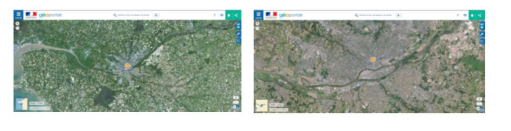
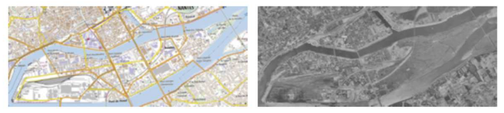
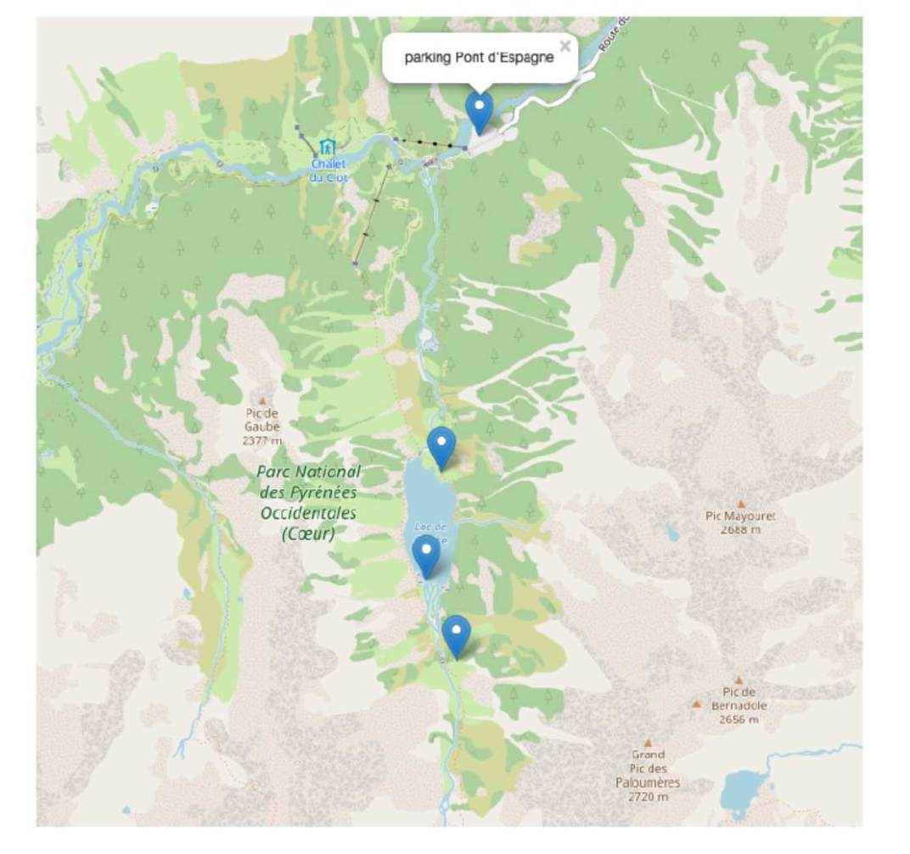

[pdf](./3_manipulation.pdf)


## I. Chercher les coordonnées d’un lieu

Quelques mots sur **Géoportail**, dans le but de contextualiser l’outil auprès des élèves : Il s’agit d’un portail web public d’informations géographiques. Il a été conçu par l’IGN et inauguré en juin 2006, soit deux mois après le lancement de la version française de Google Maps. Souvent opposés en terme de concurrence, les deux outils ont des objectifs et des modèles différents. 

Géoportail couvre exclusivement le territoire français quand Google Maps offre une représentation complète du globe. Autre différence notable, la qualité des informations fournies par Géoportail (en ce qui concerne les données images surtout) est égale quel que soit le lieu ciblé quand Google Maps concentre ses efforts sur les espaces qui représentent pour la société de Mountain View un réel intérêt. Car si le premier est un service public, l’autre reste une entreprise commerciale qui doit faire des profits. 

Un résumé hâtif permet de penser que le territoire rural français est plus richement représenté par Géoportail, notamment par le biais des différentes couches -cadastrales, historiques, etc.- que les zones urbaines, plus détaillées sur Google Maps car plus porteuses d’informations monétisables. 

A ces deux acteurs s’ajoute OpenStreetMap, projet cartographique collaboratif mondial lancé en 2004, soit au même moment que la version US de Google Maps. Exemple parfait de la culture du “libre”, à l’instar d’un Wikipédia (2001), OSM permet à chacun de renseigner des informations sur des cartes satellitaires à l’aide d’outils disponibles sur l’interface en ligne.

### a) Recherche de coordonnées géographiques d’un lieu

Sur le site [Géoportail](https://www.geoportail.gouv.fr), trouver les coordonnées géographiques de la Tour Eiffel, de votre lycée, de chez vous. Les reporter.

### b) Recherche de cartes numériques d’une ville

Toujours sur le site [Géoportail](https://www.geoportail.gouv.fr), chercher la ville de Nantes (44000) et afficher une photo aérienne de cette ville. Puis zoomer pour  réduire votre zone d’affichage.



En zoomant au maximum, quels types de détails peut-on voir dans la ville ?

### c) Utilisation d’outils cartographiques

Nantes est traversée par le fleuve de La Loire et dans la partie sud de la ville, une « ile » est formée par le fleuve : L’île de Nantes (parfois dénommée île Beaulieu). Elle constitue l’un des 11 quartiers de la ville.

À l’aide de l’outil de mesure de distance, mesurer sur la photo aérienne la longueur d’Est en Ouest de l’île de Nantes. Quelle est cette longueur ?

À l’aide de l’outil de mesure de surface, chercher une estimation de la surface totale de l’île de Nantes. Quelle est approximativement cette surface ?

### d) Utilisation de différents fonds de carte

En restant sur une vue globale de l’île de Nantes, utiliser différents fonds de carte pour afficher des renseignements différents et issus de différentes époques de cette zone géographique.



En comparant les photos aériennes et les cartes de 1950 à celles d’aujourd’hui, que remarquez-vous sur l’évolution urbaine de l’île de Nantes ?

### e) Préparer ma randonnée en montagne

Lucie habite à Bordeaux près de la place du Parlement. Elle propose à son ami Nathan d’aller faire une randonnée en montagne dans la région de Cauterets (65 – Haute-Pyrénées). Elle lui propose l’organisation suivante :

- Tu me rejoins chez moi et nous partirons en voiture et roulerons jusqu’au parking du Pont d’Espagne (Cauterets).
- Notre randonnée démarrera à cet endroit et nous marcherons jusqu’à la Cabane du Pinet en passant par le Lac de Gaube.
- Nous passerons la nuit au refuge de la Cabane du Pinet et reviendrons le lendemain.

1. Utiliser l’outil « itinéraire routier » de Géoportail pour calculer le temps de route en voiture pour se rendre au départ de la randonnée.
2. Utiliser l’outil « itinéraire piéton » pour connaître les détails de notre randonnée (aller).
3. Si les deux amis partent à 6h00 du matin de Bordeaux, à quelle heure peuvent-ils espérer être au refuge ?
4. Faire une capture d’écran de la zone de randonnée.
5. Établir le profil altimétrique de la randonnée.

## II. Contribuer à un projet collaboratif de cartes numériques

OpenStreetMap (OSM - [OpenStreetMap](https://www.openstreetmap.org)) est un projet de cartographie libre du monde (permettant par exemple de créer des cartes sous licence libre), en utilisant le système GPS et d’autres données libres. Il a la particularité d’être collaboratif, c’est à dire que chaque utilisateur peut participer à titre individuel à OpenStreetMap, pour décrire des lieux qu’il connaît bien. Il a été mis en route en juillet 2004 par Steve Coast au University College de Londres et compte aujourd’hui plus de 4 500 000 contributeurs. En France, il est de plus en plus utilisé par les collectivités (communes, départements) pour collecter de façon participative des données sur leur territoire.

### a) Découverte d’OSM

Dans OpenStreetMap, utiliser la recherche pour aller aux coordonnées : (-22.91213, -43.23013). Où est-on arrivé (lieu, ville, pays) ?

Où serait-on allé si on avait cherché le lieu de coordonnées (-43.23013, -22.91213) ?

### b) Utilisation des couches de cartes

Chercher la ville de La Roche sur Yon et faire apparaître la couche de carte « transport ».

Quelle ligne de bus permet de rejoindre le Vendespace, complexe situé à environ 5 km au nord du centre de cette ville ?

Quel numéro de piste de cyclable permet d’aller de La Roche sur Yon vers St Gilles croix de Vie (ville située sur la côte atlantique de la Vendée) ?

### c) Contribution

Comment faut-il faire pour contribuer à OpenStreetMap ? De quoi a-t-on besoin ?

(Facultatif) Se créer un compte et contribuer à améliorer les renseignements disponibles autour de votre lycée ou de votre domicile (à votre première connexion, un tutoriel expliquant les modalités de contribution sera disponible).

### d) Utilisation d’openstreetmap pour ma randonnée en montagne

1. Avant le départ :

    a. Dans OpenStreetMap, faire apparaître les cartes de transport de la ville de Bordeaux et chercher quelle ligne de bus permettrait à Nathan (qui habite place de la Victoire) de rejoindre en transport en commun le domicile de Lucie (Place du parlement).

    b. Chercher sur OSM les coordonnées géographiques du Pont d’Espagne (Cauterets).

2. Au pont d’Espagne :

    a. Faire apparaître la zone du Pont d’Espagne à l’écran

    b. Utiliser les possibilités d’OSM pour obtenir les caractéristiques de la randonnée (distance, durée prévisionnelle, dénivelés positif et négatif) partant du Pont d’Espagne vers la Cabane du Pinet. (Aide : Un clic droit avec la souris permet de définir des points de départ et d’arrivée d’un itinéraire.)

## III. Pour aller plus loin sur la cartographie numérique

Nous allons utiliser les cartes proposées par OpenStreetMap et le langage Python afin de générer des cartes personnalisées. Plus exactement, nous allons utiliser une bibliothèque Python nommée Folium. Une bibliothèque Python permet de rajouter des fonctionnalités au langage de base. Folium va donc nous permettre de créer nos propres cartes à partir des cartes proposées par OpenStreetMap.

### a) Programmation Python et cartographie

1. Créer un dossier nommé par exemple "cartOSM" et enregistrer dans ce dossier un fichier Python contenant les lignes de code suivantes :

    ```python
    import folium

    m = folium.Map(location=[45.5236, -122.6750])
    m.save('jailacarte.html')
    ```

2. Exécuter le code ci-dessus et vérifier qu’un fichier "jailacarte.html" a été créé. (Double-cliquer sur ce fichier devrait ouvrir un navigateur web avec une carte centrée sur un stade d’une ville célèbre. Nous avons une véritable carte et pas une simple image : il est possible de zoomer ou de se déplacer).

3. Modifier le programme du paragraphe précédent pour qu’il génère une carte centrée sur la ville de votre choix. Rappel : la longitude et la latitude d’une ville peuvent être trouvées avec géoportail).

    Remarque : Il est possible d’obtenir un niveau de zoom en ajoutant un paramètre `zoom_start` dans votre programme. Par exemple :

    ```python
    import folium

    m = folium.Map(location=[45.5236, -122.6750], zoom_start=15)
    m.save('jailacartejailacarte.html')
    ```

4. Afin de vraiment personnaliser la carte, il est possible d’ajouter des marqueurs sur la carte. Un marqueur sera simplement défini par ses coordonnées (latitude et longitude).


    ```python
    import folium 
    c = folium.Map(location=[47.95861, 0.219394], zoom_start=20)
    folium.Marker([47.959185, 0.22317]).add_to(c)
    c.save("ihavethecard.html")
    ```

    Remarque : Il est possible d’associer une information à un marqueur en ajoutant le paramètre `popup` : `folium.Marker([..., ...], popup= "Stade).add_to(c)`.

    Il suffira de cliquer sur e marqueur pour que l'information définie par le paramètre "popup" apparaisse à l'écran.


### c) Programmation Python pour ma randonnée en montagne 

1. Créer un dossier nommé "CarteOSMrando" et y enregistrer un fichier `rando.py` avec le code ci-dessous :

    ```python 
    import folium 
    c=folium.Map(location=[42.831499, -0.139633])
    c.save('jailacarterando.html')
    ```

2. Modifier le code pour inclure dans la carte des marqueurs et des pop-up sur la carte pour les points suivants :

1. « Départ » de la randonnée sur le parking du pont d’Espagne
1. « Pause déjeuner » sur le bord nord du Lac de Gaube
1. « Pause les pieds dans l’eau » sur le bord Sud du Lac de Gaube
1. « Arrivée » à la Cabane du Pinet

- indice 1 : Rechercher les coordonnées précises de ces lieux avec Géoportail ou openstreetmap
- indice 2 : la ligne de code : 

```python 
folium.Marker([latitude, longitude], popup = "texte à afficher").add_to(c)
```

permet d’inclure un « marqueur » 



### d) Deux vidéos ressources résumant le principe d'OpenStreetMap :

1. [Qu'est-ce qu'OSM](https://www.youtube.com/watch?v=zJSGOpqa9ew&ab_channel=R%C3%A9sineM%C3%A9dia)
2. [Qu'est-ce qu'une CartoPartie ?](https://www.youtube.com/watch?v=8A68_2_jiYc&ab_channel=R%C3%A9sineM%C3%A9dia)
