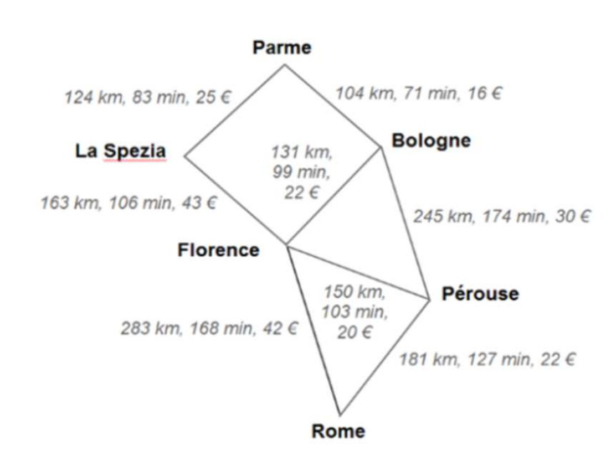
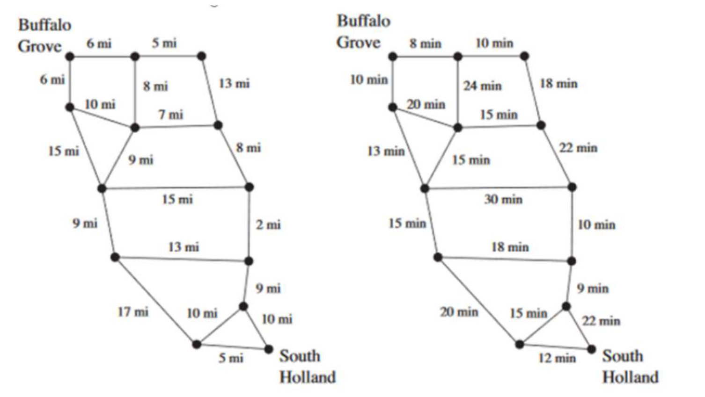

[pdf](./4_trame_nmea.pdf)

## I. Le protocole NMEA

Pour permettre à des périphériques informatiques de « dialoguer » entre eux, en réseau, il faut que les messages échangés respectent une syntaxe commune. 

On définit ce qu'on appelle un protocole, c'est à dire un ensemble de normes permettant à différents périphériques informatiques de dialoguer entre eux en réseau. 

La norme NMEA 0183 est une spécification pour la communication entre équipements marins, dont les équipements GPS. 

Elle est définie et contrôlée par la National Marine Electronics Association basée à Severna Park au Maryland (États-Unis d'Amérique). 

Ainsi, un récepteur GPS détermine par calcul sa position et transmet les données de géolocalisation correspondantes sous forme d'une **trame** de caractères **NMEA** (_National Marine Electronics Association_). 

Cette trame est ensuite envoyée via une liaison série. L'ordinateur décode le message et affiche éventuellement la carte correspondant à la position GPS reçue. 

Chaque trame commence par le caractère `$`, suivi par un groupe de deux lettres pour l'identifiant du récepteur : ici, `GP` pour _Global Positionning System_.

Puis un groupe de trois lettres pour l'identifiant de la trame.

### a) Décoder une trame NMEA pour trouver des coordonnées géographiques


**Exemple de trame NMEA**

```sh
$GPGGA,073224.279,4234.4210,N,00240.0973,E,1,04,3.2,199.2,M,,,,0000*0E
```

| Champ                | Valeur d'exemple | Définition                                                                                              |
|----------------------|:-----------------|---------------------------------------------------------------------------------------------------------|
| Type de trame        | `$GPGGA`         | Indique qu'il s'agit d'une trame GGA                                                                    |
| Heure                | `073224.279`     | Signifie que l'heure d'envoi est 07 h 32 min 24.279 s                                                   |
| Latitude             | `4234.4120,N`    | Latitude : 42°34'24.72"N                                                                                |
| Longitude            | `00240.9373,E`   | Longitude : 2°40'56.238"E                                                                               |
| Positionnement       | `1`              | 0 = point non calé ; 1 = point calé ;                                                                   |
|                      |                  | 2 = point calé en mode différentiel (précision supérieure) ; 6 = point estimé                           |
| Nombre de satellites | `04`             | Nombre de satellites utilisés pour le calcul                                                            |
| Précision            | `3.2`            | Conversion horizontale de la précision pour connaître la fiabilité                                      |
|                      |                  | du calcul : 1 = valeur optimale ; 2 - 3 = excellente ; 5 - 6 = bonne ; >8 = non fiable                  |
| Altitude             | `199.2M`         | Altitude de l'antenne par rapport au niveau de la mer                                                   |
| Champ vide           | `,,,,0000`       |                                                                                                         |
| Checksum             | `*0E`            | Numéro de référence de la trame qui permet au système de détecter une éventuelle erreur de transmission |

1. Traduire la trame ci-dessous

    ```sh
    $GPGGA,145702.00,5043.5357,N,00232.9372,E,1,07,1.19,28.9,M,,,*0
    ```

2. Traduire une trame GLL sachant qu'elle donne la latitude, la longitude, l'heure et A = données valides

    ```sh 
    $GPGLL,5043.45,N,12311.12,O,225444,A
    ```

### b) Extractions des données contenues dans une trame avec Python

Voici une vue des résultats de quelques instructions Python obtenues depuis la console.


```python 
>>> ligne = "nom,prenom,age,17"
>>> element = ligne.split(",")
>>> element
['nom', 'prenom', 'age', '17']
>>> type(element)
<class 'list'>
>>> element[1]
'prenom'
>>> prenom=element[1]
>>> prenom[2:4]
'en'
>>> type(element[3])
<class 'str'>
>>> element[3]
'17'
>>> int(element[3])
17
>>> float(element[3])
17.0
>>> 
```

1. Expliquer les lignes de commandes suivantes :

    * `element = ligne.split(",")`
    * `element`
    * `type(element)`
    * `element[1]`
    * `prenom=element[1]`
    * `prenom[2:4]`
    * `type(element[3])`
    * `int(element[3])`
    * `float(element[3])`

2. D'après ces résultats, quelle instruction en python permet d'obtenir une liste nommée attribut à partir d'une chaîne de caractères nommée trame ?

    ```python 
    trame = "$GPGGA,145702.00,5043.5357,N,00232.9372,E,1,07,1.19,28.9,M,,,*0"
    ```

3. Ecrire la fonction `tramePrefixes` qui reçoit une trame complète et renvoie l'identifiant du récepteur, c'est-à-dire les deux premières lettres du type de la trame (premier élément après le caractère `$`. Sur la trame d'exemple, la fonction doit renvoyer `'GP'`.

    ```python 
    def tramePrefixes(trame):
        talkerID = trame[1:3]
        return talkerID
    ```

    Qu'on teste ainsi :

    ```python 
    >>> trame = "$GPGGA,145702.00,5043.5357,N,00232.9372,E,1,07,1.19,28.9,M,,,*0"
    >>> tramePrefixes(trame)
    'GP'
    ```


4. Modifier cette fonction pour qu'elle renvoie le nom de l'équipement qui a émis la trame. On utilisera les correspondances suivantes :

    * BD ou GB : Beidou
    * GA : Galileo
    * GP : GPS
    * GL : GLONASS

    ```python  
    def tramePrefixes(trame):
        talkerID = trame[1:3]
        if talkerID == "GD" or talkerID == "GB":
            value = "Beidou"
        elif talkerID == "GA":
            value = "Galileo"
        elif talkerID == "GP":
            value = "GPS"
        elif talkerID == "GL":
            value = "GLONASS"
        return value
    ```

    Qu'on teste ainsi :

    ```python 
    >>> trame = "$GPGGA,145702.00,5043.5357,N,00232.9372,E,1,07,1.19,28.9,M,,,*0"
    >>> tramePrefixes(trame)
    'GPS'
    ```

5. Ecrire une fonction `ggaUtc` qui reçoit une trame complexe et renvoie l'heure en h, min, s.

    ```python 
    def ggaUtc(trame):
        attributs = trame.split(",")
        time = attributs[1]
        utc = time[:2] + "h " + time[2:4] + "m " + time[4:] + "s"
        return utc
    ```

    qu'on teste :

    ```python 
    >>> trame = "$GPGGA,145702.00,5043.5357,N,00232.9372,E,1,07,1.19,28.9,M,,,*0"
    >>> ggaUtc(trame)
    '14h 57m 02.00s'
    ```


6. Ecrire une fonction `ggaLat` qui reçoit une trame complète et renvoie la latitude convertie en DMS.

    ```python 
    def ggaLat(trame):
        attributs = trame.split(',')
        lat = attributs[2]
        lat_deg = lat[:2]
        lat_min = lat[2:4]
        lat_sec = str(float(lat[4:]) * 60)
        latDMS = lat_deg + "d " + lat_min + "m " + lat_sec + "s " + attributs[3]
        return latDMS
    ```

    Qu'on teste :

    ```python 
    >>> trame = "$GPGGA,145702.00,5043.5357,N,00232.9372,E,1,07,1.19,28.9,M,,,*0"
    >>> ggaUtc(trame)
    '50d 43m 53.57s N'
    ```


## II. Calcul d'itinéraires

De nombreux sites et applications portables proposent de calculer un itinéraire entre deux points. 

Il suffit de renseigner le point de départ et le point d'arrivée. 

Le calcul d'itinéraires repose sur des algorithmes assez complexes. 

Par exemple l'algorithme du plus court chemin de Dijkstra permet d'obtenir le plus court chemin entre deux points. Sans entrer dans les détails, l'algorithme de Dijkstra travaille sur des graphes (chaque ville est un sommet du graphe et chaque route est une arête du graphe), visionnez cette vidéo pour en savoir plus : **[Dijkstra](https://www.youtube.com/watch?v=JPeCmKFrKio&feature=youtu.be)**.

En général, on recherche le chemin le moins long, le plus rapide, ou le moins cher :



1. Répondre aux questions suivantes en joignant vos explications, schémas ou tableaux :

    1. Quel est le moins long ?
    1. Le plus rapide ?
    1. Le moins cher ?
    1. Est-ce le même chemin dans les trois cas ?

Les deux cartes suivantes représentent :

* le trajet en miles du train Expressways in the Chicago area
* la durée des différentes étapes

2. Répondre aux questions suivantes en mettant vos explications, schémas ou tableaux en dessous :

    1. Déterminer le plus court trajet de Buffalo Grove à South Holland.
    1. Déterminer le trajet le plus rapide pour relier les deux mêmes villes.

    
