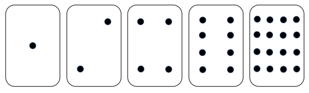
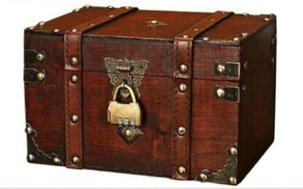

[pdf](1_codage_texte.pdf)

## 1. Introduction

1. Regarder la vidéo d’introduction : [video](https://www.youtube.com/watch?v=VRdp_vaNRoY&t=1s)

## 2. Codage binaire - Coder des nombres



À propos des cartes ci-dessous :

1.  (a) Que peut-on dire du nombre de points figurant sur les cartes ?

    (b) Combien de points devrait avoir la prochaine carte à droite ?

    (c) et la suivante ?

    (d) Par quelle opération passe-t-on du nombre de points d’une carte au nombre de points de la suivante ?

2.  À l’aide des valeurs des cartes, composer les nombre 13, 21 et 29.

Lorsque une carte d’un nombre binaire n’est pas visible, elle est représentée par un 0. Lorsqu’elle est visible, elle est représentée par un 1. C’est un système de numération binaire.

3. (a) Avec ces cartes, quel est le plus grand nombre que l’on peut obtenir ?

   (b) Quel est le plus petit ?

   (c) Y a-t-il un nombre compris entre le plus grand et le plus petit que l’on ne puisse pas obtenir ?

4. Le coffre.

   (a) Convertir en décimal le nombre binaire `1011`

   (b) Convertir en binaire le nombre `23`.

   (c) Convertir en base décimale la somme des nombres `1010 1100` et `1111 1111` afin de découvrir le code du cadenas.

   <!--- 172 + 255 = 427 --->

   

---

## 3. Coder des caractères

1.  Qu’est-ce qu’un bit ?

2.  Qu’est-ce que le code ASCII ? (On pourra revoir la vidéo de la situation déclenchante à partir de la 5ème minute)

3.  Aller chercher le fichier [snt.txt](snt.txt)

    (a) Quelle est la taille du fichier ?

    (b) Ouvrir le fichier avec un _éditeur de texte_ (sublimetexte ou bloc-notes). Que contient-il ? Quel est le lien avec la taille du fichier ?

    (c) Ouvrir le fichier à partir de l’application en ligne [hexed.it](https://hexed.it). Que constatez-vous ?

    Les lettres du message ont été codées en ASCII, et sont présentées en hexadécimal et non en binaire. Le code Hexadécimal consiste à regrouper les "lots" de 4 bits suivant le tableau ci-dessous

    | Décimal | Binaire | Hexadécimal |
    | :-----: | :-----: | :---------: |
    |   `0`   | `0000`  |     `0`     |
    |   `1`   | `0001`  |     `1`     |
    |   `2`   | `0010`  |     `2`     |
    |   `3`   | `0011`  |     `3`     |
    |   `4`   | `0100`  |     `4`     |
    |   `5`   | `0101`  |     `5`     |
    |   `6`   | `0110`  |     `6`     |
    |   `7`   | `0111`  |     `7`     |
    |   `8`   | `1000`  |     `8`     |
    |   `9`   | `1001`  |     `9`     |
    |  `10`   | `1010`  |     `A`     |
    |  `11`   | `1011`  |     `B`     |
    |  `12`   | `1100`  |     `C`     |
    |  `13`   | `1101`  |     `D`     |
    |  `14`   | `1110`  |     `E`     |
    |  `15`   | `1111`  |     `F`     |

    (d) À l’aide du fichier ouvert dans hexed.it, compléter le tableau suivant donnant le code ASCII, le code binaire et hexadécimal associé aux lettres "s minuscule", "S", "N" et "T".

    | Lettre        | S   | S   | N   | T   |
    | ------------- | --- | --- | --- | --- |
    | ASCII Décimal |     |     |     |     |
    | ASCII Hexa.   |     |     |     |     |
    | Binaire       |     |     |     |     |

    (e) Compléter le tableau ci-dessous :

    | Décimal | Hexadécimal |
    | :-----: | :---------: |
    |  `19`   |    `A3`     |
    |  `10`   |             |
    |         |    `25`     |
    |  `56`   |             |
    |         |    `4B`     |

    (f) Décoder le message secret pour ouvrir le coffre (on pourra s’aider d'un [convertisseur hexadecimal-binaire-decimal](http://sebastienguillon.com/test/javascript/convertisseur.html)).

    ```
    53 4E 54 20 66 6F 72 6D 69 64 61 62 6C 65 2C 20 6F 6E 20 61 70 70 72 65 6E 64
    20 73 61 6E 73 20 65 66 66 6F 72 74 2C 20 74 6F 75 74 20 65 73 74 20 63 6C 61
    69 72 2C 20 6A 27 61 69 6D 65 20 62 65 61 75 63 6F 75 70
    ```

    <!--- "SNT formidable, on apprend sans effort, tout est clair, j'aime beaucoup" --->

    (g) Réaliser l'opération contraire (donner les caractères sous forme hexadécimale) pour le texte suivant :

    ```
    Je sais encoder en ASCII.
    ```

    <!---  [74, 101, 32, 115, 97, 105, 115, 32, 101, 110, 99, 111, 100, 101, 114, 32, 101, 110, 32, 65, 83, 67, 73, 73] --->
