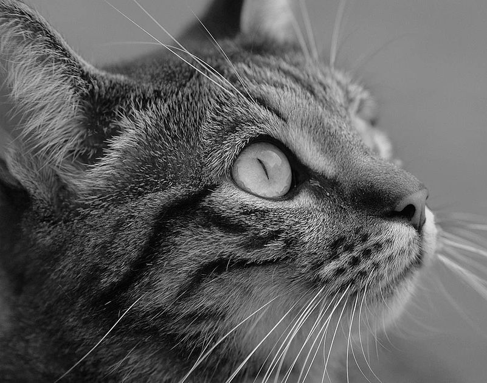
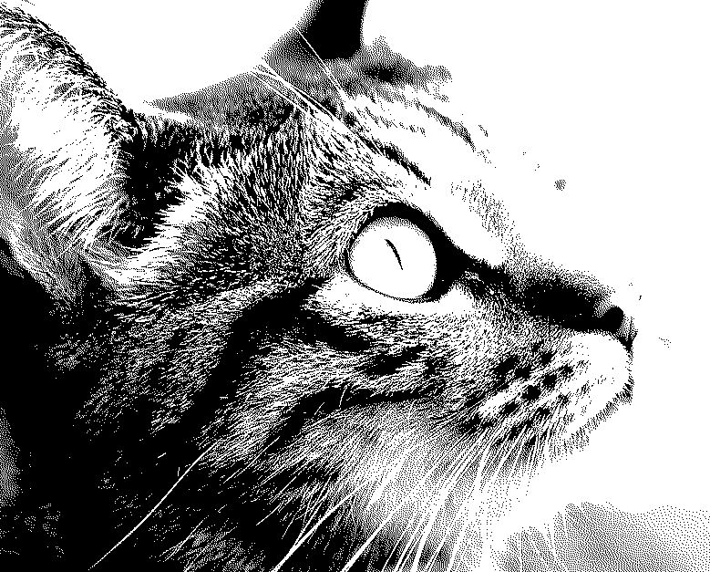
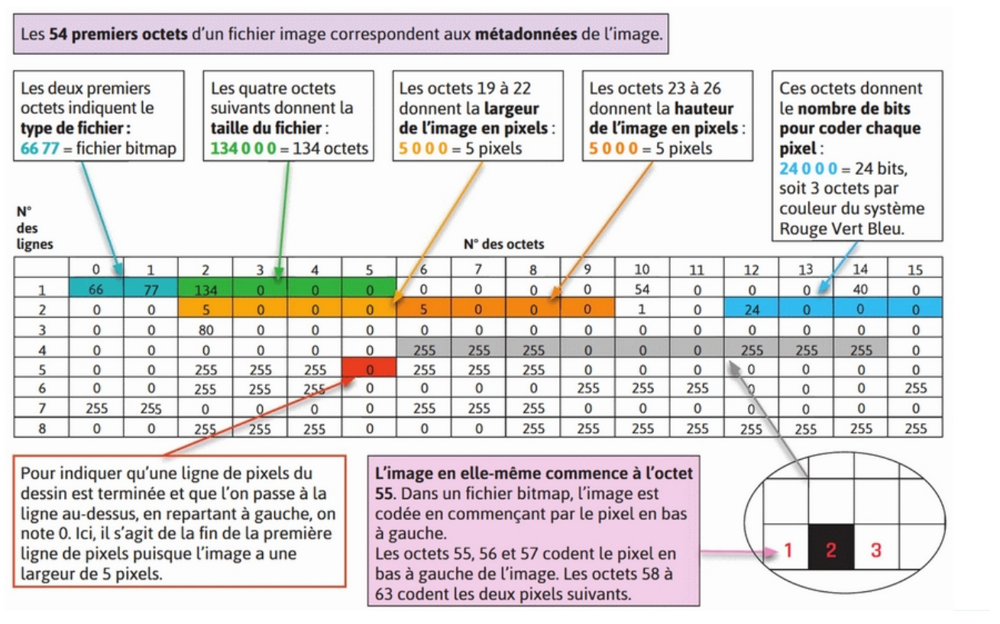
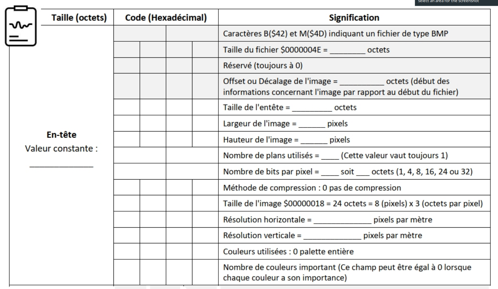
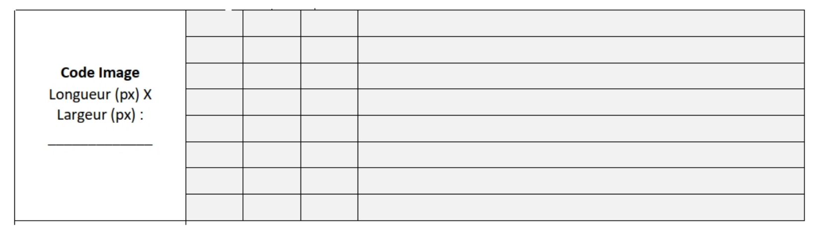

[pdf](./2_image.pdf)

## 1. Codage du noir et blanc

1. Ouvrir le fichier [lion.jpg](./lion.jpg) avec GIMP. Zoomer à 800%.
   L’image est composée de points de différentes couleurs appelés ...

2. À chaque groupe, on va attribuer un quadrillage de taille inconnue (maximum = $7 \times 7$), les cases de ce quadrillage étant colorées en noir ou blanc. Un émetteur de l’image et des décodeurs sont choisis dans le groupe. Le lecteur doit décrire l’image avec un code binaire et les décodeurs doivent la reproduire sur feuille. Avant de commencer, il faut se mettre d’accord sur le codage pour se comprendre. Appelez le professeur quand vous êtes prêts. À l’issue de l’expérience, faire les constats d’erreur :

3. Création d’une image noir et blanc et décodage.

   (a) Ouvrir le logiciel GIMP, dans le menu "Fichier", la création d’une "nouvelle image" permet de choisir la hauteur et la largeur de notre image. Créer une image de petite dimension par exemple 10×10.
   (b) À l’aide de l’outil crayon -taille : 1 pixel, couleur : noire-, créer des lignes horizontales de façon irrégulière. Enregistrer le document, puis l’exporter au format PBM. À la question "Formatage des données", répondre en cochant la case "Ascii".
   (c) Ouvrir le fichier pbm dans le bloc notes et observer son contenu. Où lit-on la taille de l’image ? Compter le nombre de 0 et 1. À quoi correspondent-ils ?

   L’information à mémoriser pour un pixel noir ou blanc est élémentaire. Un bit suffit : 1 pour noir, 0 pour blanc (ou le contraire, c’est seulement une convention).

   - profondeur = 1 bit = ... couleurs possibles

4. Photo Noir et blanc.

   (a) Ouvrir de nouveau le fichier [lion.jpg](./lion.jpg) avec GIMP. L’exporter au format PBM-ASCII.
   (b) Visualiser le résultat en ouvrant le fichier PBM. Que constate-t-on ? Pourquoi ?

   En photographie noir et blanc, c’est un peu plus subtil que noir ou blanc : pour capter un dégradé de lumière, on a besoin de plus de précision et de coder les gris du plus foncé (noir) au plus clair (blanc). On utilise alors en général 1 octet (= 8 bits) pour représenter le niveau de gris d’une image.

   - profondeur = 8 bits = ... couleurs possibles
   - Le noir sera codé par ... et le blanc par ...

## 2. Codage en couleur : le système RGB

Le RGB utilise les trois couleurs des luminophores ou photophores, des "petites pastilles" qui deviennent luminescentes sous l’effet des électrons de l’écran couleur : le Rouge (Red), le Vert (Green) et le Bleu (Blue) d’où RGB et RVB en français. Chaque couleur est obtenue par la superposition de ces trois rayonnements (rouge, vert, bleu) à plus ou moins grande intensité.

1. Sur quelle principe scientifique se base ce codage ?

2. Codage sur 3 bits

   (a) Combien de couleurs différentes peut-on obtenir avec un codage sur 3 bits ?
   (b) Compléter le tableau à double entrée sur la présentation.

3. Codage sur 3 octets
   Dans le cas général, on code les couleurs sur 24 bits soit 3 octets (1 octet respectivement pour chaque nuance de rouge, vert, bleu)
   (a) Avec un tel codage, combien de nuances de couleurs sont possibles ?
   (b) Sur la présentation, associer à chaque codage sa couleur.

En cas de difficulté, vous pouvez utiliser le site [http://www.proftnj.com/RGB3.htm](http://www.proftnj.com/RGB3.htm)

## 3. Codage d’une image

Plus d'informations sur le [Portable Pixmap](https://fr.wikipedia.org/wiki/Portable_pixmap) et le [Window Bitmap](https://fr.wikipedia.org/wiki/Windows_bitmap)

1. Ouvrir le fichier `8px.bmp` à l’aide de GIMP. Zoomer à 800%. Décrire l’image obtenue.

2. Quelle est la taille du fichier ? Cela est-il cohérent ?

3. Ouvrir le fichier `8px.bmp` à l’aide du site [https://hexed.it](https://hexed.it). Recueillir les informations et compléter la feuille de route suivante (la taille de l’image étant petite, il n’y a pas dans ce cas de séparation de lignes).

   $~$

   $~$

4. Sur la présentation, découvrir ce qui se cache derrière le codage de l’image et ouvrir le coffre.

## 4. Compression

1. Comparer les tailles des fichiers du lion au format BMP et au format JPG.
2. Dans GIMP, enregistrer l'image en JPG en changeant le taux de compression.

   - Plus le taux de compression augmente, plus la taille du fichier ... ?
   - Plus le taux de compression augmente, plus la qualité ... ?

BMP est un format d'image matricielle _sans compression_, les pixels sont enregistrés tels quels. JPG est un format d'image matricielle _compressée avec perte_, cela signifie qu'un algorithme est appliqué lors de l'enregistrement afin d'économiser de l'espace disque et qu'une partie de l'information intiale est perdue. Lorsqu'on affiche l'image, un autre algorithme permet de calculer les valeurs de chaque pixel.

L'iPhone, depuis sa version 14, propose un capteur photo de 48 MP, soit 48 millions de pixels.

3. Quelle devrait-être la taille approximative d'une photo prise avec ce capteur si elle était enregistrée en BMP (rappel, 1 pixels = 3 octets.) ?
4. Le support d'Apple indique qu'une photo prise avec ce capteur occupe environ 75 Mo. Est-elle compressée ? Avec quel taux ?
5. Rechercher des formats d'images avec _compression sans perte_. Vous devriez en connaître au moins deux ! Dans quels contextes sont-ils privilégiés ?
