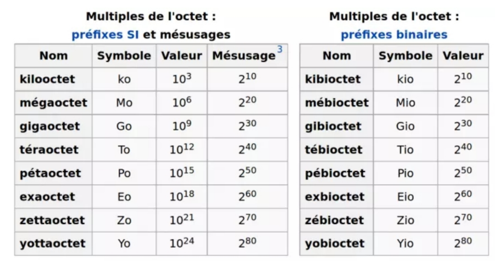

[pdf](./3_unites.pdf)

## Rappel des unités

En anglais, 1 octet = 1 Byte. On trouvera donc pour écriture ko = kB.  
On note "B" le byte ou octet et "b" le bit.

### Exercice 1

Un octet est un mot de 8 bits. Un nibble est un demi-octet (4 bits).

1. Combien de valeurs différentes peut-on coder sur un nibble ? sur un mot d’un octet ? de deux octets ? de quatre octets ?
2. Écrire toutes les combinaisons de bits possibles sur un nibble.
3. Si l’on veut coder 1000 objets, combien de bits sont nécessaires ?
4. Si les valeurs codées sont les premiers entiers naturels, quel est le plus grand nombre représentable sur un octet ? deux octets ? quatre octets ?

### Exercice 2

Convertir les données suivantes dans l’unité demandée :

- 50 octets en bits.
- 14 ko en octets.
- 1580 Mo en Go.
- 4500 ko en Mo.
- 1,5 To en Mo.

### Exercice 3

Ahmed possède un lecteur MP3 d’une capacité de 2 Go. Un morceau de musique fait en moyenne 8 Mo. Combien de morceaux de musique Ahmed pourra-t-il enregistrer sur son lecteur MP3 ?

### Exercice 4

La fiche technique d’un disque dur indique une capacité de 320 GB.  
Exprimer cette capacité en Mio.

### Exercice 5

On veut stocker un texte de 5 lignes dans la mémoire d’un ordinateur, sachant que chaque ligne est constituée de 100 caractères, et chaque caractère est codé sur un octet.

1. Donner la taille minimale pour stocker ce texte en bits ?
2. Donner la taille en Ko.

### Exercice 6

A propos d’images...

1. Soit une image noir et blanc dont la dimension est 300×600 pixels. Donner la taille du fichier la contenant en bits, puis en octets, et en Kilo-octets.
2. Soit une image couleur, ayant une résolution de 65536 couleurs, et dont la dimension est de 1024×768 pixels. Donner la taille du fichier la contenant en bits, puis en octets, et en Méga-octets.
3. La photographie Monument.png est téléchargeable sur le site www.unesco.com. Cette photo est orientée paysage, elle est en couleurs, avec une palette de couleurs de 16 Millions de couleurs et les options de téléchargement nous informent que sa définition est de 600 pixels x 1000 pixels.
   - (a) Calculer le nombre de pixels contenus dans cette photo.
   - (b) Calculer la taille du fichier Monument.png, en octets, en kilo-octets et en méga-octets.

### Exercice 7

Calculer le temps nécessaire pour télécharger une vidéo de 10 Mo avec une connexion ADSL de 2Mbits/s.

### Exercice 8

Votre fournisseur d’accès internet vous annonce un débit descendant de 8192 kibits/s. Vous faites une mesure de débit réel et vous trouvez une moyenne de 3 280 kibits/s.  
Quel sera le temps théorique minimal de téléchargement d’une application de taille égale à 25 Mo ?

### Exercice 9

Les différents supports de stockage à travers le temps.  
Les supports de stockage ont évolué dans le temps pour répondre à la quantité croissante de données.  
L’augmentation de la capacité tout en diminuant la dimension des transports est due à la miniaturisation des composants électroniques et l’augmentation de leur capacité de traitement qui a été exponentielle. On donne ci-dessous le nombre de supports de chaque sorte nécessaire pour stocker 128 Go de données.  
Retrouver la capacité des différents modèles de disquettes, CD et DVD.
