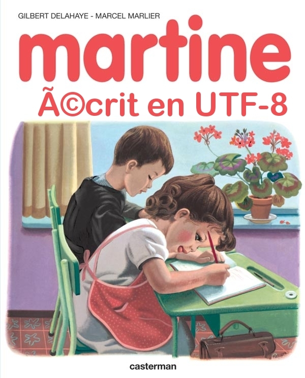

## Unicode

Unicode est un standard informatique conçu pour permettre le codage, la représentation et la gestion cohérente de texte exprimé dans la plupart des systèmes d'écriture du monde. Son objectif principal est de fournir un numéro unique pour chaque caractère, indépendamment de la plateforme, du programme ou de la langue.

### Différences Majeures avec ASCII et ISO-Latin

#### ASCII (American Standard Code for Information Interchange)

- **Taille** : ASCII utilise 7 bits pour représenter chaque caractère, permettant ainsi de coder 128 caractères (de 0 à 127).
- **Jeu de caractères** : Inclut les lettres majuscules et minuscules de l'alphabet anglais, les chiffres, les signes de ponctuation de base et quelques caractères de contrôle.
- **Limitation** : Ne peut représenter que les caractères nécessaires pour l'anglais, ce qui limite son utilisation pour d'autres langues.

#### ISO-Latin (ISO 8859)

- **Taille** : ISO 8859 utilise 8 bits pour représenter chaque caractère, ce qui permet de coder 256 caractères.
- **Variantes** : Il existe plusieurs variantes de l'ISO 8859, comme ISO 8859-1 (Latin-1), ISO 8859-2 (Latin-2), etc., chacune étant conçue pour différentes langues ou groupes de langues.
- **Jeu de caractères** : Chaque variante de l'ISO 8859 étend l'ASCII pour inclure des caractères accentués, des symboles spécifiques et d'autres caractères nécessaires pour représenter les langues européennes et certaines autres langues.
- **Limitation** : Chaque variante ne peut représenter qu'un sous-ensemble limité de caractères, ce qui nécessite l'utilisation de différentes pages de code pour différentes langues.

#### Unicode

- **Taille** : Unicode peut utiliser plusieurs encodages, les plus courants étant UTF-8, UTF-16 et UTF-32. UTF-8 utilise entre 1 et 4 octets par caractère, UTF-16 utilise 2 ou 4 octets, et UTF-32 utilise toujours 4 octets.
- **Jeu de caractères** : Unicode couvre presque tous les caractères utilisés dans les langues modernes, ainsi que de nombreux caractères historiques et symboles. Il comprend plus de 140 000 caractères différents.
- **Universalité** : Conçu pour être un système universel de codage des caractères, éliminant le besoin de pages de code multiples.
- **Compatibilité** : UTF-8 est compatible en rétrocompatibilité avec ASCII, ce qui signifie que tout fichier ASCII valide est également un fichier UTF-8 valide.
- **Extensibilité** : Unicode continue de s'étendre pour inclure de nouveaux caractères et symboles, comme les émojis.

## Exercices

### Exercice 1

Construire une frise chronologique des dates clés d'apparition et de standardisation de ces différents formats (ASCII, ISO-Latin, UNICODE). On citera les sources employées.

### Exercice 2

1. Quel est le format d'encodage de la [page d'accueil de mon site ?](https://qkzk.xyz) ? On utilisera les sources de la page et on citera la ligne qui permet de répondre.
2. Sous windows, quel est l'encodage par défaut d'un fichier texte créée dans le bloc note ? Comment s'en assurer ?
3. L'introduction précise qu'ASCII ne permet d'encoder que 128 caractères. Pourquoi ?
4. Coller une image d'une table ASCII trouvée en ligne (on doit voir apparaître le caractère, son encodage en binaire, en décimal et en hexadécimal).
5. En utilisant votre image, expliquer l'affirmation suivante : "_Pour passer des minuscules aux majuscules, il suffit de changer un seul bit_".
6. Que sont les _caractères blancs_ et comment sont-il encodés en ASCII ? On donnera une petite table.

### Exercice 3

On dispose d'un fichier texte de 700 octets mais on ne sait pas quel encodage il utilise parmi ceux cités plus hauts.

Quelle est la longueur du texte ...

1. S'il est encodé en ASCII sur 7 bits ?
2. S'il est encodé en ASCII sur 8 bits ?
3. S'il est encodé en iso-latin1 sur 8 bits ?
4. S'il est encodé en utf-8 ? Peut-on répondre à la question ?

### Exercice 4

1. On a extrait les octets suivants d'un document texte. Ils sont écrits en hexadécimal. Traduire en texte.

   `73 61 6c 75 74 20 6c 65 73 20 65 6e 66 61 6e 74 73`

2. Encoder le texte suivant en iso-latin1 puis en unicode :

   `André et Françoise écrivent à leur père`

3. Ouvrir les différentes versions dans [hexed](https://hexed.it/) et comparer. Déterminer les encodages des caractères suivants :

   | Caractère | Encodage ISO-Latin1 | Encodage UTF-8 |
   | :-------: | ------------------- | -------------- |
   |    `é`    |                     |                |
   |    `ç`    |                     |                |
   |    `è`    |                     |                |
   |    `à`    |                     |                |
   |    `ù`    |                     |                |
   |    `€`    |                     |                |

   _Il sera nécessaire de modifier le texte d'origine._

4. Ce texte peut-il être encodé en ASCII ? Expliquer.

5. Le code source d'un programme informatique est _généralement_ encodé en ASCII et on évite au maximum d'utiliser des caractères accentés ou spéciaux. Motiver ce choix.

### Exercice 5

Expliquer la "blague" de l'image de Martine présentée plus haut.
