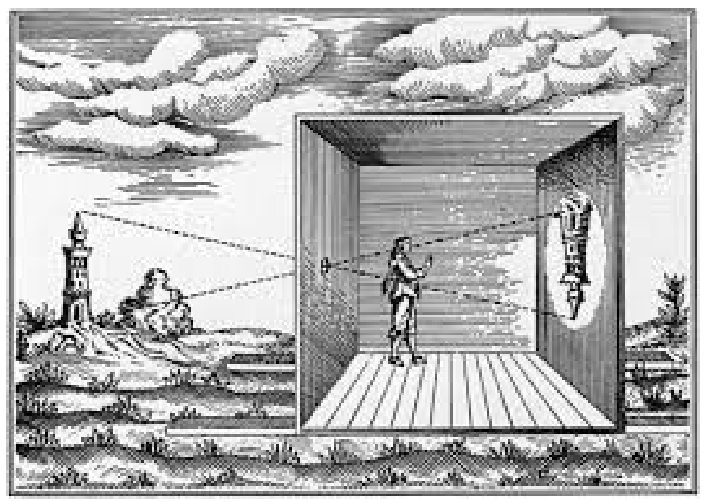
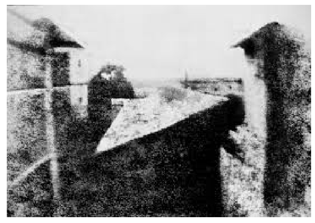
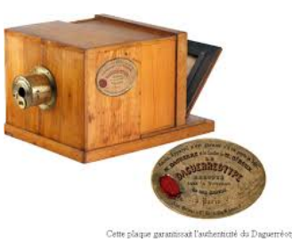
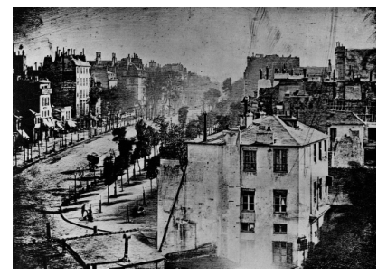
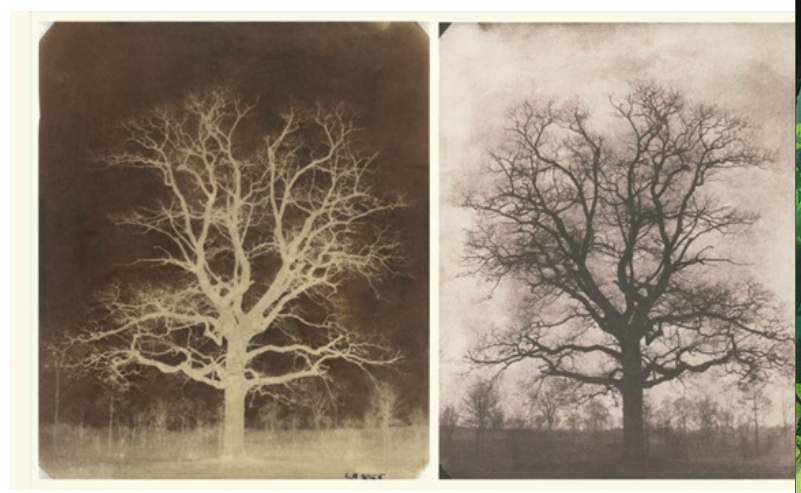
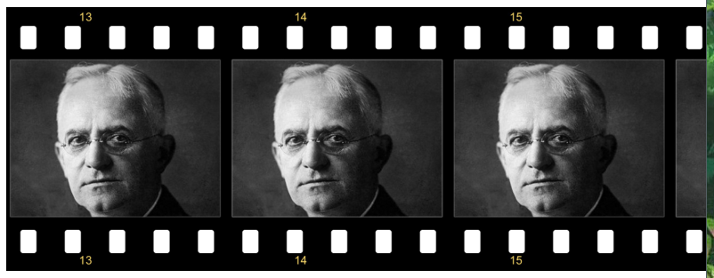
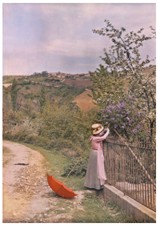
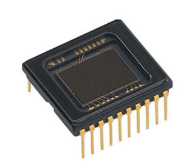
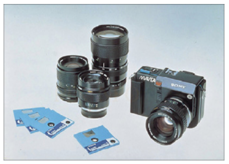
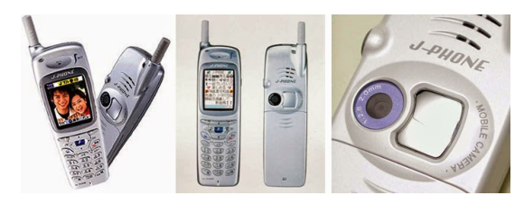

[pdf](./historique.pdf)

## 1 Vidéos histoire

- [Introduction](https://youtu.be/QFCoCo99N88)
- [Du sténopé à la photographie](https://youtu.be/Kkx-7fDIb)
- [La naissance d’une invention](https://youtu.be/q2awCruG7UI)

## 2 Camera obscura

De l’Antiquité aux peintres de la Renaissance.

## Nicéphore Niepce

Le premier procédé de fixation de l’image en 1826 par Nicéphore Niepce (Héliographie).

## 4 Daguerre

Daguerre et le daguerréotype en 18.

## 5 Talbot

Le premier procédé de négatif en 1840, le Calotype, par Talbot.

## 6 Eastman

En 1884, George Eastman met au point les surfaces sensibles souples, et le film en celluloïd.

Eastman est le créateur de la marque KODAK. Le dernier laboratoire KODAK a fermé en 2007 en France.

## 7 Les frères Lumière

Le premier procédé véritablement pratique de photographie en couleurs, l’« autochrome », est inventé par les frères Lumière en 190 Le procédé gardait comme support la plaque de verre.

## 8 Les capteurs

En 1969 invention du capteur CCD qui équipe actuellement la plupart des appareils photos numériques, avec sa variante moins chère le capteur CMOS apparu en 1995. Dans cette technologie, le capteur transforme les photons (la lumière) en électrons (électricité).

## 9 Le premier appareil photo

C’est Sony qui fut la première société au monde à comprendre l’intérêt de la photographie numérique. Après avoir sorti en 1980 la première caméra vidéo CCD, en 1981, Sony présenta à Tokyo le premier appareil photo numérique, le Mavica, nom dérivé de « Magnetic Video Camera ».

## 10 Premier téléphone appareil photo

Le Sharp J-SH04 est considéré comme le premier téléphone mobile équipé d’un appareil photo intégré. Ce fut un succès immédiat au Japon.

