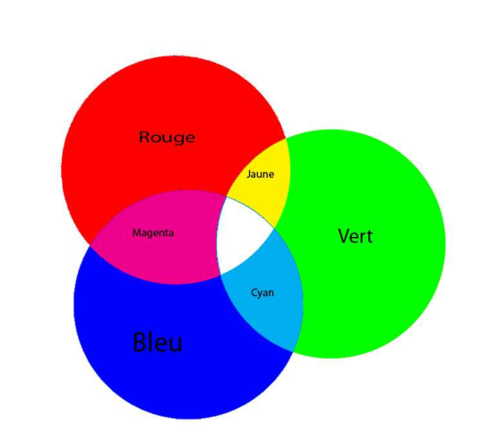
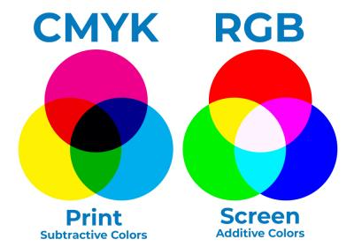
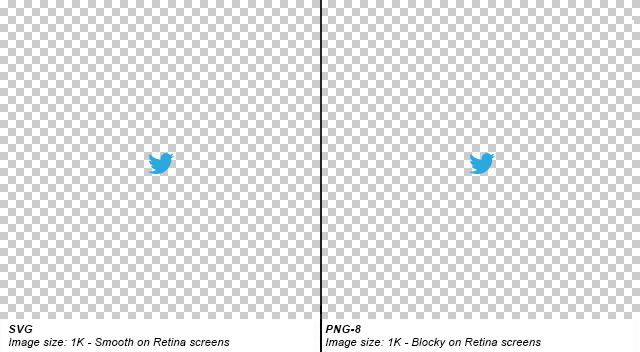

[pdf](./1_images_numeriques.pdf)

Les appareils photographiques numériques permettent d’enregistrer des images avec une qualité telle qu’ils ont pratiquement remplacé les appareils argentiques. Pour comprendre leur fonctionnement, il faut d’abord examiner en détail une image point par point, couleur par couleur.

## 1. Caractéristiques d’une image

Le logiciel GIMP est le logiciel libre[^1] le plus complet et le plus utilisé pour à la fois dessiner des images et traiter des photographies numériques.

1. Ouvrir le fichier [./ficellelaplusbelle.jpg](ficellelaplusbelle.jpg) avec GIMP. Zoomer à 1 600%.
2. Comment sont appelés les points de différentes couleurs qui composent l'image ?
3. Combien en comporte l'image précédente ? Détailler le calcul.

---

Pour mémoriser une image numérique constituée de pixels, il suffit de choisir comment représenter chaque pixel et ensuite de bien les ranger.

Il existe deux types d’images en informatiques :

- les images matricielles ;
- les images vectorielles.

En photographie, on utilise les images _matricielles._

3. Qu'est-ce qu'une _matrice_ en mathématique ?
4. Quel est le lien avec les images matricielles ?
5. Dans l’onglet **Image**, choisir **Propriétés de l’image** et noter ci-dessous les trois premières informations.

[^1]: Un logiciel libre est un logiciel dont l’utilisation, l’étude, la modification et la duplication par autrui en vue de sa diffusion sont permises, techniquement et légalement, ceci afin de garantir certaines libertés induites, dont le contrôle du programme par l’utilisateur et la possibilité de partage entre individus.

---

## 2. Définition et résolution

Ces deux notions sont souvent confondues.

6. Définir ces deux termes dans le cadre de la photographie numérique
7. Quelle est la définition d'une image $4~000 \times 3~000$ ?

> Le pouce est une unité de longueur du système _impérial_ en usage dans certains pays (États-Unis, Royaume-Uni) et dans certaines industries comme l'aéronautique. 1 pouce = 2,54 cm.

La résolution n’est pas une caractéristique du fichier image. On ne peut la calculer que lorsqu’on connaît la taille du support. Plus la résolution est élevée, plus les pixels sont petits et nombreux, et plus l’image est fine. Mais plus les points sont nombreux, plus il faut de place en mémoire et sur disque dur pour les stocker. C’est pour cela qu’il est important de faire un bon compromis entre la qualité d’une image et la place nécessaire pour la stocker. Les résolutions usuelles sont de 72 ppp à l’écran et de 300 ppp à l’impression.

La résolution d’une image lie le nombre de pixels de cette image à ses dimensions réelles. On a ainsi la relation suivante :

8. Soit une image de définition 800×533 que l’on imprime sur du papier photo de taille 15 × 10 (en cm), calculer la résolution de cette image en ppp.
9. On estime que pour avoir une impression de qualité il faut atteindre une résolution de 300 ppp, calculer la définition minimale d’une image dans le cas d’une impression sur du papier 15 × 10.
10. L’écran d’un smartphone a une résolution de 458 ppp, il affiche des images de définition 2 436 × 1 125. Calculer la taille de cet écran (largeur et hauteur) en cm.

---

## 3. Codage d’une image

En plus de sa définition, une image numérique utilise plus ou moins de mémoire selon les informations de couleur qu’elle possède. C’est ce que l’on nomme le codage des couleurs ou profondeur de couleur qui est le nombre de bits[^2] utilisés pour coder la couleur d’un pixel.

a) Le noir et blanc

L’information à mémoriser pour un pixel noir ou blanc est élémentaire. Un bit suffit : 1 pour noir, 0 pour blanc (ou le contraire, c’est seulement une convention).

11. Combien de couleurs peuvent être représentées avec une profondeur de 1 bit ?

En photographie noir et blanc, c’est un peu plus subtil que noir ou blanc : pour capter un dégradé de lumière, on a besoin de plus de précision et de coder les gris du plus foncé (noir) au plus clair (blanc). On utilise alors en général 1 octet (= 8 bits) pour représenter le niveau de gris d’une image.

- profondeur = 8 bits = ... couleurs possibles
- Le noir sera codé par ... et le blanc par ...

12. Et pour une profondeur de 8 bits ? Comment sont codés le noir ? Le blanc ?

b) Codage RVB

C’est le codage utilisé pour les écrans couleurs. Chaque couleur peut être obtenue par addition des trois couleurs primaires : Rouge, Vert et Bleu.

[^2]: On appelle bit (BInary digiT) le plus petit élément d’information stockable par un ordinateur. Un bit ne peut prendre que deux valeurs (0 ou 1) correspondant à deux états possibles d’un élément de circuit électrique (tension présente ou absente aux bornes d’un dipôle). L’opération qui consiste à transformer (ou coder) ...

## 4. Impression

Contrairement à l'écran, le papier n'émet pas de lumière. Autrement dit, sans source lumineuse extérieure, vous ne pouvez lire un livre...

Les couleurs imprimées sont donc obtenues autrement, par _soustraction_ de couleur.

Le papier imprimé absorbe donc une partie des couleurs. Pour le blanc, on n'absorbe rien, pour le noir on absorbe tout.

Ces vidéos vous éclaieront davantage :

- [Supperposition](https://www.youtube.com/watch?v=nHVIL2ZVQIU)
- [Procédé d'impression](https://www.youtube.com/watch?v=qpCBHM_jLGg)

L'_imprimante_ est un périphérique qu'on retrouve souvent chez un particulier.

13. Quelles sont les deux grandes catégories d'imprimantes qu'on peut trouver dans le commerce ?
14. L'impression _laser_ utilise un toner. Qu'est-ce ?
15. Epson est un constructeur d'imprimante qui propose une imprimante à bas coût XP 2200. Combien coûte-t-elle ? Combien coûte une recharge _officielle_ vendue par Epson ? Calculer le coût d'une page imprimée pour une de ces cartouches.
16. Comparer avec le premier prix d'imprimante laser Noir et Blanc vendu par le concurrent Brother. Coût à l'achat, coût d'un toner, coût de revient d'une page.
17. _Complément._ Tracer les coûts par page dans un même repère sur la calculatrice Numworks (utiliser l'[émulateur](https://www.numworks.com/fr/simulateur/)) et joindre une capture d'écran. À partir de combien de page N&B est-il plus intéressant d'acheter une imprimante laser ?

    Expliquer pourquoi les services administratifs des entreprises sont tous munis d'imprimantes laser et jamais à jet d'encre.

## 5. Images vectorielles

Les _images matricielles_ sont très pratiques pour la photographie. Elles permettent de représenter fidélement les nuances de couleurs qu'on trouve dans le monde réel. Malheureusement, pour un _dessin_ ou pour du _texte_, elles gaspillent beaucoup de ressources et présentent un défaut majeur. **Lorsqu'on zoome sur une image matricielle, on perd en qualité**.

Si l'on veut pouvoir écrire avec du texte aussi
grand que possible, il faut disposer de polices de caractère dans toutes les tailles ! Ce n'est pas raisonnable.

Voilà pourquoi il existe un autre format de représentation des images, les _images vectorielles_.

Une image vectorielle, est la description géométrique des formes qu'elle contient. Par exemple ces deux images sont enregristrées différemment :

18. Zoomer à l'écran et comparer la qualité d'affichage des images. Que constatez-vous ?
19. Enregistrer ces deux images et comparer les dimensions des fichiers.
20. Ouvrir la première image (.svg) dans _sublime text_. Faire de même avec la seconde, que constatez-vous ?
21. Modifier les valeurs des lignes 17 et 18 afin d'en faire un dégradé de rouge. On pourra s'aider d'un [_color picker_](https://www.google.com/search?q=color+picker&oq=color+picker&gs_lcrp=EgZjaHJvbWUyDwgAEEUYORiDARixAxiABDIHCAEQABiABDINCAIQABiDARixAxiABDIHCAMQABiABDIHCAQQABiABDIHCAUQABiABDIMCAYQABgUGIcCGIAEMgcIBxAAGIAEMgcICBAAGIAEMgcICRAAGI8C0gEIMTkzMWowajeoAgCwAgA&sourceid=chrome&ie=UTF-8).

    Reporter les couleurs choisies et joindre une capture d'écran.
