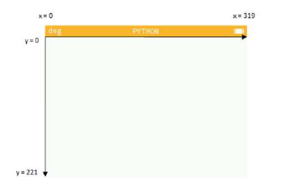
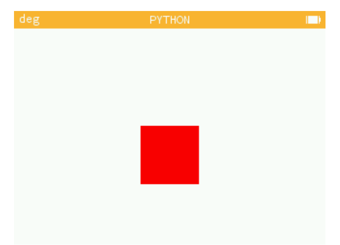
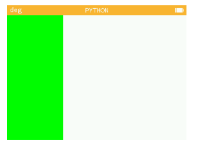
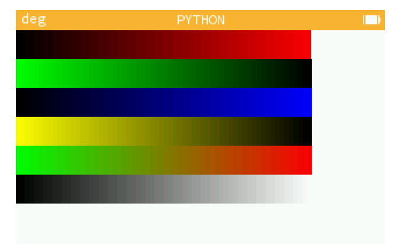

---

[pdf](./2_creation_image.pdf)

_Pour ce travail, on travaillera dans l'**[émulateur de la calculatrice](https://www.numworks.com/fr/simulateur/)** et on produira des captures d'écran directement depuis l'émulateur._

_Ces codes sont donc reproductibles à l'identique sur les calculatrices dont vous disposez réellement._

_Si vous n'avez jamais utilisé Python, ce n'est pas grave. Sachez juste qu'il faut écrire **exactement** ce qu'on vous donne. Au caractère près._

---

# Création d’une image avec NumWorks

L’objectif de cette séance est de comprendre, à l’aide d’instructions Python, la structure d’une image numérique et le codage des pixels selon leurs composantes rouge, vert, bleu. On s’exercera à jouer avec les couleurs à l’écran.

La calculatrice NumWorks intègre un module graphique appelé kandinsky qui va permettre d’analyser et de définir la couleur de chacun des pixels de l’image (écran 320 × 222 pixels).



## Partie 1: le drapeau français

Dans cette partie, nous allons découvrir le module graphique et construire peu à peu le drapeau français.

### I. Découverte du codage des couleurs

On aura besoin ici d'une fonction du module graphique `kandinsky` :

- `set_pixel(x,y,(r,g,b))` : colore le pixel de coordonnées `(x,y)` de la couleur `(r,g,b)`.

1.  a. À partir de l’écran principal, aller sur l’application Python. Faire défiler la page et **ajouter un script** que l’on nommera `pixel.py`. Saisir le code suivant :

    ```python
    import kandinsky as kd
    kd.set_pixel(10,10,(255,0,0))
    ```

    b. Exécuter le script et inclure une capture d'écran. **On fera de même pour chaque nouvelle image produite**

    Qu’observe-t-on ? Expliquer le programme ligne par ligne.

2.  a. Modifier le script `pixel.py` en saisissant le code suivant :

    ```python
    import kandinsky as kd
    for x in range(10,60):
        for y in range(10,60):
            kd.set_pixel(x,y,(255,0,0))
    ```

    - `range(a, b)` : tous les nombres entre `a` (inclu) et `b` (exclu). Par exemple `range(20, 25) = [20, 21, 22, 23, 24]`
    - `for x in range(a, b)` : `x` prend chaque valeur dans le `range`.

    b. Exécuter le script. Qu’observe-t-on ? Expliquer le programme ligne par ligne.

3.  On voudrait créer un carré rouge de taille 60 × 60 comme ci-dessous.

    

    a. Comment faire pour obtenir le carré rouge ? Que faut-il ajouter au script précédent ?

    b. Modifier le script `pixel.py` pour obtenir ce carré rouge.

    c. Modifier le script `pixel.py` pour obtenir un carré bleu, puis jaune, puis gris.

4.  Modifier le script `pixel.py` afin de créer une bande verticale verte sur toute la hauteur de l’écran, de largeur 60 et commençant tout à gauche de l’écran.

    

5.  En utilisant vos nouvelles connaissances, créer le script `drapeau.py` qui dessinera le drapeau français sur tout l’écran de la calculatrice.

## Partie 2: dégradés

### I. Un premier dégradé

1.  a. Créer le script `degrade.py` et copier le code ci-dessous.

    ```python
    import kandinsky as kd
    for x in range(256):
        for y in range(222):
            kd.set_pixel(x,y,(x,0,0))
    ```

    b. Exécuter le script. Qu’observe-t-on ?

    c. Expliquer les différentes lignes du programme.

    d. Pourquoi le dégradé ne s’étend-il pas sur l’ensemble de la longueur de l’écran ?

    e. **BONUS :** Modifier le script afin que le dégradé s’arrête tout à droite de l'écran.

2.  a. Ajouter au script `degrade.py` les lignes suivantes.

    ```python
    for x in range(256,320):
        for y in range(222):
            kd.set_pixel(x,y,(255,x-256,0))
    ```

    b. Exécuter le script. Qu’observe-ton ?

### II. Bandes horizontales

L'objectif de cette partie est de construire L'image ci-dessous. Nous allons la créer bande par bande.



1. Modifier le script précédent pour créer une première bande horizontale, de largeur 256, de hauteur 25 du noir vers le rouge.

2. Modifier le script pour créer une deuxième bande horizontale, du vert vers le noir, sous la première.

3. Compléter le script `degrade.py` pour créer une troisième bande de dégradé noir vers bleu de largeur 25 et de longueur 256.

4. Compléter le script `degrade.py` pour créer une quatrième bande de dégradé jaune vers noir de largeur 25 et de longueur 256. Le jaune correspond à une intensité égale du rouge et du vert ; le bleu est à 0.

5. Compléter le script `degrade.py` pour créer une cinquième bande de dégradé vert vers rouge de largeur 25 et de longueur 256.

6. Compléter le script `degrade.py` pour créer une sixième bande de dégradé noir vers blanc en nuance de gris de largeur 25 et de longueur 256.

7. Observer de près : la calculatrice paraît-elle produire réellement 256 niveaux dans chaque couleur ?

## Compléments : les drapeaux

1. _Complément._ Reproduire un maximum de [**drapeaux des pays du monde**](https://fr.wikipedia.org/wiki/Galerie_des_drapeaux_des_pays_du_monde) en utilisant les outils présentés plus haut. Une capture du code et une du résultat par pays.
