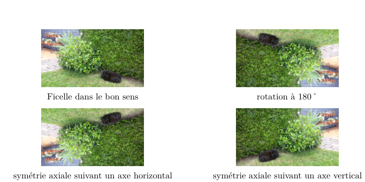

[pdf](./3_traitement_image.pdf)

## Fichiers fournis pour la séance

- [ficellelaplusbelle.jpg](./ficellelaplusbelle.jpg)
- [pillowSNT.py](./pillowSNT.py)
- [modifgeo.py](./modifgeo.py)

Enregistrez les tous dans le même dossier de votre espace de travail. Vos fichiers source doivent aussi y être.

## 1. Filtre et codage RVB

En effectuant des opérations mathématiques sur les trois composantes des pixels d'une image, on transforme l'aspect de la photo : on réalise un filtre.

Avec GIMP, nous en testerons quelques uns puis nous verrons leur fonctionnement afin de les programmer.

---

### Principe d'un filtre "simple" :

Certains filtres sont trop compliqués pour être abordés en seconde. Les notions mathématiques nécessaires (les matrices notamment) ne sont abordées que bien plus tard.

Nous allons tout d'abord nous intéresser aux filtres qui fonctionnent de la façon suivante :

Pour chaque pixel d'une image :

- On lit les composantes R,V,B.
- On effectue une opération, qui dépend du filtre voulu, sur ces composantes et on obtient ainsi de nouvelles composantes.
- On remplace les anciennes composantes par les nouvelles.

---

1. Ouvrir le logiciel Thonny, créer un fichier filtres.py puis le sauvegarder dans le répertoire où se trouve les fichiers fournis (pillowSNT.py, ficellelaplusbelle.jpg et éventuellement votre photo).

   Nous allons y coder tous les filtres de ce TP.

### a) filtres rouge, vert, bleu

Le principe de ces trois filtres est le même : on garde une des trois composante intacte et on passe les deux autres à 0.

2.  a. Écrire le code de la fonction rouge dans la fenêtre d'édition.

    ```python
    def rouge(r, v, b):
        return r, 0, 0
    ```

    b. Tester la fonction via la console après avoir exécuté ce programme.

    ```python
    >>> rouge(171, 222, 33)
    (171, 0, 0)
    ```

Maintenant, il reste à appliquer ce filtre à tous les pixels d'une image.

Pour cela, nous allons utiliser le « module » [pillowSNT.py](./pillowSNT.py) qui doit être placé dans le même dossier que votre fichier filtres.py.

Pour utiliser ce module, on ajoute la ligne suivante en haut du fichier filtres.py :

```python
from pillowSNT import *
```

pillowSNT propose quelques fonctions intéressantes qui permettent de travailler sur les filtres sans avoir besoin d'une grande connaissance et d'une grande maîtrise de Python.

- `ouvrir(chemin)` renvoie l'image stockée dans le fichier désigné par son chemin d'accès.

  ```python
  ImageDepart = ouvrir("ficellelaplusbelle.jpg")
  ```

- `filtrer(image, filtre)` applique le filtre à tous les pixels de l'image et renvoie l'image obtenue.

  ```python
  monImage = filtre(ImageDepart,rouge)
  ```

  appliquera donc le filtre rouge à tous les pixels de l'image en mémoire dans ImageDepart et stockera le résultat dans la variable monImage.

- `afficher(image)` affichera l'image correspondant au paramètre image.

  ```python
  afficher(monImage)
  ```

  affichera l'image obtenue précédemment.

- `sauver(image,nom)` sauvegarde l'image correspondant au paramètre image sous le nom spécifiée

  ```pyton
  sauver(monImage,"ficellerouge.jpg")
  ```

3. Ajouter dans la fenêtre d'édition les quatre lignes ci-dessus (modifier le nom du fichier pour appliquer le filtre rouge sur une photo personnelle) puis exécuter ce programme.

4. Après la fonction `rouge`, écrire les fonctions `vert` et `bleu` puis les tester sur une image.

### b) filtre niveau de gris

5. a. Ouvrir [ficellelaplusbelle.jpg](./ficellelaplusbelle.jpg) ou votre photo personnelle avec GIMP.

   b. Avec l'outil Pipette à couleurs, cliquer sur différents pixels pour observer les composantes rouge, vert, bleu.
   c. Passer maintenant cette image en mode niveaux de gris (Image/Mode/Niveaux de gris) puis ré-itérez l'opération précédente. Qu'observez-vous ?

Pour passer d'une image couleur à une image en niveaux de gris, il faut remplacer chaque composante par une même valeur L, appelée luminance. La luminance est le résultat d'un calcul de moyenne pondérée sur les trois composantes d'un pixel arrondie à l'entier le plus proche. L est donc un entier entre 0 (noir) et 255 (blanc).

Les pondérations dépendent de la sensibilité des couleurs primaires à l'œil humain et du support utilisé pour afficher l'image.

Une formule couramment utilisée est `L = (21R + 71V + 8 B)//100`.

Les `//` désigne l'opérateur division entière.

6. Calculer la luminance L dans les cas suivants.

   - Pixel rouge (R=255, V=0, B=0) : L =
   - Pixel vert (R=0, V=255, B=0) : L =
   - Pixel bleu (R=0, V=0, B=255) : L =
   - Pixel violet (R=238, V=130, B=238) : L =

7. Pour réaliser un filtre niveaux de gris sur un pixel, on calcule la luminance L du pixel et on remplace les trois composantes RVB par cette luminance.

À la suite des fonctions déjà écrites, créer la fonction gris(r,v,b) qui renvoie les trois composantes qui résultent du passage en niveaux de gris d'un pixel de composantes r,v,b puis la tester.

### c) filtre négatif

Le principe du filtre négatif est de remplacer chaque composante par son complémentaire dans [0,255].

- Le négatif d'un pixel rouge (R=255, V=0, B=0) est un pixel aqua (R=0, V=255, B=255).
- Le négatif d'un pixel violet (R=238, V=130, B=238) est un pixel vert citron (R=17, 125, 17).

8. À la suite des fonctions déjà écrites, créer la fonction `negatif` qui renvoie les trois composantes qui résultent du passage au négatif d'un pixel de composantes r,v,b puis la tester.

### d) filtre noir ou blanc

Ce filtre reprend en partie le principe du filtre niveaux de gris.

- On fixe un seuil entre 0 et 255.
- On calcule la luminance L d'un pixel.
- Si L est supérieur au seuil alors on remplace les trois composantes RVB par 255.
- Sinon on remplace les 3 composantes RVB par 0 .

9. À la suite des fonctions déjà écrites, créer la fonction `nb` qui renvoie les trois composantes qui résultent du passage au noir ou blanc d'un pixel de composantes r,v,b puis la tester avec différentes valeurs pour le seuil.

   _Indication syntaxe :_

   ```python
   def nb(r, v, b):
       seuil = ...
       L = ...
       if ... :
           return (  ,   ,  )
       else:
           return (  ,   ,  )
   ```

## 2. Modification géométrique

Chaque pixel d'une image se repère par ses coordonnées.

Pour une image de définition 400 × 300, les coordonnées du pixel en haut à gauche sont (0 ;0) et celles de celui en bas à droite sont (399 ;299).

10. On souhaite effectuer, pour une image donnée, une rotation de 180° de cette image.
    a. Pour une image de définition 400 × 300, où se déplace un pixel de coordonnées :

    - (0; 0) ?
    - (399; 0) ?
    - (0; 299) ?
    - (150; 90) ?
    - (x; y) ?

    b. Créer un fichier modifgeo.py puis le sauvegarder dans le même répertoire que précédemment.

    c. Écrire dans ce fichier le code expliqué ci-dessous qui effectue une rotation de 180° de l'image [ficellelaplusbelle.jpg](./ficellelaplusbelle.jpg) (vous pouvez mettre votre photo personnelle).

    ```python
    from pillowSNT import *

    image = ouvrir("ficellelaplusbelle.jpg")
    largeur, hauteur = image.size # affecte la largeur et la hauteur de l'image

    image_retournee = Image.new("RGB", (largeur, hauteur)) # nouvelle image de même taille
    for x in range(largeur): # pour chaque abscisse
        for y in range(hauteur): # pour chaque ordonnée
            # place un pixel de la nouvelle image
            image_retournee.putpixel((x, y), image.getpixel((largeur-1-x, hauteur-1-y)))

    afficher(image_retournee)
    ```

11. Modifier le code ci-dessus pour effectuer une symétrie axiale de l'image suivant un axe horizontal.

12. Modifier le code ci-dessus pour effectuer une symétrie axiale de l'image suivant un axe vertical.

    
