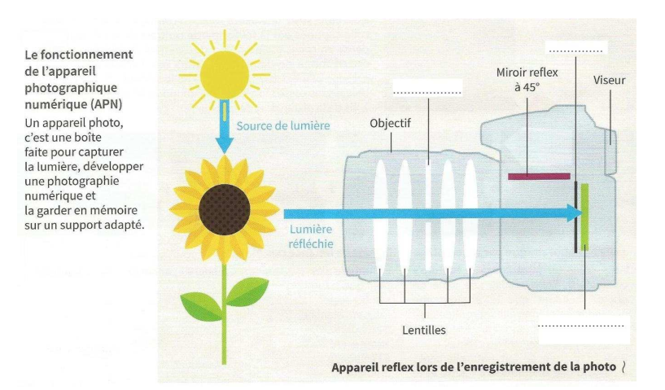
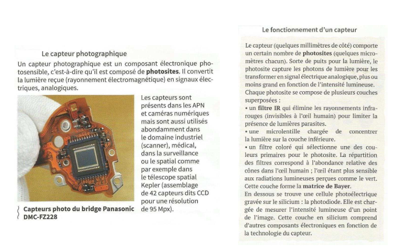
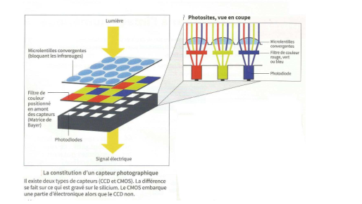
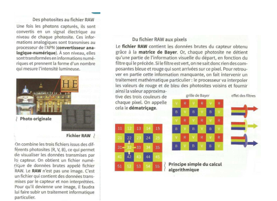

[pdf](./4_capture.pdf)

La photographie numérique a pour objectif d’enregistrer des fichiers d’images matricielles à partir de prises de vue réelles.

## I Capteur et capture d’une image

### a) Capture de la lumière

1 Compléter le schéma ci-dessus avec les mots : capteur photographique, diaphragme, obturateur.

2. Rechercher sur Internet le rôle du diaphragme et de l’obturateur.

### b) Le capteur photographique

Répondre aux questions ci-dessous à l’aide des trois documents situés sur la page suivante.

3. Quel est le rôle d’un capteur photographique ?

4. De quoi est constitué un capteur photographique ?

5. Que fait un photosite ?

6. Combien faut-il au minimum de photosite pour obtenir la couleur d’un pixel ?

7. Pourquoi l’œil humain est plus sensible à la lumière verte ?

### c) Photoite et pixel

Les photosites jouent un rôle dans la captation de la lumière à l’intérieur du capteur de l’appareil photo numérique, alors que les pixels de l’écran servent à reproduire cette lumière.

8. À l’aide des deux documents de la page suivante, décrire les trois grandes étapes qui permettent de passer de la capture de la lumière aux pixels.

9. À l’aie de cet article, répondre aux questions suivantes.

   a. Comment a évolué le nombre de méga-pixels entre l’iPhone 6 et l’iPhone 6S ?

   b. Quelle a été la conséquence de cette évolution ?

   c. Dans le même temps, qu’ont décidé de faire Samsung et Google ?

   d. Quel est l’avantage à avoir de plus grands photosites dans un capteur ?

   e. Quel changement la matrice de Bayer subit-elle avec la technologie BritCell développée par Samsung ?

## II Les algorithmes

Le numérique a libéré les photographes amateurs de bon nombre de soucis techniques. Par exemple, les algorithmes prennent le relais des capteurs physiques en calculant les pixels de l’image finale ou en compensant le bruit[^1] ou le bougé de l’utilisateur. Ils améliorent donc la prise de vue en automatisant les réglages, puis le traitement avec des retouches faciles. Suite à l’arrivée du téléphone mobile, des algorithmes de fusion d’images permettent de concilier qualité et taille minuscule du capteur et de l’objectif.

10. De nombreux algorithmes sont utilisés à différents stades :

- lors de la prise de vue,
- lors du développement de l’image,
- après le développement.

Catégoriser chacune des fonctionnalités suivantes aux différents stades : Compression du fichier ; calcul de l’exposition ; mise au point ; correction automatique des distorsions optiques ; stabilisation par le capteur ; gestion du contraste ; balance des blancs ; changement de format ; prise en rafales d’images multiples.

## III Manipulation de photographies numériques

11. À l’aide de ses différents liens :

- [lien 1](https://www.arretsurimages.net/articles/coreee-du-nord-photo-truquee)
- [lien 2](http://www.la-retouche-photo.com/la-retouche-photo-cest-de-la-triche/)
- [lien 3](http://www.topito.com/top-photo-truquees-hoax-histoire-fake)
- [lien 4](https://www.journaldunet.com/ebusiness/expert/48599/les-consequences-juridiques-de-la-retouche-d-images.shtml)
- [une vidéo](https://www.youtube.com/watch?v=lMWPDuiZ4L8&feature=youtu.be)
- [Rafraîchir cette page et il se crée chaque fois un nouveau visage...](https://thispersondoesnotexist.com/)

Répondre, en détaillant, aux questions suivantes :

a. Pourquoi vouloir manipuler l’image ?

b. Retoucher pour améliorer ou pour tromper ?

c. Comment détecter une manipulation d’image ?

[^1]: On appelle bruit numérique toute information parasite ou dégradation que subit l’image de l’instant de son acquisition jusqu’à son enregistrement.
