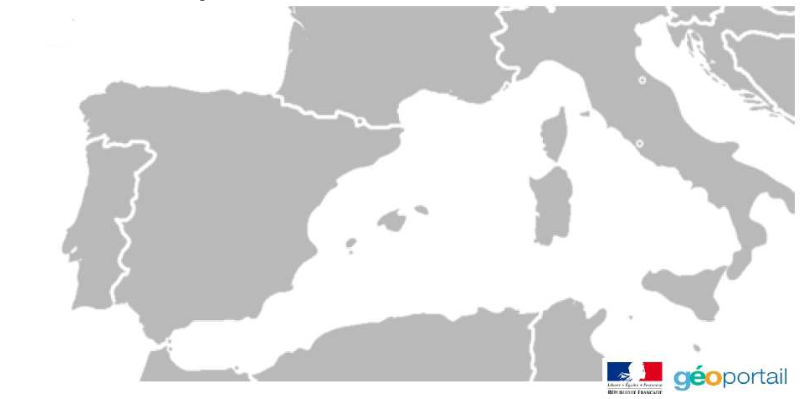

[pdf](./geolocalisation_photo.pdf)

---

### Matériel pour la séance :

- [photo 0](./0-depart.JPG)
- [photo 1](./1-etape1.JPG)
- [photo 2](./2-etape2.JPG)
- [photo 3](./3-etape3.JPG)
- [photo 4](./4-etape4.JPG)
- [photo 5](./5-etape5.JPG)
- [photo 6](./6-etape6.JPG)
- [photo 7](./7-etape7.JPG)

---

## MÉTADONNÉES PHOTOGRAPHIQUES

### Les Métadonnées

Outre les informations indispensables à la génération d’une image par un logiciel, le fichier qui permet de représenter une image contient aussi divers renseignements concernant la conception de l’image. Ces informations sont des métadonnées, plus spécifiquement appelés ici métadonnées EXIF[^1]. Ainsi, peut-on trouver : la marque et le modèle de l’appareil, date et heure de prise de vue, localisation GPS, etc.

### Lire les métadonnées

Les métadonnées d’une photographie peuvent être visualisées de différentes manières :

- dans les propriétés du fichier ;
- à l’aide de logiciels de visualisation, de modification ou d’archivage de photographies ;
- en ligne à l’aide de sites spécialisés[^2] ;
- sur smartphone avec des applications dédiées[^3].

### Application

Le but du travail est de reconstituer les différentes étapes de la croisière de M. et Mme DUPONT. Il semble qu’ils en aient rajouté une !

1. Dans votre dossier Travail, créer un dossier croisière et y copier les photos données plus haut.

2. A l’aide du site Metapicz, trouver alors les informations suivantes pour la première photo (départ).

   a. La résolution de la photo : ............................................

   b. Date et heure de la prise de vue : ........................................

   c. Marque de l’appareil et sa référence : ..............................

   d. Le flash a-t-il fonctionné durant la prise de vue ? ............

   e. Que signifie la mention sRGB, sachant que "s" signifie standard ?

3. Pour chacune des photos, repérer la latitude et longitude du lieu et reporter dans le tableau :

   | Photo     | Départ | Étape 1 | Étape 2 | Étape 3 | Étape 4 | Étape 5 | Étape 6 | Étape 7 |
   | --------- | ------ | ------- | ------- | ------- | ------- | ------- | ------- | ------- |
   | Latitude  |        |         |         |         |         |         |         |         |
   | Longitude |        |         |         |         |         |         |         |         |

4. Parmi toutes les escales, l’une est fictive. Justifier : ............................................

5. Tracer sur la carte le parcours réel de la croisière.

   

6. Utiliser le document ressource Géoportail pour reproduire la croisière sur le site sur une carte du monde (soit via le nom des villes ou les coordonnées géographiques) Geoportail. Déterminer une approximation de la distance parcourue pendant la croisière.

7. A quoi servent les métadonnées EXIF ? Peut-on les trafiquer ?

8. Les métadonnées des photographies sont utiles dans différents domaines. Définir quelles métadonnées pourraient être utilisées par chacune des personnes et pour quels objectifs.

   a. un community manager : ............................................

   b. un journaliste : ............................................

   c. un policier : ............................................

9. Activer/Désactiver la géolocalisation sur votre téléphone.

[^1]: De l’anglais Exchangeable image file format, c’est un format spécifiant les métadonnées de photographies numériques. Ce format a été défini par des constructeurs d’appareil photo.
[^2]: [Metapicz](http://www.metapicz.com) ou encore [Get Metadata](http://get-metadata.com)
[^3]: Sous Android Photo Exif Editor, sous iOS Exif Manager
