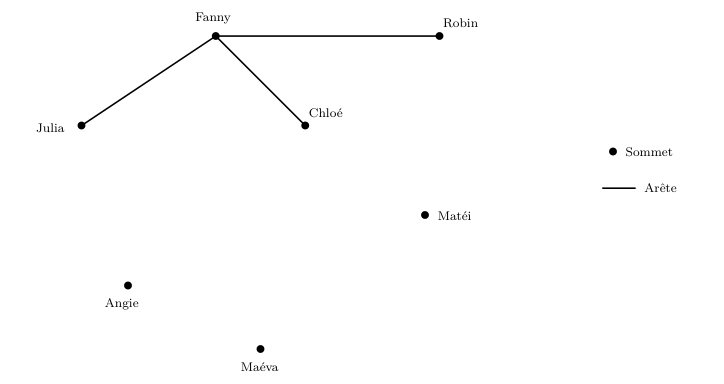
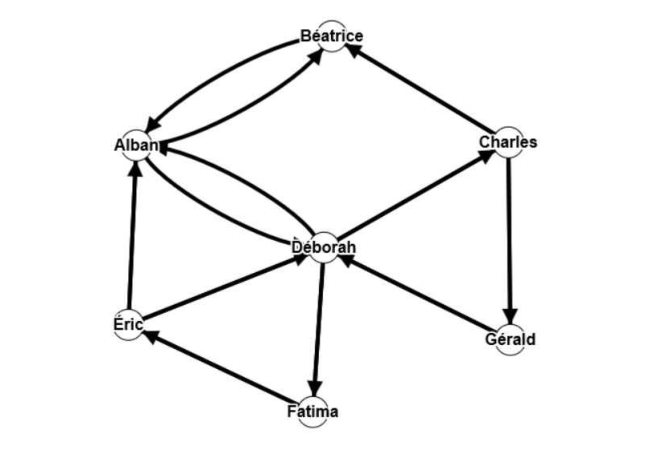

[pdf](./3_graphes.pdf)

## I. Réseau social de type Facebook

Fanny utilise avec ses amis un réseau social. Elle a fait la liste des liens d’amitié dans le tableau suivant. Une croix dans le tableau signifie que les deux personnes concernées partagent un lien d’amitié. L’objectif de cette activité est de modéliser ces liens d’amitié pour pouvoir ensuite les étudier.

|       | Fanny | Chloé | Robin | Maéva | Angie | Matéi | Julia |
| ----- | ----- | ----- | ----- | ----- | ----- | ----- | ----- |
| Fanny | ×     | ×     |       | ×     |       |       |       |
| Chloé | ×     | ×     | ×     | ×     | ×     |       | ×     |
| Robin |       | ×     | ×     |       |       | ×     | ×     |
| Maéva | ×     | ×     |       | ×     | ×     |       |       |
| Angie |       | ×     |       | ×     | ×     |       |       |
| Matéi |       |       | ×     |       |       | ×     |       |
| Julia |       | ×     | ×     |       |       |       | ×     |

### a) Notion de graphe

Pour étudier les liens d’amitié entre ces sept personnes, on va utiliser une représentation sous forme de graphe, appelé graphe non orienté.

1. Compléter le graphe où chaque arête signifie ".... et .... sont amis".

   Chaque personne est représentée par un sommet et chaque lien d’amitié est représenté par une arête.

### b) écartement d’un sommet

On considère que seulement deux personnes amies peuvent communiquer entre elles. Fanny peut parler avec ses amis qui sont Chloé, Robin et Julia.

- Pour communiquer avec Maéva, elle doit passer par exemple par Chloé, ce qui fait une distance de 2.
- Pour parler à Angie, elle doit également passer par Chloé, ce qui fait également une distance de 2.
- Pour parler à Matéi, elle doit passer par Robin, soit une distance de 2.

La distance maximale entre Fanny et les autres personnes du graphe est de 2, ainsi l’écartement du sommet Fanny est de 2.

2. Compléter le tableau ci-dessous :

   | Sommet     | Fanny | Chloé | Robin | Maéva | Angie | Matéi | Julia |
   | ---------- | ----- | ----- | ----- | ----- | ----- | ----- | ----- |
   | Écartement | 2     | ?     | ?     | ?     | ?     | ?     | ?     |

### c) centre d’un graphe

Dans un graphe donné, le centre est le sommet dont l’écartement est minimal. Un graphe peut avoir plusieurs centres. Les centres d’un graphe sont alors les éléments à partir desquels l’information se diffuse le plus vite.

3. Déterminer le centre de ce graphe.
4. Interpréter la réponse précédente dans le contexte de l’activité.

### d) rayon d’un graphe

Le rayon d’un graphe est l’écartement d’un centre du graphe.

5. Déterminer le rayon de ce graphe.
6. Interpréter la réponse dans le contexte.

### e) diamètre d’un graphe

Le diamètre d’un graphe est la plus longue distance entre deux sommets du graphe.

7. Déterminer le diamètre de ce graphe.
8. Interpréter la réponse dans le contexte.

### f) matrice d’adjacence

Une chaîne d’un graphe est une liste ordonnée de sommets du graphe, telle que chaque sommet de la liste soit adjacent à l’autre. Par exemple, Fanny-Robin-Matéi et Chloé-Julia-Angie sont des chaînes du graphe.

La longueur d’une chaîne est le nombre d’arêtes qui la composent. Ainsi, les chaînes citées précédemment sont de longueur 2.

La distance entre deux sommets d’un graphe est la plus petite longueur des chaines qui la relient. On a vu précédemment que cette longueur était de 1 ou 2.

La matrice d’adjacence associée à un graphe non orienté d’ordre n dont les sommets sont numérotées de 1 à n est la matrice carrée d’ordre n, où le terme figurant en ligne i et colonne j est égal au nombre d’arêtes reliant i et j.

9.  Compléter la matrice d’adjacence de ce graphe.
    _Fanny est le sommet 1, Chloé le sommet 2, Robin le sommet 3, ..._

    $$
    M=
    \begin{pmatrix}
    0       & 1 & 1         & 0         & 0      & 0      & 1\newline
    \cdots  & 0 & \cdots    & \cdots    & \cdots & \cdots & \cdots\newline
    \cdots  & 1 & 0         & \cdots    & \cdots & \cdots & \cdots\newline
    \cdots  & 1 & \cdots    & 0         & \cdots & \cdots & \cdots\newline
    \cdots  & 1 & \cdots    & \cdots    & 0      & \cdots & \cdots\newline
    \cdots  & 1 & \cdots    & \cdots    & \cdots & 0      & \cdots\newline
    \cdots  & 1 & \cdots    & \cdots    & \cdots & \cdots & 0\newline
    \end{pmatrix}
    $$

10. a. Déterminer le nombre de chaînes de longueur 2 reliant :

        Fanny et Maéva : ...... Chloé et Julia : ...... Robin et Maéva : ......

    b. Si $M$ est la matrice d’adjacence associée à un graphe non orienté et $p$ un entier naturel, le terme figurant en ligne $i$ et colonne $j$ de la matrice $M^p$ est égal au nombre de chaînes de longueur $p$ reliant $i$ et $j$.

    c. À l’aide de la calculatrice, calculer $M^2$.

    Pour entrer une matrice dans la barre d’affichage au bas de l’écran, utilisez les crochets chets $[$ et $]$, accessibles en appuyant sur `shift` puis `[`.

    $$
    M^2=
    \begin{pmatrix}
     3       & 2      & 1         & 2         & 2      & 2      & 1\newline
     \cdots  & \cdots & \cdots    & \cdots    & \cdots & \cdots & \cdots\newline
     \cdots  & \cdots & \cdots    & \cdots    & \cdots & \cdots & \cdots\newline
     \cdots  & \cdots & \cdots    & \cdots    & \cdots & \cdots & \cdots\newline
     \cdots  & \cdots & \cdots    & \cdots    & \cdots & \cdots & \cdots\newline
     \cdots  & \cdots & \cdots    & \cdots    & \cdots & \cdots & \cdots\newline
     \cdots  & \cdots & \cdots    & \cdots    & \cdots & \cdots & \cdots\newline
    \end{pmatrix}
    $$

11. À l’aide de la calculatrice, calculer $M^3$ et déterminer le nombre de chaînes de longueur 3 reliant Fanny à Chloé et en citer deux.

## II. Réseau social de type Twitter

La représentation est différente dans le cas d’un réseau comme celui créé par Twitter : Éric peut être un « follower » de Déborah sans que la réciproque soit nécessairement vraie. Dans ce cas, la relation est dite orientée. Elle est alors représentée par une flèche.

Dans cet exemple :

Alban suit Béatrice et Déborah, Béatrice suit Alban, Charles suit Béatrice et Gérald, Déborah suit Alban, Chloé et Fatima, Éric suit Alban et Déborah, Fatima suit Éric et Gérald suit Déborah.

12. Compléter le tableau ci-dessous.

    | Sommet     | Béatrice | Alban | Chloé | Déborah | Éric | Fatima | Gérald |
    | ---------- | -------- | ----- | ----- | ------- | ---- | ------ | ------ |
    | Écartement |          |       |       |         |      |        |        |

13. Déterminer le centre de ce graphe.
14. Déterminer le rayon de ce graphe.
15. Déterminer le diamètre de ce graphe.

## III. Pour aller plus loin

Réaliser les exercices [de ce site](https://www.infoforall.fr/act/snt/graphes-et-liaisons-sociales/).
