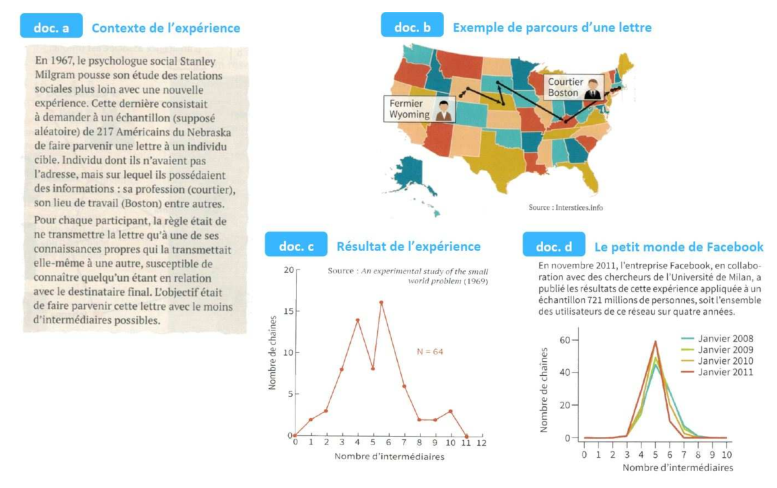
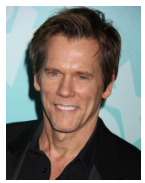
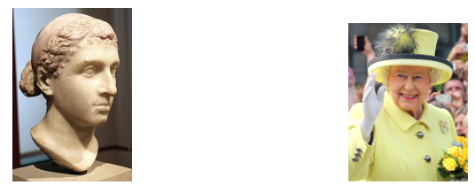
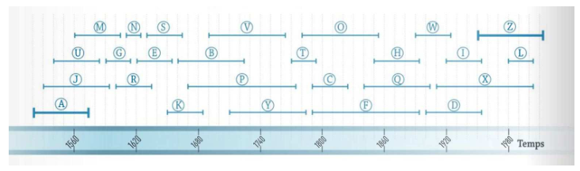

[pdf](./4_petit_monde.pdf)

### Situation déclenchante : [Les 4,74 degrés de séparation de Facebook](./4_74.pdf)

## I L’expérience du « petit monde » de Milgram

### 1. À l’aide des documents ci-dessus, répondre aux questions suivantes.

a. doc b Combien d’intermédiaires sont utilisés pour porter la lettre à son destinataire ?

b. doc a et doc c Combien de lettres sont arrivées à destination ? Quelle pourcentage cela représente-t-il ?

c. doc c Quelle est la moyenne du nombre d’intermédiaires utilisés pour transmettre la lettre ?

d. doc d Quelle est la moyenne du nombre d’intermédiaires utilisés pour transmettre une information ?

### 2. En utilisant les informations trouvées sur le net, répondre aux questions suivantes.

a. À quelle conclusion est parvenue Milgram avec cette expérience ?

b. Que penser de ce résultat ? Quelles critiques ont été faites ?

### 3. Quel impact ont les réseaux sociaux sur le « petit monde » ?

### 4. Quel risque peut être lié au « petit monde » ?

### 5. Déterminer un chemin de 6 intermédiaires (ou moins) permettant de vous lier à Barack Obama.

## II Le nombre de Bacon

Un jeu a été crée en 1994 par trois étudiants de l’Albright College. Ils se sont amusés à trouver des liens entre un acteur et Kevin Bacon : un acteur est en relation avec Kevin Bacon s’ils ont tourné un film ensemble. Ainsi, un acteur avec un nombre de Bacon de 3, est un acteur qui a joué avec un autre acteur qui a joué avec un autre acteur qui a joué avec Kevin Bacon.

### 1. Dans un tableur, on a construit un tableau à double entrée avec une liste d’acteurs et une liste de films. Chaque case a été cochée lorsque l’acteur de la colonne a joué dans le film de la ligne.

|                              | Anne Hathaway | Hugh Jackman | Johnny Depp | Kevin Bacon | Zoé Kravitz |
| ---------------------------- | ------------- | ------------ | ----------- | ----------- | ----------- |
| Alice au Pays des Merveilles | x             |              | x           |             |             |
| Les animaux fantastiques     |               |              | x           |             | x           |
| Les misérables               | x             | x            |             |             |             |
| X-Men : le commencement      |               | x            |             | x           | x           |

a. Dessiner le graphe des liens entre ces cinq acteurs.

b. Déterminer le nombre de Bacon de Anne Hathaway, Hugh Jackman, Johnny Depp et Zoë Kravitz.

### 2. Ce jeu est devenu un site (et même une application) : [The Oracle of Bacon](https://oracleofbacon.org/)

a. Déterminer le nombre de Bacon de quatre autres acteurs.

b. Calculer la moyenne des quatre nombres de Bacon obtenus.

c. Calculer la moyenne des nombres de Bacon obtenus par les élèves du groupe.

## III Les petits mondes temporels

Dans l’expérience des petits mondes, on suppose que les individus sont tous contemporains. Mais pour relier Cléopâtre à la reine Elizabeth II, il en faudrait sûrement plus, si on considère qu’il ne peut y avoir des liens d’amitiés qu’entre contemporains.

### 1. On suppose que la durée de vie maximale d’un être humain est de 100 ans. Sachant que Cléopâtre est décédée en l’an 30 avant JC et que Elizabeth II est née en 1926, combien faudrait-il au minimum de liens d’amitié pour relier Cléopâtre à Elizabeth II ?

### 2. Sur une frise chronologique, on représente un individu par un segment entre ses dates de naissance et de décès. On considère qu’il existe un lien entre deux personnes si elles ont vécu en même temps à un moment de leur vie.

Dans l’exemple ci-dessous, quel est le nombre minimum de liens pour relier la personne A à la personne Z ?

