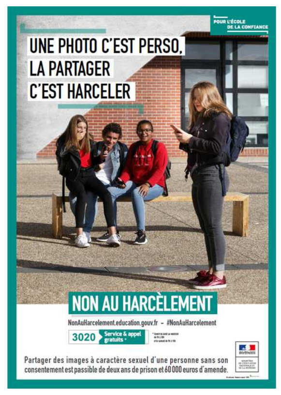
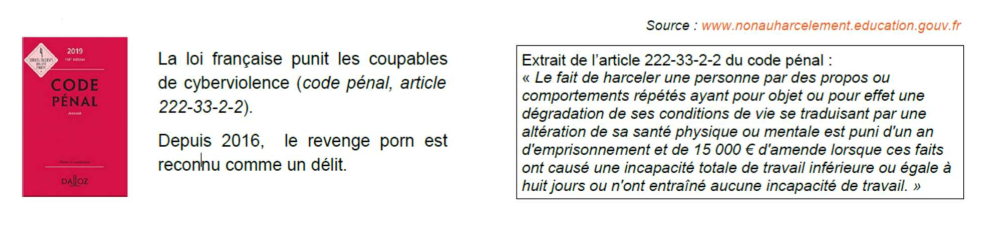
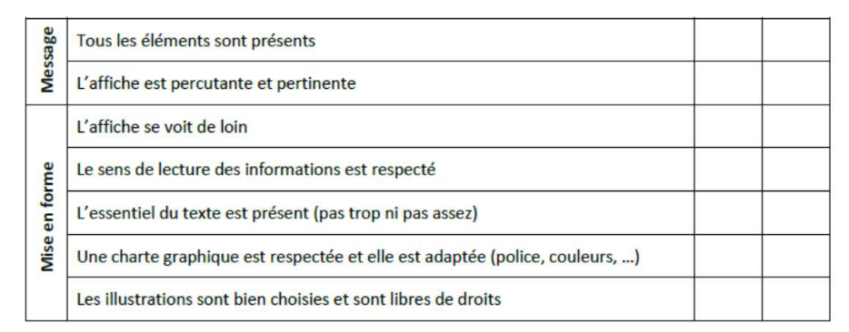

[pdf](5_cyberviolence.pdf)

### Documents de la séance 

1. [Ligue du LOL](article_ligueLOL.pdf)
1. [témoignage Caroline](témoignage_caroline.pdf)
1. [témoignage Netecoute](témoignage_netecoute.pdf)
1. [témoignage Elise.pdf](témoignage_elise.pdf)

## Cyberviolence

### Problématique : Qu'est-ce que la Cyberviolence ? Comment l'affronter ?

{width=500px}

Le cyber-harcèlement (ou la cyberviolence) est défini comme « un acte agressif, intentionnel, perpétré par un individu ou un groupe d’individus au moyen de formes de communication électroniques, de façon répétée à l’encontre d’une victime qui ne peut facilement se défendre seule ». Le cyber-harcèlement se pratique via les téléphones portables, messageries instantanées, forums, chats, jeux en ligne, courriers électroniques, réseaux sociaux, site de partage de photographies etc. Il peut prendre plusieurs formes telles que :

- Les intimidations, insultes, moqueries ou menaces en ligne
- La propagation de rumeurs
- Le piratage de comptes et l’usurpation d’identité digitale
- La création d’un sujet de discussion, d’un groupe ou d’une page sur un réseau social à l’encontre d’un camarade de classe
- La publication d’une photo ou d’une vidéo de la victime en mauvaise posture
- Le sexting (c’est la contraction de « sex » et « texting ». On peut le définir comme « Des images produites par les jeunes (17 ans et moins) qui représentent d’autres jeunes et qui pourraient être utilisées dans le cadre de la pornographie infantile »)

La cyberviolence et le cyber-harcèlement ont des conséquences graves sur le bien-être et la santé mentale des victimes mais aussi des agresseurs et des témoins. Alors, #NonAuHarcelement !

[https://www.nonauharcelement.education.gouv.fr](https://www.nonauharcelement.education.gouv.fr)

---

### I. Cas 1 : L’affaire de la Ligue du LOL, février 2019

**Présentation :**
L’affaire de la « ligue du LOL » désigne une affaire de cyber-harcèlement impliquant des jeunes journalistes et communicants (30 ans). Pendant près d’une dizaine d’années, certains membres du groupe privé Facebook, crée en 2009, « Ligue du LOL » ont harcelé d’autres journalistes, bloggeurs, principalement des femmes sur les réseaux sociaux. L’affaire a été rendue publique par le journal Libération le 8 février 2019.

**Consignes :**

- lire l’article paru dans Le Monde : "_L’affaire de la Ligue du LOL, 5 questions pour comprendre l’affaire et ses enjeux_" 
- lire les témoignages publiés sur le site de France Inter 
- répondre aux questions suivantes :

1. Relevez les faits qui qualifient le cyber-harcèlement :

2. Quels médias (réseaux sociaux, messageries) ont été utilisés ?

3. Qui sont les auteurs ?
    - Âge
    - Sexe
    - Profession

4. Qui sont les victimes ?
    - Âge
    - Sexe
    - Profession

5. Y a-t-il des témoins/spectateurs ?

6. Quand et comment le harcèlement a-t-il pris fin ?

7. Décrivez les conséquences :
    - Pour les auteurs
    - Pour les victimes
    - Pour les témoins/spectateurs

---

### II. J’ai été victime de cyber-harcèlement

[Voir l’article](https://www.netecoute.fr)

**Présentation :**
Pendant 8 mois une jeune fille de 12 ans a été harcelée sur les réseaux sociaux. Ce cyber-harcèlement n’est pas intervenu dans le cadre d’un harcèlement scolaire.

**Consignes :**
Après avoir lu le témoignage publié sur le site : [https://www.netecoute.fr,](https://www.netecoute.fr) le 22 octobre 2018, répondez aux questions suivantes :

1. Relevez les faits qui qualifient le cyber-harcèlement :

2. Quels médias (réseaux sociaux, messageries) ont été utilisés ?

3. Qui sont les auteurs ?
    - Âge
    - Sexe
    - Profession

4. Qui sont les victimes ?
    - Âge
    - Sexe
    - Profession

5. Y a-t-il des témoins/spectateurs ?

6. Quand et comment le harcèlement a-t-il pris fin ?

7. Décrivez les conséquences :
    - Pour les auteurs
    - Pour les victimes
    - Pour les témoins/spectateurs

---

### III. Elise a été victime de harcèlement scolaire

[Voir l’article](http://www.madmoizelle.com/premiere-classe-temoignage-972074)

**Présentation :**
Pendant son année de terminale L elle a été harcelée du mois d’octobre jusqu’à la fin des cours. Le harcèlement a eu lieu dans son établissement et se prolongé sur le net.

**Consignes :**
Après avoir lu le témoignage d’Elise publié sur le site : [www.mademoiselle](http://www.madmoizelle.com) le 9 novembre 2017, répondez aux questions suivantes :

1. Relevez les faits qui qualifient le cyber-harcèlement :

2. Quels médias (réseaux sociaux, messageries) ont été utilisés ?

3. Qui sont les auteurs ?
    - Âge
    - Sexe
    - Profession

4. Qui sont les victimes ?
    - Âge
    - Sexe
    - Profession

5. Y a-t-il des témoins/spectateurs ?

6. Quand et comment le harcèlement a-t-il pris fin ?

7. Décrivez les conséquences :
    - Pour les auteurs
    - Pour les victimes
    - Pour les témoins/spectateurs

---

### IV. Caroline a été victime de rumeurs qui se sont propagées sur Facebook

[Voir l’article](https://www.20minutes.fr/high-tech/2319871-20181001-cyber-harcelee-contacts-facebook-publiaient-photos-poitrine-disant)

**Présentation :**
En 2015, quelques semaines avant de passer le brevet, Caroline a été victime de rumeurs relayées sur Facebook.

**Consignes :** 
Après avoir lu le témoignage de Caroline publié sur le site : [https://www.20minutes.fr](https://www.20minutes.fr) le 1er octobre 2018 répondez aux questions suivantes.

1. Relevez les faits qui qualifient le cyber-harcèlement :

2. Quels médias (réseaux sociaux, messageries) ont été utilisés ?

3. Qui sont les auteurs ?
    - Âge
    - Sexe
    - Profession

4. Qui sont les victimes ?
    - Âge
    - Sexe
    - Profession

5. Y a-t-il des témoins/spectateurs ?

6. Quand et comment le harcèlement a-t-il pris fin ?

7. Décrivez les conséquences :
    - Pour les auteurs
    - Pour les victimes
    - Pour les témoins/spectateurs

---

### TRAVAIL À FAIRE À LA MAISON

1. Relire et Analyser l’article 222-33-2-2 du Code Pénal ci-contre.

2. Rechercher les définitions des formes de cyberviolences suivantes :
    - Exclusion
    - Flaming
    - Dénigrement
    - Usurpation d’identité
    - Outing
    - Happy Slapping
    - Sexting

3. Réaliser une affiche qui traite d’un type de cyberviolence (Vous pouvez par exemple utiliser l’application en ligne Canva). Celle-ci devra contenir :
    - Un titre en rapport avec la forme de cyberviolence
    - L’explication de ce type de violence
    - Un rappel de l’article de loi 222-33-2-2
    - Un message percutant compréhensible par tous
    - Des solutions pour lutter contre ce type de conduite et les bonnes conduites à avoir

[https://www.canva.com/](https://www.canva.com/)

**Mon affiche sera réussie si :**

