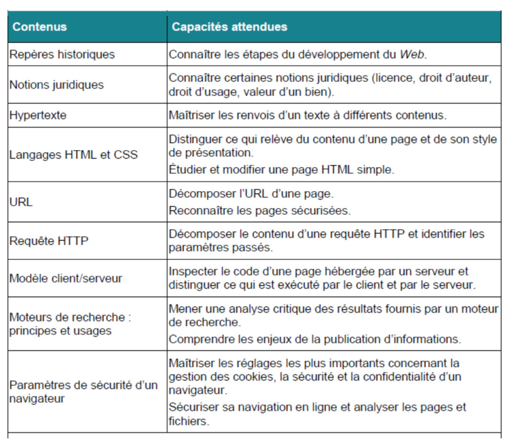
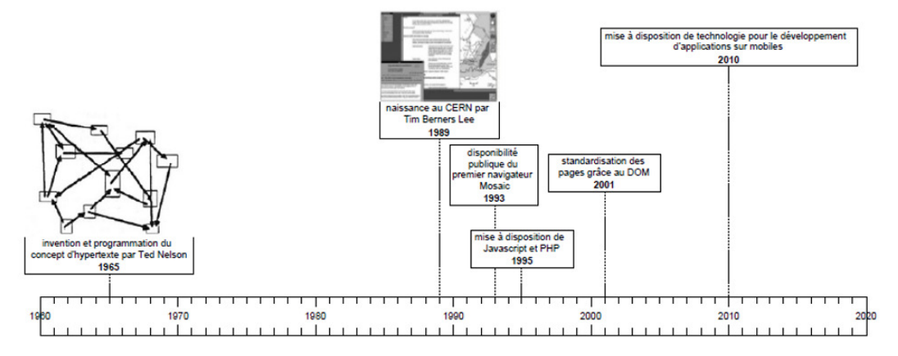

[pdf](./presentation-slides.pdf)

# Le web

## Plan

- Introduction
- Contenus et capacités attendues
- Repères historiques
- Les cinq séances

## Introduction

### Le Web, c’est quoi?

- Une courte **[vidéo](./webcquoi.mp4)** de l’Inria
- Le Web n'est **qu'une partie** d'internet
- Le World Wide Web, est construit sur le réseau internet pour mettre à disposition des documents.
- Son fonctionnement nécessite des normes de formats de fichiers et des protocoles entre serveurs et clients.
- Son développement conjoint à celui d'internet a révolutionné l’information et la communication.

## Contenus et capacités attendues

# Repères historiques

## Six dates à connaître

- 1965 : invention et programmation du concept d’hypertexte par Ted Nelson
- 1989 : naissance au CERN par Tim Berners-Lee
- 1993 : mise dans le domaine public, disponibilité du premier navigateur Mosaic
- 1995 : mise à disposition de technologies pour le développement de site Web interactif (langage JavaScript) et dynamique (langage PHP)
- 2001 : standardisation des pages grâce au DOM (Document Object Model)
- 2010 : mise à disposition de technologies pour le développement d’applications sur mobiles

## 1965 : invention et programmation du concept d’hypertexte par Ted Nelson

Le sociologue américain Ted Nelson propose la notion d’hypertexte (= texte + liens + mise en forme) pour mettre à disposition des données au niveau mondial.

## 1989 : naissance au CERN par Tim Berners-Lee

Invention du World Wide Web par Tim Berners-Lee au Centre européen de recherche nucléaire.

Le web est un système hypertexte qui permet de naviguer de document en document grâce à des hyperliens. Berners-Lee définit le protocole **HTTP**, le langage **HTML**, ainsi que les adresses **URL** et il crée le premier **navigateur** Web.

## 1993 : domaine public, disponibilité du premier navigateur Mosaic

Création du navigateur Mosaic, qui va populariser le Web car il est disponible sur les machines Windows, Linux et Mac OS.

Avec ce navigateur, le nombre d’utilisateurs du Web augmente rapidement, ainsi que le nombre de sites.

## 1995 : technologies pour le développement de site Web interactif

- Création du langage de programmation JavaScript (client), qui permet de rendre les pages Web interactives.
- La même année, création du langage PHP (Hypertext Preprocessor) (serveur), avec lequel on peut créer des sites Web dynamiques, par exemple pour le commerce en ligne.

C’est l’avènement du Web des données.

## 2001 : standardisation des pages grâce au DOM

- Standardisation du DOM (Document Object Model) qui est la représentation d’une page Web par un arbre.

- Grâce au DOM, le contenu d’une page Web peut-être modifié par du code JavaScript inclus dans la page.

C’est l’apparition du Web des applications.

## 2010 : mise à disposition de technologies pour le développement d’applications sur mobiles

Émergence de technologies adaptées qui donnent naissance au Web mobile. Le web mobile se décompose en deux usages au travers de différentes interfaces :

- Les applications mobiles, à télécharger sur des plateformes dédiées, comme l'App Store ou Play Store
- Les sites Internet **responsive** qui s'adaptent aux écrans des mobiles et les **Web apps** (sites dont le fonctionnement est identique à une application, mais sans téléchargement).

Une nouvelle interface fait son apparition, les **Progressive Web Apps (PWA)**. Ce sont des sites web développés spécifiquement pour les mobiles. Utilisables en mode hors-ligne, les contenus sont mis à jour en arrière-plan et disposent de systèmes de notifications.

## Frise chronologique

## Les cinq séances

- Créer des pages Web
- Les Protocoles du Web
- Les moteurs de recherche
- Confidentialité du Web et droit d’auteur
- Tâche finale (Création d’un site web)

## Séance 1 : Créer des pages Web

- Introduction à HTML et au CSS
- Découvrir HTML
- Du style avec CSS
- Création de votre page Web

## Séance 1 : Ce qu’il faut retenir

Le Web désigne un système donnant accès à un ensemble de données (page, image, son, vidéo) reliées par des liens hypertextes et accessibles sur le réseau internet.

Les pages Web sont écrites en HTML (Hypertext Markup Language), leur style en CSS (Cascading Style Sheets) et leurs fonctions en JavaScript.

Le W3C (World Wide Web Consortium), est un organisme international qui développe des standards pour le Web. Les spécifications déjà élaborées, il y en a une cinquantaine (HTML, XML, CSS, SVG ...), sont accessibles au public sur le site de W3C.

## Séance 2 : Les Protocoles du Web

- HTTP : qu'est-ce ?
- URL
- Communication entre serveur et client

## Séance 2 : Ce qu’il faut retenir

Les pages ont une **adresse unique, nommée URL** (Uniform Resource Locator).

Elles sont accessibles via internet en utilisant le **protocole HTTP** (Hypertext Transfer Protocol) ou sa version **sécurisée HTTPS** qui chiffre les échanges.

L’**affichage** des pages est réalisé chez l’utilisateur par un programme appelé **navigateur**.

Le Web s’appuie sur le **dialogue entre clients et serveurs**. L’interaction est à **l’initiative des clients** (les applications qui se connectent au Web, dont les navigateurs), qui envoient des **requêtes HTTP** aux serveurs. **Ces derniers renvoient leur résultat** : des pages qu’ils ont stockées ou qu’ils créent dynamiquement en fonction de la requête formulée.

## Séance 3 : Les moteurs de recherche

- Des moteurs de recherche
- Fonctionnement d’un moteur de recherche
- Calcul de la popularité d’une page

## Séance 3 : Ce qu’il faut retenir

Les **moteurs de recherche** permettent de trouver des informations dans des pages dont on ne connaît pas l’adresse, voire dont on ignore l’existence.

L’**ordre** de ces pages dépend de plusieurs facteurs dont les utilisateurs n’ont pas toujours connaissance mais **les concepteurs de sites Web peuvent améliorer le référencement de leurs pages** en choisissant bien les mots et en les plaçant à des endroits stratégiques dans les pages.

## Séance 4 : Confidentialité du Web et droit d’auteur

- La confidentialité du web
- Le web et le droit d’auteur

## Séance 4 : Ce qu’il faut retenir

La licence est un contrat qui régit les conditions d’utilisation et de distribution d’une œuvre, notamment d’un logiciel. L’acquisition de logiciels n’entraîne que le droit d’utilisation.

- Les licences libres : Libre ne signifie pas gratuit.
- Les licences propriétaires.

Il y a toujours trois termes dans ces contrats :

- Peut-on la copier ?
- Peut-on l'éditer ?
- Peut-on l'exploiter (financièrement, pédagogiquement, ...) ?

## Séance 4 : Ce qu’il faut retenir (suite)

Le **droit d’auteur** est l’ensemble des **règles qui protègent les œuvres de l’esprit**.

Il faut réunir **deux conditions** pour qu’une œuvre soit protégée ; elle doit d’une part se **concrétiser dans une forme** (les idées ne sont pas protégées), d’autre part elle doit être **originale**.

L’auteur peut ainsi être **rémunéré** pour son œuvre sur une **durée de 70 ans** et la paternité de l’intégralité de l’œuvre est reconnue de façon perpétuelle. Ensuite elle entre dans le **domaine public**.

## Séance 5 : Tâche finale

- Création d’un site web
