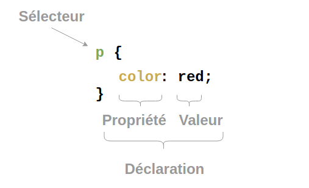

[pdf](./1_code_page.pdf)

## 1. Introduction au HTML et CSS

Pour consulter une page web, on lance un programme appelé navigateur web.


Le rôle de ce navigateur est d’interpréter le code dans lequel la page est écrite et de la présenter à l'utilisateur.

Plusieurs langages ont été standardisés par le W3C pour décrire le contenu des pages (HTML) et leur forme (CSS).

- Le langage HTML, Hypertext Markup Language (langage de balisage pour hypertexte) :
  Il s’agit du langage qui permet d’afficher les informations sur une page web, il décrit la structure du document.

- Le langage CSS, Cascading Stylesheet (feuilles de style en cascade) :
  Il s’agit du langage qui permet de définir la présentation du document : l’apparence du texte (comme la police, la couleur, la taille, etc ...) ainsi que l’agencement de la page (comme les marges, l’arrière-plan, etc ... )

En résumé, HTML a été conçu pour définir la structure d’un document, pas sa mise en forme. Par conséquent, tout ce qui est lié à la mise en forme d’un document devra être défini à l’aide du CSS que nous aborderons dans un deuxième temps.

### Deux langages pour une page web, quel intérêt ?

- Séparer le contenu de la forme est un des concepts clé de l’informatique.
- Dans le cas d’un site web, on peut uniformiser la présentation en définissant un type de présentation une seule fois que l’on réutilise dans toutes les pages. Cela permet donc aussi un gain de temps.
- Changer le style du site tout entier en modifiant seulement la feuille de style.
- Le code HTML est considérablement réduit en taille et en complexité.
- Faciliter la lecture de la page par les robots des moteurs de recherche qui ignorent la présentation.

### Structurer sa page

Les balises pour organiser la page :

- un en-tête de page : `<header>`,
- une barre de navigation : `<nav>`,
- une colonne de gauche : `<aside>`.
- une zone principale pour le contenu : `<article>`,
- un pied de page : `<footer>`

## 2. Découvrir le HTML

**ATTENTION: ce mini tutoriel est à rendre, faites le soigneusement**

### 2.1 Structure générale

L’acteur fondamental du développement web est le couple HTML (Hyper Text Markup Langage) et CSS (Cascading Style Sheets). **HTML n’est pas un langage de programmation** (comme le JavaScript par exemple), c’est un **langage de description**. Une page HTML pourrait être écrite dans un éditeur de texte basique comme le bloc note. C'est un mauvaise idée et nous allons employer un outil adapté.

1. Ouvrir **Sublime Text**,
2. enregistrer un nouveau fichier source `index.html`
3. glisser le fichier source dans le navigateur.
4. Rafraîchir le navigateur (F5) après chaque enregistrement du fichier source.

Utiliser le [memento html](./memento_xhtml.pdf) pour de l’aide.

On remarque des mots clés encadrés par les caractères `<` et `>`, comme par exemple `<html>`, `<body>`. Il s’agit de balises (le fameux markup langage) qui permettent de donner au navigateur des indications sur l'organisation des données associées.

La majorité des balises vont par paires : une balise ouvrante `<html>` et une balise fermante `</html>`. Les balises fermantes s’écrivent avec un slash (/). Le texte écrit entre la balise ouvrante et la balise fermante est le contenu de la balise.

L'ordre des balises est similaire à celui des parenthèses en mathématiques :

- $[(x+1)(x-3) + x^2]$ est correct comme `<html><body>texte</body></html>` ;
- [(x-2]) est incorrect, comme `<html><body>texte</html></body>`.

Tout document HTML doit se conformer à la structure suivante :

```html
<!doctype html>
<html>
  <head>
    <title>Ceci est le titre de l'onglet du navigateur</title>
  </head>
  <body>
    <!-- Ici le contenu de la page - remarque : ceci est un commentaire -->
  </body>
</html>
```

- `<!doctype html>` : La toute première ligne s’appelle le doctype. Elle est indispensable car c’est elle qui indique au navigateur qu’il s’agit bien d’une page web HTML.
- `<html>` `</html>` : C’est la balise principale. Elle englobe tout le code de la page.
- `<head>` `</head>` : Entre ces balises se trouvent des informations supplémentaires qui n’apparaissent pas directement sur la page, comme par exemple les styles utilisés sur la page, le titre de l'onglet donné à la page ou l’encodage (pour la gestion des caractères spéciaux).
- `<body>` `</body>` : Entre ces balises se trouvent la partie principale de la page. Tout ce que nous écrirons ici apparaîtra sur la page.
- `<title>` `</title>` : Cette balise, inscrite dans la partie head, correspond en fait au texte qui sera affiché comme titre de l’onglet. Le contenu de cette balise ne correspond pas à un titre qui apparaît directement sur la page.

### 2.2 Quelques balises : les incontournables

Il est possible d’ajouter des éléments à une balise ouvrante, on parle d’attributs. Il existe beaucoup d’attributs différents, nous allons nous contenter de 2 exemples avec l’attribut `id` (id pour identifiant) et `class`. L’intérêt de ces attributs sera précisé par la suite... Saisir le code HTML suivant à la suite dans la balise `<body>` :

```html
<h1>Bienvenue sur mon site</h1>
<p>J’apprends à <strong>coder</strong> une page web !</p>
<h2 class="titre_1">Ceci est un sous-titre</h2>
<p id="para_1">Ceci est un paragraphe. Avez-vous bien compris ?</p>
<p>Bien sûr !</p>
```

- Rafraîchir le navigateur pour voir le résultat.

1. Repérer les titres dans le document : quelles balises sont utilisées pour déclarer un titre ?

2. A quoi sert la balise `<p>` `</p>` ?

3. A quoi sert la balise `<strong>` `</strong>` ?

_Modifier le style à l'aide de balise HTML n'est pas vraiment une bonne pratique, on utilisera plutôt CSS_.

### 2.3 Insertion d’images et de liens hypertexte

- Insertion d’une image :
  Télécharger l’image [icon-HTML-CSS.png](./icon-HTML-CSS.png) et l’insérer dans la page sous le sous-titre en 300x200 pixels. Trouver dans le mémento la balise et les attributs nécessaires à l’insertion de cette image.

- Insertion d’une liste :
  À la suite du texte et à l’aide du mémento, insérer une liste numérotée comportant quatre éléments.

  1. Une balise ouvrante
  2. Un ou deux attributs
  3. Du contenu
  4. Une balise fermante

- Modifier la balise `<ol>` en `<ul>`. Que se passe-t-il ?

- Insertion d’une vidéo :
  À la suite du texte, créer un nouveau sous-titre. Aller sur la vidéo youtube [en lien vidéo](https://www.youtube.com/watch?v=Q__MVPY2Prw) et copier le code d’intégration.

- Insertion d’un lien hypertexte vers une autre page du site :
  Insérer une nouvelle page WEB

- Renommer la page « page1.html »

- Saisir le contenu :

```html
<body>
  <h1>Titre de la page 1</h1>
  <p>Un peu de blabla pour voir ce qui s’affiche !</p>
</body>
```

- Trouver dans le memento la balise et les attributs nécessaires pour mettre un lien depuis la page index.html vers la page1.html. Ajouter un lien dans page1.html pour revenir à index.html

- Insertion d’un lien hypertexte vers une page web externe :
  Ajouter à la page index.html un lien sur une page web en ligne, en indiquant son chemin. Par exemple, pour un lien vers le site du lycée des flandres. On peut aussi faire un lien en cliquant sur une image en combinant les balises `<a>` et ``. Créer un lien sur l’image de l’index vers la page web : https://www.pierre-giraud.com/ Comment faire pour que le lien s’ouvre dans un nouvel onglet du navigateur ?

- Lien vers une partie de la page :

On pose un repère avec l’attribut id déjà rencontré.
Exemple : `<h2 id="chap5">Chapitre 5</h2>`

- Faire un lien pour s’y rendre avec : `<a href="#chap5">Cliquez ici pour le chapitre 5</a>`
- Créer un sommaire sous le titre h1 afin d’accéder aux 2 sous-titres h2.

### 2.4 Autres balises

Les balises `<div>` et `<span>` : Ces 2 balises sont très utilisées car elles servent à organiser la page, à regrouper plusieurs balises dans une même entité. La balise `<div>` est une balise de type « block » alors que `<span>` est une balise de type « inline ».

Les contenus des balises de type « block » se placent les uns en dessous des autres alors que les contenus des balises de type « inline » se placent les uns à côté des autres. Créer une `page2.html` avec le contenu suivant, sans oublier les balises indispensables (html, head, body etc.) :

```html
<h1>Titre de la page 2</h1>
<div>div est une balise de type "block"</div>
<p>la balise p est une autre balise de type block</p>
<span>En revanche, span est une balise de type "inline"</span>
<a href="page1.html">Et voici une autre balise de type "inline"</a>
<h1>h1 est bien une balise de type "block"</h1>
<span>la malheureuse balise span est obligée de se placer en dessous</span>
```

- Tester ce code.

## 3. Du style avec CSS

- Consulter le site [zengarden](http://www.csszengarden.com/tr/fr/)

- Changer le fichier CSS qui gère le style de la page en choisissant le style : **Orchid Beauty**. Le contenu a-t-il changé ? Le style ?

- Choisir ensuite le style **Apothecary**. Remarques ?

### 3.1 Règles CSS



Dans l'illustration, la règle `color: red;` s'applique aux balises `p`. Chaque règle doit être terminée par un point virgule.
Plusieurs règles peuvent être appliquées à un même sélecteur.

Les **selecteurs** peuvent être :

- des noms de balise : `p`, `a`, `div` etc. ;
- des identifiant : `#mon_id` ;
- des éléments de classe : `.ma_classe` ;
- une description d'un élément du DOM (hors programme).

Les _identifiants_ sont _uniques_ tandis que les _classes_ peuvent s'appliquer à _plusieurs balises_, parfois différentes.

### 3.2 Style du corps de texte

- Ouvrir ou créer un fichier `style.css` et copier le code suivant :

```css
body {
  background-color: white;
  color: #444;
  font-family: "Open Sans", sans-serif;
  padding: 4px 25px 5px 25px;
  font-size: 18px;
  margin: 0;
}
```

- Modifier la balise `head` du fichier .html afin de prendre en compte les règles du fichier `style.css`.

- Décrire les différentes parties de ce code à partir du mémento CSS :

| Règle                                   | Description                                           |
| --------------------------------------- | ----------------------------------------------------- |
| `background-color: white;`              | Donne une couleur blanche au fond du corps de la page |
| `color: #444;`                          |                                                       |
| `font-family: "Open Sans", sans-serif;` |                                                       |
| `padding: 4px 25px 5px 25px;`           |                                                       |
| `font-size: 18px;`                      |                                                       |
| `margin: 0;`                            |                                                       |

### 3.3 Style des titres

```css
h1 {
  text-align: center;
  background-color: #c12808;
}
h2 {
  font-family: Verdana;
  font-style: italic;
  color: blue;
}
```

- Remplir le même tableau pour les règles ci-dessus.

### 3.4 Style des paragraphes

- Compléter le code CSS avec les éléments suivants :

```css
#para_1 {
  font-style: italic;
  color: green;
}
```

- À quel élément s'applique cette règle ?

- Rendre tous les textes des paragraphes orange et en italique.

- Chercher comment rendre le texte **en gras** (font-weight) et passer un paragraphe en gras.

### Fin du mini tutoriel. Ajouter vos fichiers au travail à rendre

---

## 4. Création de votre page Web

Créer une page Web sur le thème que vous voulez. Si vous manquez d'inspiration j'impose le thème, attention :)

### Contraintes à respecter :

- Le texte doit être organisé : un titre principal, des sous-titres, des paragraphes, ...
- La page Web doit contenir au moins un mot en gras, un mot en italique et une liste.
- La page Web doit contenir au moins une image.
- La page Web doit contenir au moins un lien hypertexte.
- Inclure du style dans votre page Web.
