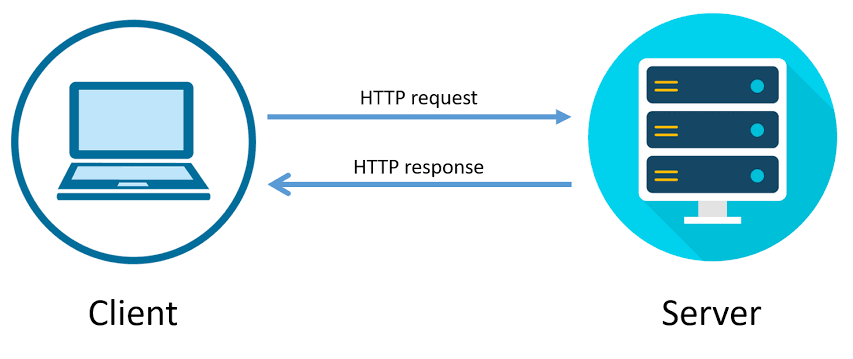

[pdf](./protocoles.pdf)

Nous avons vu, lors de la séance 1, que plusieurs langages étaient standardisés par le W3C[^1] pour décrire le contenu des pages (HTML) et leur forme (CSS).

Le W3C a aussi standardisé les règles de communication permettant aux ordinateurs connectés de pouvoir communiquer ensemble.

Pour pouvoir « naviguer » sur le web, il faut disposer sur sa machine d’un programme spécifique, le navigateur ou client web, capable de communiquer avec les serveurs du web.

## I. HTTP, c’est quoi ?

HTTP, c’est l’abréviation de HyperText Transfer Protocol.

C’est-à-dire :

- Protocole : c’est une règle
- Transfert : pour échanger
- HyperTexte : c’est du texte qui contient des liens vers d’autres ressources (documents, images, etc)



HTTP est donc le protocole qui permet à une machine de demander et recevoir une ressource d’un serveur.

Ce protocole précise quel message le navigateur doit envoyer par le réseau internet pour demander une page, et dans quel format il attend une réponse. Le message obtenu en retour peut préciser le format de la réponse, sa taille ainsi que diverses informations sur le serveur et la date de dernière modifications de la page.

Pour que la communication sur le web fonctionne, il faut que la manière d’écrire les adresses des pages soit standardisée.

Une règle importante d'HTTP est qu'**une requête provoque une unique réponse**. Chaque ressource doit faire l'objet d'une requête.

Lorsqu'on demande au navigateur d'accéder à une page HTML qui contient 3 images, il doit effectuer 4 requêtes pour afficher le contenu. Ceci est fait automatiquement par le navigateur.

[^1]: World Wide Web Consortium

## II. URL

URL veut dire Uniform Resource Locator, soit « localisateur uniforme de ressource ». C’est un système normé (possédant des règles) permettant d’effectuer une demande sans créer d’ambiguïté sur la demande elle-même.

1. Ouvrir un navigateur et copier cela[^2] dans la barre d’adresse du navigateur :

   **[http://info.cern.ch/hypertext/WWW/TheProject.html](http://info.cern.ch/hypertext/WWW/TheProject.html)**

2. Une URL doit comporter :

   - le schéma[^3] définissant le protocole à utiliser pour accéder à la ressource ;
   - le nom du domaine qui héberge la ressource ;
   - le chemin vers la ressource ;
   - et éventuellement des paramètres optionnels.

   1. Recopier le schéma de cette URL : `http://info.cern.ch/hypertext/WWW/TheProject.html`

   2. Recopier le nom du domaine : `http://info.cern.ch/hypertext/WWW/TheProject.html`

   3. Recopier le chemin vers la ressource : `http://info.cern.ch/hypertext/WWW/TheProject.html`

   4. Recopier et compléter le texte ci-dessous :

   `http://info.cern.ch/hypertext/WWW/TheProject.html` signifie donc dire d’aller :

   - sur le serveur http gérant...
   - d’aller dans le répertoire... qui se trouve à la racine du site,
   - puis dans le répertoire... qui se trouve dans le répertoire...,
   - puis de demander le document... qui devrait y être stocké.

3. Saisir dans la barre d’adresse du navigateur l’URL suivante et observer la page affichée.

   **[http://www1.ac-lille.fr/cid127639/l-inscription-college.html#Cas_du_redoublement](http://www1.ac-lille.fr/cid127639/l-inscription-college.html#Cas_du_redoublement)**

4. Décomposer alors cette URL.

5. Les navigateurs Web sont créés avec une volonté de robustesse : ils sont capables de compléter des URL incomplets.

   a. Saisir `info.cern.ch/hypertext/WWW/TheProject.html`

   b. Saisir `info.cern.ch/hypertext/WWW`

   c. Saisir `info.cern.ch`

[^2]: Il s’agit de la première page web mise en ligne le 13 novembre 1990.

[^3]: Il en existe plus de 250 comme par exemple `skype:`, `mailto:`, `ftp:`, `smtp:`

6. Quelle différence, hormis la page qui s’affiche, entre les URL : <http://www1.ac-lille.fr/> et <https://www.education.gouv.fr/> ?

7. Quelle hypothèse peut-on faire sur l’utilité de la partie recherche `?q=URL` dans l’URL <https://education.francetv.fr/recherche?q=URL> ?

Reste une question : _comment parvient-on à trouver le bon serveur dans l’immensité d’Internet ?_

## III Communication entre serveur et client

### a) serveur, client

Deux ordinateurs en réseau peuvent s’échanger des données.

Dans la plupart des cas ces échanges ne sont pas « symétriques » : en effet un ordinateur A va souvent se contenter de demander des ressources (fichiers contenant du texte, photos, vidéos, ...) à un ordinateur B. L’ordinateur B va lui se contenter de fournir des ressources à tous les ordinateurs qui lui en feront la demande. On dira alors que l’ordinateur A (celui qui demande des ressources) est un **client** alors que l’ordinateur B (celui qui fournit les ressources) sera qualifié de **serveur.**

Le principe du serveur informatique est similaire au serveur d'un restaurant. Sans client à servir, il continuer d'effectuer des tâches courantes jusqu'à ce qu'un client lui adresse une requête : "Pourrais-je avoir un café s'il-vous-plaît ?". Lorsqu'une requête arrive au serveur, il l'effectue et attend la suivante.

N’importe quel type d’ordinateur peut jouer le rôle de serveur, mais dans le monde professionnel les serveurs sont des machines spécialisées conçues pour fonctionner 24h sur 24h. Ils peuvent aussi avoir une grosse capacité de stockage afin de stocker un grand nombre de ressources (vidéos, sons,...).

Afin assurer une continuité de service, dans les sociétés, plusieurs serveurs assurent exactement le même rôle. Google, Amazon ou encore Facebook possèdent un très grand nombre de serveurs afin de pouvoir satisfaire les demandes[^4] des utilisateurs en permanence. Ces entreprises possèdent d’immenses salles contenant chacune des centaines ou des milliers de serveurs : des datacenters.

[^4]: En moyenne, chaque seconde, c’est environ 65 000 clients qui se connectent aux serveurs du moteur de recherche de Google.

8. Rechercher sur Internet une estimation du nombre de serveurs de Google et de Facebook.

Il y a quelques années, le web était dit « statique » : le concepteur de site web écrivait son code HTML et ce code était simplement envoyé par le serveur au client. Les personnes qui consultaient le site avaient toutes le droit à la même page. Le site que vous utilisez est _statique_ : impossible de s'authentifier ou d'y enregistrer quoi que ce soit.

Les choses ont ensuite évolué : les serveurs sont aujourd’hui capables de générer eux-mêmes du code HTML. Les résultats qui s’afficheront à l’écran dépendront donc des demandes effectuées par l’utilisateur du site : le web est devenu dynamique. Différents langages de programmation peuvent être utilisés « côté serveur » afin de permettre au serveur de générer lui-même le code HTML à envoyer. Il existe plusieurs langages pour créer ces pages. Les plus utilisés sont Java, PHP, JavaScript et Python.

### b) requête HTTP

En tapant <http://www.google.fr>, votre machine va chercher à entrer en communication avec le serveur portant le nom www.google.fr. Une fois la liaison établie, le client et le serveur vont échanger des informations en dialoguant :

- Client : Bonjour www.google.fr, pourrais-tu m’envoyer le fichier index.html ?
- Serveur : OK client, voici le fichier index.html.
- Client : je constate que des images, du code css sont utilisés, peux-tu m'envoyer la première image ?
- Serveur : OK, la voici.

etc.

Évidemment ce dialogue est très imagé, mais il porte tout de même une part de vérité.

Le protocole HTTP va permettre au client d’effectuer des requêtes à destination d’un serveur. En retour, le serveur va envoyer une réponse.

Voici une version simplifiée de la composition d’une requête HTTP (client vers serveur).

- La méthode employée pour effectuer la requête. Voici deux méthodes disponibles :
  - GET, c’est la méthode la plus courante pour demander une ressource, elle est sans effet sur la ressource. ;
  - POST, cette méthode est utilisée pour soumettre des données en vue d’un traitement (côté serveur), c’est la méthode employée lorsque l’on envoie au serveur les données issues d’un formulaire.
- l’URL de la ressource,
- la version du protocole utilisé par le client,
- le type du document demandé,
- le navigateur employé et sa version,
- ...

9. Décrypter les paramètres de la requête présentée ci-dessous.

   ```sh
   GET http://www.monsite.com HTTP/2.0
   Accept: text/html
   User-Agent: Mozilla Firefox/65.0 (compatible; windows 10)
   ```

   a. méthode employé :

   b. URL de la ressource :

   c. version du protocole utilisé par le client :

   d. type de document demandé :

   e. navigateur employé et sa version :

Une fois la requête reçue, le serveur va renvoyer une réponse.

10. Décrypter les paramètres de la réponse présentée ci-dessous.

    ```sh
    HTTP/2.0 200 OK
    Date : Sat, 15 Jan 2024 14:27:12 GMT Server: Microsoft-IIS/10.0.17763.1
    Content-Type: text/HTML
    Content-Length : 1245
    ```

    a. version du protocole :

    b. code de statut :

    c. date de transfert des données

    d. Caractéristique du serveur

    e. type de contenu du corps de la réponse

    f. longueur du corps de la réponse

### c) visualisation d’une requête HTTP avec Mozilla Firefox

12. Ouvrir le navigateur Mozilla Firefox et si ce n’est pas la page par défaut, saisir l’URL https://www.google.fr/.
13. En haut à droite de la fenêtre, ouvrir la fenêtre de Développement web avec la touche F12 et enfin appuyer sur Réseau.
14. Recharger la page puis remonter à la première des lignes qui viennent d’être générées.
15. Cliquer sur la ligne permet d’obtenir sur la droite, la réponse reçue pour cette requête.
    a. Cliquer sur l’onglet En-têtes
    b. Décrypter les paramètres de la requête.

    - méthode employé :
    - URL de la ressource :
    - version du protocole utilisé par le client
    - type de document demandé
    - navigateur employé et sa version

    c. Décrypter les paramètres de la réponse.

    - version du protocole
    - date de transfert des données
    - Caractéristique du serveur
    - type de contenu du corps de la réponse
    - longueur du corps de la réponse

16. Cliquer sur l’onglet Réponse. Que remarque-t-on ?
17. Trouver la ligne de la requête qui a permis de recevoir le gros logo Google central de la
    page Web. Donner l’URL du fichier image.
18. a. En gardant la fenêtre Développement web ouverte, aller sur le site de l’ENT du lycée des Flandres puis se connecter à son compte.

    b. Cliquer sur la première ligne générée dans la fenêtre Développement web et décrypter les paramètres de la requête.

    - méthode employé
    - URL de la ressource
    - version du protocole utilisé par le client
    - type de document demandé
    - navigateur employé et sa version

    c. Décrypter les paramètres de la réponse.

    - version du protocole
    - code de statut
    - date de transfert des données
    - Caractéristique du serveur
    - type de contenu du corps de la réponse
    - longueur du corps de la réponse
