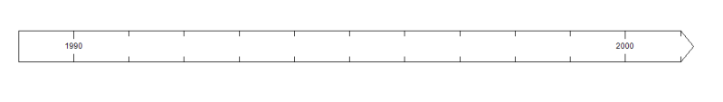
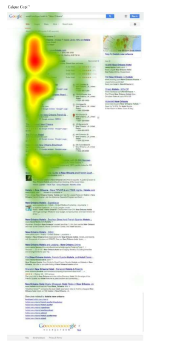
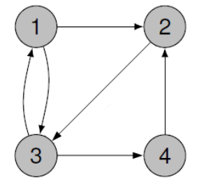
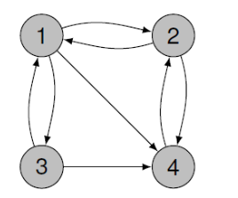
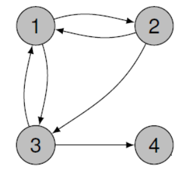
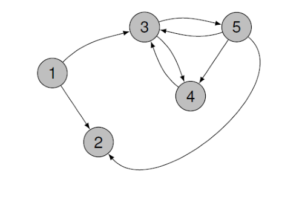
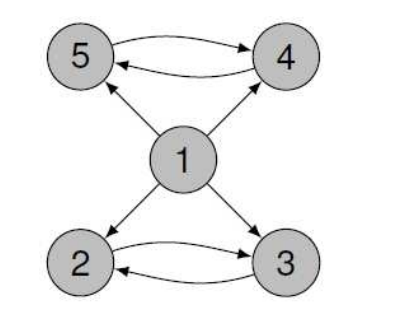

[pdf](./moteurs_recherche.pdf)

Au tout début du web, il y avait des sites qui tentaient de maintenir une liste des sites. Au fur et à mesure de l'évolution du Web, il est vite devenu évidemment que tenir à jour une telle liste était illusoire. C'est ainsi qu'est née la nécessité du moteur de recherche.

- Qu'est-ce qu'un moteur de recherche ?

C'est une application qui attend qu'on lui fournisse une liste de mots clés et qui fournit en retour un document hypertexte permettant d'obtenir une liste de sites liés aux mots clés.

## I. Des moteurs de recherche

### a) chronologie

1. En visionnant cette vidéo https://youtu.be/0A5fQER40Wg, compléter la frise ci-dessous pour établir une chronologie des moteurs de recherche.

### b) comparaison de moteurs de recherche

Les moteurs de recherche constituent le mode principal d'accès au web quand on ne connaît pas l'URL de la page recherchée.

2.  Comparer et analyser le résultat de la même requête : « les moteurs de recherche » dans cinq moteurs de recherche différents.

    a. [https://www.google.fr/](https://www.google.fr/)

    

        - Indications de la page d'accueil :
        - Les trois premiers sites :
        - Autres résultats :
        - Publicités :

    b. [https://www.bing.com/](https://www.bing.com/)

    

        - Indications de la page d'accueil :
        - Les trois premiers sites :
        - Autres résultats :
        - Publicités :

    c. [https://fr.yahoo.com/](https://fr.yahoo.com/)

    

        - Indications de la page d'accueil :
        - Les trois premiers sites :
        - Autres résultats :
        - Publicités :

    d. [https://www.qwant.com/](https://www.qwant.com/)

    

        - Indications de la page d'accueil :
        - Les trois premiers sites :
        - Autres résultats :
        - Publicités :

    e. [https://duckduckgo.com/](https://duckduckgo.com/)

    

        - Indications de la page d'accueil :
        - Les trois premiers sites :
        - Autres résultats :
        - Publicités :

## II Fonctionnement d'un moteur de recherche

3. Regarder la vidéo suivante [https://www.youtube.com/watch?v=iKMm6SXO0wA](https://www.youtube.com/watch?v=iKMm6SXO0wA) afin de compléter les pointillés dans les paragraphes ci-dessous.

### a) exploration

Les moteurs de recherche utilisent des ... appelés ... ou ....

Ils explorent la toile, le web, de liens en liens. On dit qu'ils rampent.

Ce processus est appelé le ....

Les principales fonctions d'un ... sont d'identifier les hyperliens, d'en extraire les adresses et de se déplacer de page en page.

### b) indexation

Les pages explorées sont téléchargées et enregistrés dans d'énormes data-centers.

Que signifie indexer une page web ? ...

Le contenu des pages est analysé en termes de mots clés. Les pages sont ensuite classées selon leur pertinence, leur degré de confiance, ... À chaque mot clé va alors correspondre une liste d'adresses de pages web. C'est un index.

Toutes les pages sont-elles indexées ?
...

Les index ne listent pas tous les mots. Les stops words (mots vides) désignent des petits mots très souvent utilisés comme « le », « la », « du », « à », ..., mais non significatifs. Les mots significatifs sont associés à un poids dépendant de leur occurrence dans la page.

Enfin, les moteurs de recherche préparent à l'avance les résultats des requêtes les plus populaires : « Facebook », « Youtube », « Vidéo », « TV », « Jeux », ...

Ainsi, ils donnent directement les résultats sans nécessairement avoir à chercher dans l'index.

Un analyse des requêtes les plus populaires est donnée par Google à l'adresse suivante [https://trends.google.fr](https://trends.google.fr)

4. Observer l'évolution de l'intérêt pour la recherche du mot « jouet » puis du mot « noel ».
   ...

### c) recherche

Comment un moteur de recherche effectue-t-il un classement de la liste de liens correspondant à une recherche donnée ?
...

Ont-ils tous la même méthode ?
...

- 62 % des internautes ne dépassent pas la première page des résultats d'une recherche sur internet. D'où l'importance d'y figurer.

L'image montre où se porte le regard de l'internaute sur une page Google.

Vous aurez :

- 100 % de visibilité si vous êtes en 1er, 2e ou 3e position,
- 85 % de visibilité pour la 4e position,
- 60 % de visibilité pour la 5e position,
- 50 % de visibilité pour la 6e et 7e position,
- 30 % de visibilité pour la 8e et 9e position,
- 20 % de visibilité si vous êtes en 10e position.

Ainsi, certains moteurs de recherche vont proposer des liens sponsorisés avant les résultats dits naturels de la requête de l'internaute.

## III Calcul de la popularité d'une page

### a) Principe

La société Google a été créée en 1998, à une époque où il y avait déjà plus d'un million de sites disponibles. Elle a rapidement écrasé ses concurrents.

Pourquoi ? Google donnait des résultats beaucoup plus pertinents.

Comment ? Avec un algorithme créé par Larry Page, cofondateur de Google, inspiré de la manière dont les scientifiques classent les articles scientifiques.

Cet algorithme est devenu depuis une marque déposée : PageRank.

Google met des notes aux pages. Plus une page semble importante, plus elle apparait tôt dans la liste. La note finale est comprise entre 0 au minimum et 1 au maximum.

Le principe tient en quatre points :

- On effectue un fonctionnement aléatoire : on prend une page au hasard et on regarde les liens qu'elle fournit et suit l'un des liens.
- Plus on détecte de liens vers un site, plus sa note augmente.
- Plus le lien provient d'un site important, plus le lien apporte de points.
- Plus un site crée de liens, moins on donne d'importante aux liens qu'il fournit (cela permet de lutter contre les sociétés tentant d'augmenter artificiellement les notes de leurs clients).

Ce calcul est en fait très complexe car il oblige à calculer en même temps la popularité de toutes les pages du web qui dépendent les unes des autres, ce qui aboutit à une gigantesque équation avec un nombre d'inconnues égal au nombre des pages du web !

### b) Marche aléatoire

Pour évaluer la note des pages, on simule un internaute qui se déplace aléatoirement de page en page. Ainsi le résultat ne dépendra que des liens que reçoit et émet le site. En mathématiques on dit que l'internaute est un marcheur aléatoire qui parcoure le graphe, les pages sont des nœuds. Le procédé suivant peut être appliqué :

- Choisir au hasard un nœud de départ.
- Marquer le nœud comme visité une fois.
- Déterminer au hasard une flèche à suivre.
- Se déplacer au nouveau nœud.
- Recommencer la procédure à la deuxième étape.

La fréquence des visites d'un nœud par le marcheur aléatoire donne une approximation de la popularité de la page correspondante. Plus la procédure sera répétée, plus l'évaluation sera précise.

5.  Le robot d'un moteur de recherche a permis d'établir les relations suivantes entre quatre pages web. Elles sont modélisées dans le graphe ci-dessous.

    Dans ce graphe, la flèche allant de 1 vers 2 signifie que la page 1 référence la page 2 et l'absence de flèche de 2 vers 4 signifie que la page 2 ne référence pas la page 4.

    

    a. Appliquer la méthode du marcheur aléatoire en complétant le tableau ci-dessous. Travailler en binôme et effectuer 20 visites.

    À la calculatrice, `randint(1, 4)` permet de simuler un nombre au hasard entre 1 et 4 et `randint(0, 1)` permet de simuler un nombre au hasard entre 0 et 1.

    |                            | Nœud 1 | Nœud 2 | Nœud 3 | Nœud 4 |
    | -------------------------- | ------ | ------ | ------ | ------ |
    | Nombre de visites (sur 20) |        |        |        |        |
    | Fréquence en %             |        |        |        |        |

    b. Comparer les résultats avec ceux des autres binômes de la classe. Que peut-on en conclure ?

    c. Rassembler les résultats de toute la classe et compléter le nouveau tableau ci-dessous.

    |                   | Nœud 1 | Nœud 2 | Nœud 3 | Nœud 4 |
    | ----------------- | ------ | ------ | ------ | ------ |
    | Nombre de visites |        |        |        |        |
    | Fréquence en %    |        |        |        |        |

    d. Reporter les fréquences sur le graphe.

### c) simulateur en ligne

6. a. Aller sur le site https://www.seoquantum.com/test-pagerank.

   b. Créer le graphe précédent et comparer les résultats affichés avec ceux du tableau précédent.

7. Créer le graphe ci-dessous avec le simulateur et reporter les notes.

8. Une page pose problème dans le graphe ci-dessous. Laquelle et pourquoi ?

9. Deux pages posent un problème dans le graphe ci-dessous. Lesquelles et pourquoi ?

10. Identifier le problème dans le graphe ci-dessous.

- La solution de Google :

  Si un nœud ne comporte aucun lien vers l'extérieur, le marcheur saute aléatoirement vers un des autres nœuds.

  Cela simule un internaute qui se trouverait dans ce cas de figure. Bloqué sur une page, il en changerait tout simplement.

  De plus, même s'il n'est pas bloqué, à chaque nœud le marcheur a une probabilité de 0.15 (15 %) de sauter aléatoirement vers un des autres nœuds.

  Cela simule l'ennui de l'internaute à suivre toujours les liens proposés par les pages.

11. Créer les graphes précédents avec le simulateur et reporter les notes.
