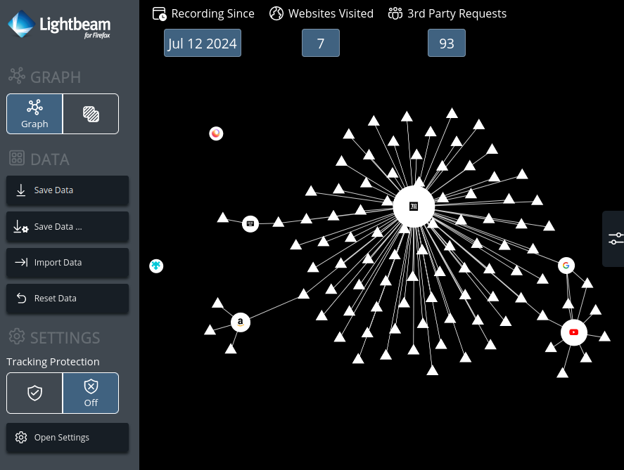
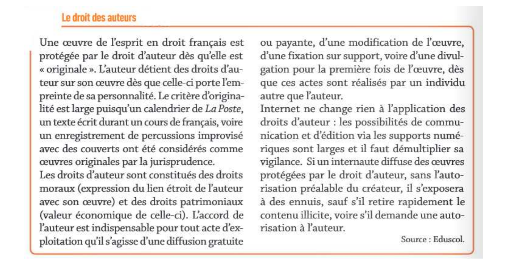

[pdf](./4_confidentialite.pdf)

## I. La confidentialité du web

La navigation sur le web peut laisser des traces.
Certaines sont enregistrées directement par l’internaute sur son navigateur, les cookies, et d’autres peuvent être enregistrées par les serveurs qui utilisent des mécanismes de traçage.
Dans les deux cas, l’internaute peut choisir de rester discret et paramétrer son navigateur pour éviter de laisser ces traces.

### a. Cookies

Après avoir visionné autant de fois que nécessaire les deux vidéos suivantes, répondre aux questions suivantes.

- [https://www.youtube.com/watch?v=t4vSgoAdCyY](https://www.youtube.com/watch?v=t4vSgoAdCyY)
- [https://youtu.be/fm5MSdPU8tY](https://youtu.be/fm5MSdPU8tY)

1. Qu’est-ce qu’un cookie ?
2. Que peut-il se passer après avoir visité un site vendant des bagues ?
3. Combien de temps un cookie peut-il rester sur un ordinateur ?
4. Quelle peut-être l’utilité d’un cookie ?
5. À qui peut-être utile un cookie ?
6. Lorsque l’on visite un site, est-ce le seul à envoyer des cookies ?
7. Comment peut-on réagir face aux cookies ?
8. Sait-on qu’un site utilise des cookies ?
9. Un cookie peut-il avoir accès aux données du disque dur d’un ordinateur ?
10. Qu’est-ce qu’un cookie tiers ?
11. Quel site récolte le plus d’information sur l’internaute ?
12. Quel est l’intérêt des voleurs de cookies ?
13. Quels sont les moyens de se protéger des cookies tiers et des voleurs de cookies ?
14. Finalement, bonne chose ou mauvaise chose les cookies ?

### b. Visualiser l’impact des cookies

Pour visualiser l’activation des cookies lorsque l’on navigue sur Internet, on peut utiliser l’extension **Lightbeam** dans le navigateur Firefox.

15. Utiliser ce lien [Lightbeam](https://addons.mozilla.org/fr/firefox/addon/lightbeam-chikl/) et installer l'extension sous Firefox.
    Si le lien ne fonctionne plus, rechercher "Lightbeam Mozilla" dans un moteur de recherche, choisir le premier lien menant à [https://addons.mozilla.org](https://addons.mozilla.org) et chercher **LightBeam** directement.

16. Visiter plusieurs sites (faire une recherche sur Google, aller sur votre compte Facebook, voir un produit sur Amazon, ...) puis cliquer sur l’icône en haut à droite pour visualiser l’activité des cookies.

    

    Chaque triangle correspond à un cookie qui s’est activé lors de la visite du site dans le rond.

### c. Gérer ses traces en lignes

17. En utilisant le site [https://www.cnil.fr/fr/maitriser-mes-donnees](https://www.cnil.fr/fr/maitriser-mes-donnees) et les vidéos précédentes, donner huit moyens de limiter ses traces en lignes.
18. En utilisant la page [https://www.cnil.fr/fr/les-moteurs-de-recherche](https://www.cnil.fr/fr/les-moteurs-de-recherche), répondre aux questions suivantes.

    a. Quelles sont les informations susceptibles d’être collectées par les moteurs de recherche ?
    b. Dans quels buts ces informations sont collectées ?
    c. Ces informations sont-elles conservées ?
    d. Peut-on supprimer une donnée enregistrée dans un moteur de recherche ?

### d. On fait le ménage !

19. À l’aide des indications du site [https://www.cnil.fr/fr/maitriser-mes-donnees](https://www.cnil.fr/fr/maitriser-mes-donnees), effectuer sur votre poste les manipulations suivantes.

    - Bloquer les cookies tiers.
    - Empêcher l’installation des traqueurs.
    - Effacer l’historique de navigation.

20. Appliquer sur votre smartphone les conseils de la page suivante : [https://www.cnil.fr/fr/maitrisez-les-reglages-vie-privee-de-votre-smartphone](https://www.cnil.fr/fr/maitrisez-les-reglages-vie-privee-de-votre-smartphone)

## II. Le web et le droit d’auteur

Le fait de pouvoir accéder à une ressource sur le web ne signifie pas que l’on puisse en faire ce que l’on veut, en particulier la recopier ou la redistribuer sur le web.

Pour la recopier, il faut disposer du droit de reproduction et, pour la redistribuer, du droit de représentation. Le droit d’auteur s’applique aussi sur le web.

On étudie trois auteurs de bande dessinée qui publient (ou ont publié) leurs œuvres en accès libre sur internet.

21. Répondre aux questions suivantes en étudiant l’un de ces trois documents :

    **[Laurel](./laurel.pdf), [Manu Larcenet](./manularcenet.pdf) ou [David Revoy](./revoy.pdf)**

    a. J’ai envie d’imprimer une image trouvée sur le site web de l’auteur pour l’afficher dans ma chambre.

    - En ai-je le droit ?

    - La loi autorise-t-elle l’auteur à autoriser ou interdire cet usage ?

    b. J’ai envie d’utiliser une image trouvée sur le site web de l’auteur pour illustrer un article du journal du lycée.

    - En ai-je le droit ?
    - La loi autorise-t-elle l’auteur à autoriser ou interdire cet usage ?

    c. Les lecteurs payent-ils pour voir les dessins publiés sur le site web ?

    - L’auteur gagne-t-il de l’argent avec la publication des dessins sur son site web ?

22. Bilan de l’étude de ces trois documents :

    a. Usage privé :
    b. Usage public :
    c. Commercialisation :
